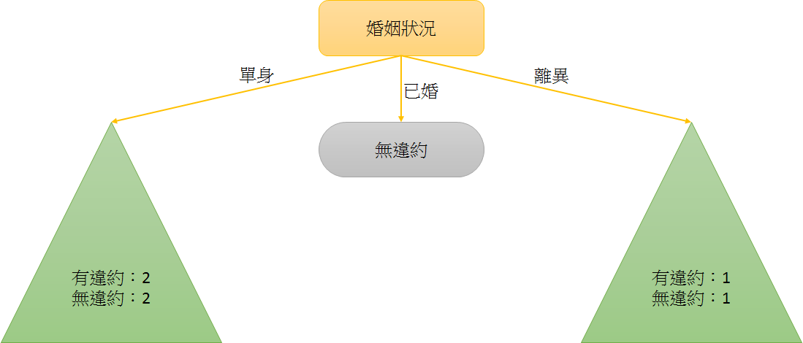
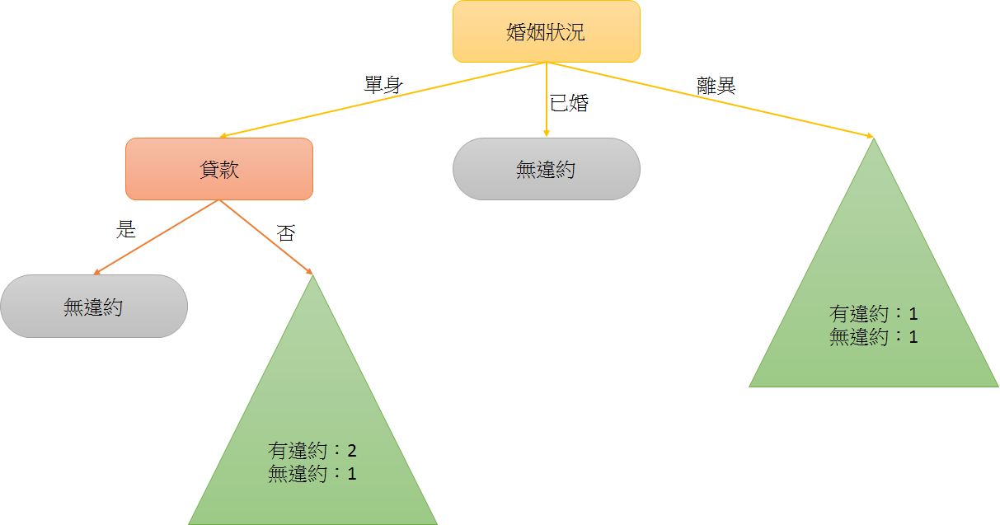

# Homework - Python Spark ML（三）：Decision Tree Survey

> 題目連結：[Python Spark ML（三）：Decision Tree Survey](http://hemingwang.blogspot.tw/2017/09/python-spark-mldecision-tree-survey.html)

【My Answer】★此篇最後結果有誤，仍需更新尋找 Why★

決策樹，學生的理解是將特定領域的一群資料，區分不同的欄位；透過演算法將每個欄位視為一個決策節點，並以目標欄位作為終點建構決策樹。

未來，在相同欄位的規範下，若出現了無目標變數的資料，我們依然可透過走訪之前已建好的決策樹，來預測此資料的結果。

# 例如（範例截取自 References 1 內容）：

<table style="width:75%; text-align:center; vertical-align:middle; border: 5px dotted #BACAC6;">
<tr>
<!------------------------------------------------------>
<th colspan="5" align="center">發福人壽貸款紀錄</th>
<!------------------------------------------------------>
</tr>
<tr>
<!------------------------------------------------------>
<td>編號												</td>
<td style="width:20%;">貸款（類別型尺度）				</td>
<td style="width:20%;">婚姻狀況（類別型尺度）			</td>
<td style="width:20%;">應稅收入（連續型尺度）			</td>
<td style="width:20%;">違約（目標變數）				</td>
<!------------------------------------------------------>
</tr>
<tr>
<!------------------------------------------------------>
<td>1												</td>
<td>是												</td>
<td>單身												</td>
<td>125K											</td>
<td>否												</td>
<!------------------------------------------------------>
</tr>
<tr>
<!------------------------------------------------------>
<td>2												</td>
<td>否												</td>
<td>已婚												</td>
<td>100K											</td>
<td>否												</td>
<!------------------------------------------------------>
</tr>
<tr>
<!------------------------------------------------------>
<td>3												</td>
<td>否												</td>
<td>單身												</td>
<td>70K												</td>
<td>否												</td>
<!------------------------------------------------------>
</tr>
<tr>
<!------------------------------------------------------>
<td>4												</td>
<td>是												</td>
<td>已婚												</td>
<td>120K											</td>
<td>否												</td>
<!------------------------------------------------------>
</tr>
<tr>
<!------------------------------------------------------>
<td>5												</td>
<td>否												</td>
<td>離異												</td>
<td>95K												</td>
<td>是												</td>
<!------------------------------------------------------>
</tr>
<tr>
<!------------------------------------------------------>
<td>6												</td>
<td>否												</td>
<td>已婚												</td>
<td>60K												</td>
<td>否												</td>
<!------------------------------------------------------>
</tr>
<tr>
<!------------------------------------------------------>
<td>7												</td>
<td>是												</td>
<td>離異												</td>
<td>220K											</td>
<td>否												</td>
<!------------------------------------------------------>
</tr>
<tr>
<!------------------------------------------------------>
<td>8												</td>
<td>否												</td>
<td>單身												</td>
<td>85K												</td>
<td>是												</td>
<!------------------------------------------------------>
</tr>
<tr>
<!------------------------------------------------------>
<td>9												</td>
<td>否												</td>
<td>已婚												</td>
<td>75K												</td>
<td>否												</td>
<!------------------------------------------------------>
</tr>
<tr>
<!------------------------------------------------------>
<td>10												</td>
<td>否												</td>
<td>單身												</td>
<td>90K												</td>
<td>是												</td>
<!------------------------------------------------------>
</tr>
</table>

註：類別型尺度（是非題）：是 or 否；是否單身 or 是否已婚 or 是否離異

註：連續型尺度（數值）：90K、100K、110K、115K

## 藉由計算同質性（Homogeneous）得分，將所有欄位作為節點建構決策樹

### 首先先將「貸款」欄位的資料區分「是」及「否」，再計算對於「違約」目標欄位的「是」「否」數目。

<table style="width:75%; text-align:center; vertical-align:middle; border: 5px dotted #BACAC6;">
<tr>
<!------------------------------------------------------>
<th colspan="4" align="center">貸款（類別型尺度）</th>
<!------------------------------------------------------>
</tr>
<tr>
<!------------------------------------------------------>
<td colspan="2" style="width:50%;">是				</td>
<td colspan="2" style="width:50%;">否				</td>
<!------------------------------------------------------>
</tr>
<tr>
<!------------------------------------------------------>
<td style="width:25%;">有違約數						</td>
<td style="width:25%;">0							</td>
<td style="width:25%;">有違約數						</td>
<td style="width:25%;">3							</td>
<!------------------------------------------------------>
</tr>
<tr>
<!------------------------------------------------------>
<td>無違約數											</td>
<td>3												</td>
<td>無違約數											</td>
<td>4												</td>
<!------------------------------------------------------>
</tr>
<tr>
<!------------------------------------------------------>
<td colspan="4">同質性（Homogeneous）得分：3 分		</td>
<!------------------------------------------------------>
</tr>
</table>

### 此時我們可取得同質性（Homogeneous）得分（也有人透過計算 Information Gain 來取得資訊獲利分數，在本文章下方附錄有 Information Gain 計算方式），以這邊為例，同質性得分就是「貸款」「是」的資料中，若達成「有違約數」或「無違約數」其中一個為 0，則同質性得分則為另一個數字：3；而「貸款」「否」的資料中，卻沒有達成其中一個為 0，所以沒有分數：0；最後在「貸款」的同質性得分為 3 + 0 = 3。

- 假設另一種情況：

<table style="width:75%; text-align:center; vertical-align:middle; border: 5px dotted #BACAC6;">
<tr>
<!------------------------------------------------------>
<td colspan="2" style="width:50%;">是				</td>
<td colspan="2" style="width:50%;">否				</td>
<!------------------------------------------------------>
</tr>
<tr>
<!------------------------------------------------------>
<td style="width:25%;">有違約數						</td>
<td style="width:25%;">0							</td>
<td style="width:25%;">有違約數						</td>
<td style="width:25%;">1							</td>
<!------------------------------------------------------>
</tr>
<tr>
<!------------------------------------------------------>
<td>無違約數											</td>
<td>3												</td>
<td>無違約數											</td>
<td>0												</td>
<!------------------------------------------------------>
</tr>
</table>

- 「是」的資料中，「有違約數」為 0，所以此資料的同質性得分為 3；「否」資料中，「無違約數」為 0，所以此資料的同質性得分為 1；同質性總得分則為 3 + 1 = 4。

### 同理，「婚姻狀況」同質性得分為 4 分。

<table style="width:75%; text-align:center; vertical-align:middle; border: 5px dotted #BACAC6;">
<tr>
<!------------------------------------------------------>
<th colspan="6" align="center">婚姻狀況（類別型尺度）</th>
<!------------------------------------------------------>
</tr>
<tr>
<!------------------------------------------------------>
<td colspan="2" style="width:33%;">單身				</td>
<td colspan="2" style="width:33%;">已婚				</td>
<td colspan="2" style="width:34%;">離異				</td>
<!------------------------------------------------------>
</tr>
<tr>
<!------------------------------------------------------>
<td style="width:17%;">有違約數						</td>
<td style="width:17%;">2							</td>
<td style="width:16%;">有違約數						</td>
<td style="width:16%;">0							</td>
<td style="width:17%;">有違約數						</td>
<td style="width:17%;">1							</td>
<!------------------------------------------------------>
</tr>
<tr>
<!------------------------------------------------------>
<td>無違約數											</td>
<td>2												</td>
<td>無違約數											</td>
<td>4												</td>
<td>無違約數											</td>
<td>1												</td>
<!------------------------------------------------------>
</tr>
<tr>
<!------------------------------------------------------>
<td colspan="6">同質性（Homogeneous）得分：4 分		</td>
<!------------------------------------------------------>
</tr>
</table>

### 最後，因為「應稅收入」是連續型尺度，無法直接按照上方計算同質性（Homogeneous）得分，故在計算同質性得分前，需先使用 Gini Index（吉尼係數或稱亂度，此值越小越好）來找到連續型尺度中的最佳分割點。

#### 前置動作（排序、找中間點）

- 將「應稅收入」資料進行排序

<table style="width:75%; text-align:center; vertical-align:middle; border: 5px dotted #BACAC6;">
<tr>
<!------------------------------------------------------>
<td style="width:10%;">違約							</td>
<td style="width:9%;">否								</td>
<td style="width:9%;">否								</td>
<td style="width:9%;">否								</td>
<td style="width:9%;">是								</td>
<td style="width:9%;">是								</td>
<td style="width:9%;">是								</td>
<td style="width:9%;">否								</td>
<td style="width:9%;">否								</td>
<td style="width:9%;">否								</td>
<td style="width:9%;">否								</td>
<!------------------------------------------------------>
</tr>
<tr>
<!------------------------------------------------------>
<td>應稅收入											</td>
<td>60K												</td>
<td>70K												</td>
<td>75K												</td>
<td>85K												</td>
<td>90K												</td>
<td>95K												</td>
<td>100K											</td>
<td>120K											</td>
<td>125K											</td>
<td>220K											</td>
<!------------------------------------------------------>
</tr>
</table>

- 將不同資料找到其中間點，以方便後續計算 Gini Index（吉尼係數）。

<table style="width:75%; text-align:center; vertical-align:middle; border: 5px dotted #BACAC6; font-size:15px;">
<tr>
<!------------------------------------------------------>
<td colspan="1">違約									</td>
<td colspan="3">否									</td>
<td colspan="2">否									</td>
<td colspan="2">否									</td>
<td colspan="2">是									</td>
<td colspan="2">是									</td>
<td colspan="2">是									</td>
<td colspan="2">否									</td>
<td colspan="2">否									</td>
<td colspan="2">否									</td>
<td colspan="3">否									</td>
<!------------------------------------------------------>
</tr>
<tr>
<!------------------------------------------------------>
<td colspan="1">應稅收入								</td>
<td colspan="3">60K									</td>
<td colspan="2">70K									</td>
<td colspan="2">75K									</td>
<td colspan="2">85K									</td>
<td colspan="2">90K									</td>
<td colspan="2">95K									</td>
<td colspan="2">100K								</td>
<td colspan="2">120K								</td>
<td colspan="2">125K								</td>
<td colspan="3">220K								</td>
<!------------------------------------------------------>
</tr>
<tr>
<!------------------------------------------------------>
<td colspan="1">切割點								</td>
<td colspan="2">55K									</td>
<td colspan="2">65K									</td>
<td colspan="2">73K									</td>
<td colspan="2">80K									</td>
<td colspan="2">88K									</td>
<td colspan="2">93K									</td>
<td colspan="2">98K									</td>
<td colspan="2">110K								</td>
<td colspan="2">123K								</td>
<td colspan="2">173K								</td>
<td colspan="2">230K								</td>
<!------------------------------------------------------>
</tr>
</table>

#### 計算 Gini Index（吉尼係數）及其過程

##### 當切割點在 55K 時

- Gini ( <= 55K ) = 1 - ( 違約數 / ( 違約數 + 未違約數 ) ) ^ 2 - ( 未違約數 / ( 違約數 + 未違約數 ) ^ 2 = 1 - ( 0 / ( 0 + 0 ) ) ^ 2 - ( 0 / ( 0 + 0 ) ^ 2 = 1

- Gini ( > 55K ) = 1 - ( 違約數 / ( 違約數 + 未違約數 ) ) ^ 2 - ( 未違約數 / ( 違約數 + 未違約數 ) ^ 2 = 1 - ( 3 / ( 3 + 7 ) ) ^ 2 - ( 7 / ( 3 + 7 ) ^ 2 = 0.420

- Gini ( 55K ) = Gini ( <= 55K ) * ( <=55K違約數 + <=55K未違約數 ) / ( 總違約數 + 總未違約數 ) + Gini ( > 55K ) * ( >55K違約數 + >55K未違約數 ) / ( 總違約數 + 總未違約數 ) = 0 * ( 0 + 0 ) / ( 3 + 7 ) + 0.42 * ( 3 + 7 ) / ( 3 + 7 ) = 0.420

<table style="width:75%; text-align:center; vertical-align:middle; border: 5px dotted #BACAC6;">
<tr>
<!------------------------------------------------------>
<td style="width:10%;">								</td>
<td style="width:9%;"><= 55K						</td>
<td style="width:9%;">> 55K							</td>
<!------------------------------------------------------>
</tr>
<tr>
<!------------------------------------------------------>
<td>有違約數											</td>
<td>0												</td>
<td>3												</td>
<!------------------------------------------------------>
</tr>
<tr>
<!------------------------------------------------------>
<td>無違約數											</td>
<td>0												</td>
<td>7												</td>
<!------------------------------------------------------>
</tr>
<tr>
<!------------------------------------------------------>
<td>吉尼係數（個別）									</td>
<td>1												</td>
<td>0.420											</td>
<!------------------------------------------------------>
</tr>
<tr>
<!------------------------------------------------------>
<td>吉尼係數（加權後）								</td>
<td colspan="2">0.420								</td>
<!------------------------------------------------------>
</tr>
</table>

##### 當切割點在 65K 時

- Gini ( <= 65K ) = 1 - ( 違約數 / ( 違約數 + 未違約數 ) ) ^ 2 - ( 未違約數 / ( 違約數 + 未違約數 ) ^ 2 = 1 - ( 0 / ( 0 + 1 ) ) ^ 2 - ( 1 / ( 0 + 1 ) ^ 2 = 0

- Gini ( > 65K ) = 1 - ( 違約數 / ( 違約數 + 未違約數 ) ) ^ 2 - ( 未違約數 / ( 違約數 + 未違約數 ) ^ 2 = 1 - ( 3 / ( 3 + 6 ) ) ^ 2 - ( 6 / ( 3 + 6 ) ^ 2 = 0.444

- Gini ( 65K ) = Gini ( <= 65K ) * ( <=65K違約數 + <=65K未違約數 ) / ( 總違約數 + 總未違約數 ) + Gini ( > 65K ) * ( >65K違約數 + >65K未違約數 ) / ( 總違約數 + 總未違約數 ) = 0 * ( 0 + 1 ) / ( 3 + 7 ) + 0.444 * ( 3 + 6 ) / ( 3 + 7 ) = 0.400

<table style="width:75%; text-align:center; vertical-align:middle; border: 5px dotted #BACAC6;">
<tr>
<!------------------------------------------------------>
<td style="width:10%;">								</td>
<td style="width:9%;"><= 65K						</td>
<td style="width:9%;">> 65K							</td>
<!------------------------------------------------------>
</tr>
<tr>
<!------------------------------------------------------>
<td>有違約數											</td>
<td>0												</td>
<td>3												</td>
<!------------------------------------------------------>
</tr>
<tr>
<!------------------------------------------------------>
<td>無違約數											</td>
<td>1												</td>
<td>6												</td>
<!------------------------------------------------------>
</tr>
<tr>
<!------------------------------------------------------>
<td>吉尼係數（個別）									</td>
<td>0												</td>
<td>0.444											</td>
<!------------------------------------------------------>
</tr>
<tr>
<!------------------------------------------------------>
<td>吉尼係數（加權後）								</td>
<td colspan="2">0.400								</td>
<!------------------------------------------------------>
</tr>
</table>

##### 當切割點在 73K 時

- Gini ( <= 73K ) = 1 - ( 違約數 / ( 違約數 + 未違約數 ) ) ^ 2 - ( 未違約數 / ( 違約數 + 未違約數 ) ^ 2 = 1 - ( 0 / ( 0 + 2 ) ) ^ 2 - ( 2 / ( 0 + 2 ) ^ 2 = 0

- Gini ( > 73K ) = 1 - ( 違約數 / ( 違約數 + 未違約數 ) ) ^ 2 - ( 未違約數 / ( 違約數 + 未違約數 ) ^ 2 = 1 - ( 3 / ( 3 + 5 ) ) ^ 2 - ( 5 / ( 3 + 5 ) ^ 2 = 0.469

- Gini ( 73K ) = Gini ( <= 73K ) * ( <=73K違約數 + <=73K未違約數 ) / ( 總違約數 + 總未違約數 ) + Gini ( > 73K ) * ( >73K違約數 + >73K未違約數 ) / ( 總違約數 + 總未違約數 ) = 0 * ( 0 + 2 ) / ( 3 + 7 ) + 0.469 * ( 3 + 5 ) / ( 3 + 7 ) = 0.375

<table style="width:75%; text-align:center; vertical-align:middle; border: 5px dotted #BACAC6;">
<tr>
<!------------------------------------------------------>
<td style="width:10%;">								</td>
<td style="width:9%;"><= 73K						</td>
<td style="width:9%;">> 73K							</td>
<!------------------------------------------------------>
</tr>
<tr>
<!------------------------------------------------------>
<td>有違約數											</td>
<td>0												</td>
<td>3												</td>
<!------------------------------------------------------>
</tr>
<tr>
<!------------------------------------------------------>
<td>無違約數											</td>
<td>3												</td>
<td>4												</td>
<!------------------------------------------------------>
</tr>
<tr>
<!------------------------------------------------------>
<td>吉尼係數（個別）									</td>
<td>0												</td>
<td>0.469											</td>
<!------------------------------------------------------>
</tr>
<tr>
<!------------------------------------------------------>
<td>吉尼係數（加權後）								</td>
<td colspan="2">0.375								</td>
<!------------------------------------------------------>
</tr>
</table>

##### 當切割點在 80K 時

- Gini ( <= 80K ) = 1 - ( 違約數 / ( 違約數 + 未違約數 ) ) ^ 2 - ( 未違約數 / ( 違約數 + 未違約數 ) ^ 2 = 1 - ( 0 / ( 0 + 3 ) ) ^ 2 - ( 3 / ( 0 + 3 ) ^ 2 = 0

- Gini ( > 80K ) = 1 - ( 違約數 / ( 違約數 + 未違約數 ) ) ^ 2 - ( 未違約數 / ( 違約數 + 未違約數 ) ^ 2 = 1 - ( 3 / ( 3 + 4 ) ) ^ 2 - ( 4 / ( 3 + 4 ) ^ 2 = 0.490

- Gini ( 80K ) = Gini ( <= 80K ) * ( <=80K違約數 + <=80K未違約數 ) / ( 總違約數 + 總未違約數 ) + Gini ( > 80K ) * ( >80K違約數 + >80K未違約數 ) / ( 總違約數 + 總未違約數 ) = 0 * ( 0 + 3 ) / ( 3 + 7 ) + 0.490 * ( 3 + 4 ) / ( 3 + 7 ) = 0.343

<table style="width:75%; text-align:center; vertical-align:middle; border: 5px dotted #BACAC6;">
<tr>
<!------------------------------------------------------>
<td style="width:10%;">								</td>
<td style="width:9%;"><= 80K						</td>
<td style="width:9%;">> 80K							</td>
<!------------------------------------------------------>
</tr>
<tr>
<!------------------------------------------------------>
<td>有違約數											</td>
<td>0												</td>
<td>3												</td>
<!------------------------------------------------------>
</tr>
<tr>
<!------------------------------------------------------>
<td>無違約數											</td>
<td>3												</td>
<td>4												</td>
<!------------------------------------------------------>
</tr>
<tr>
<!------------------------------------------------------>
<td>吉尼係數（個別）									</td>
<td>0												</td>
<td>0.490											</td>
<!------------------------------------------------------>
</tr>
<tr>
<!------------------------------------------------------>
<td>吉尼係數（加權後）								</td>
<td colspan="2">0.343								</td>
<!------------------------------------------------------>
</tr>
</table>

##### 當切割點在 88K 時

- Gini ( <= 88K ) = 1 - ( 違約數 / ( 違約數 + 未違約數 ) ) ^ 2 - ( 未違約數 / ( 違約數 + 未違約數 ) ^ 2 = 1 - ( 1 / ( 1 + 3 ) ) ^ 2 - ( 3 / ( 1 + 3 ) ^ 2 = 0.375

- Gini ( > 88K ) = 1 - ( 違約數 / ( 違約數 + 未違約數 ) ) ^ 2 - ( 未違約數 / ( 違約數 + 未違約數 ) ^ 2 = 1 - ( 2 / ( 2 + 4 ) ) ^ 2 - ( 4 / ( 2 + 4 ) ^ 2 = 0.444

- Gini ( 88K ) = Gini ( <= 88K ) * ( <=88K違約數 + <=88K未違約數 ) / ( 總違約數 + 總未違約數 ) + Gini ( > 88K ) * ( >88K違約數 + >88K未違約數 ) / ( 總違約數 + 總未違約數 ) = 0.375 * ( 1 + 3 ) / ( 3 + 7 ) + 0.444 * ( 2 + 4 ) / ( 3 + 7 ) = 0.416

<table style="width:75%; text-align:center; vertical-align:middle; border: 5px dotted #BACAC6;">
<tr>
<!------------------------------------------------------>
<td style="width:10%;">								</td>
<td style="width:9%;"><= 88K						</td>
<td style="width:9%;">> 88K							</td>
<!------------------------------------------------------>
</tr>
<tr>
<!------------------------------------------------------>
<td>有違約數											</td>
<td>1												</td>
<td>2												</td>
<!------------------------------------------------------>
</tr>
<tr>
<!------------------------------------------------------>
<td>無違約數											</td>
<td>3												</td>
<td>4												</td>
<!------------------------------------------------------>
</tr>
<tr>
<!------------------------------------------------------>
<td>吉尼係數（個別）									</td>
<td>0.375											</td>
<td>0.444											</td>
<!------------------------------------------------------>
</tr>
<tr>
<!------------------------------------------------------>
<td>吉尼係數（加權後）								</td>
<td colspan="2">0.416								</td>
<!------------------------------------------------------>
</tr>
</table>

##### 當切割點在 93K 時

- Gini ( <= 93K ) = 1 - ( 違約數 / ( 違約數 + 未違約數 ) ) ^ 2 - ( 未違約數 / ( 違約數 + 未違約數 ) ^ 2 = 1 - ( 2 / ( 2 + 3 ) ) ^ 2 - ( 3 / ( 2 + 3 ) ^ 2 = 0.480

- Gini ( > 93K ) = 1 - ( 違約數 / ( 違約數 + 未違約數 ) ) ^ 2 - ( 未違約數 / ( 違約數 + 未違約數 ) ^ 2 = 1 - ( 1 / ( 1 + 4 ) ) ^ 2 - ( 4 / ( 1 + 4 ) ^ 2 = 0.320

- Gini ( 93K ) = Gini ( <= 93K ) * ( <=93K違約數 + <=93K未違約數 ) / ( 總違約數 + 總未違約數 ) + Gini ( > 93K ) * ( >93K違約數 + >93K未違約數 ) / ( 總違約數 + 總未違約數 ) = 0.480 * ( 2 + 3 ) / ( 3 + 7 ) + 0.320 * ( 1 + 4 ) / ( 3 + 7 ) = 0.400

<table style="width:75%; text-align:center; vertical-align:middle; border: 5px dotted #BACAC6;">
<tr>
<!------------------------------------------------------>
<td style="width:10%;">								</td>
<td style="width:9%;"><= 93K						</td>
<td style="width:9%;">> 93K							</td>
<!------------------------------------------------------>
</tr>
<tr>
<!------------------------------------------------------>
<td>有違約數											</td>
<td>2												</td>
<td>1												</td>
<!------------------------------------------------------>
</tr>
<tr>
<!------------------------------------------------------>
<td>無違約數											</td>
<td>3												</td>
<td>4												</td>
<!------------------------------------------------------>
</tr>
<tr>
<!------------------------------------------------------>
<td>吉尼係數（個別）									</td>
<td>0.480											</td>
<td>0.320											</td>
<!------------------------------------------------------>
</tr>
<tr>
<!------------------------------------------------------>
<td>吉尼係數（加權後）								</td>
<td colspan="2">0.400								</td>
<!------------------------------------------------------>
</tr>
</table>

##### 當切割點在 98K 時

- Gini ( <= 98K ) = 1 - ( 違約數 / ( 違約數 + 未違約數 ) ) ^ 2 - ( 未違約數 / ( 違約數 + 未違約數 ) ^ 2 = 1 - ( 3 / ( 3 + 3 ) ) ^ 2 - ( 3 / ( 3 + 1 ) ^ 2 = 0.500

- Gini ( > 98K ) = 1 - ( 違約數 / ( 違約數 + 未違約數 ) ) ^ 2 - ( 未違約數 / ( 違約數 + 未違約數 ) ^ 2 = 1 - ( 0 / ( 0 + 4 ) ) ^ 2 - ( 4 / ( 0 + 4 ) ^ 2 = 0

- Gini ( 98K ) = Gini ( <= 98K ) * ( <=98K違約數 + <=98K未違約數 ) / ( 總違約數 + 總未違約數 ) + Gini ( > 98K ) * ( >98K違約數 + >98K未違約數 ) / ( 總違約數 + 總未違約數 ) = 0.500 * ( 3 + 3 ) / ( 3 + 7 ) + 0 * ( 0 + 4 ) / ( 3 + 7 ) = 0.300

<table style="width:75%; text-align:center; vertical-align:middle; border: 5px dotted #BACAC6;">
<tr>
<!------------------------------------------------------>
<td style="width:10%;">								</td>
<td style="width:9%;"><= 98K						</td>
<td style="width:9%;">> 98K							</td>
<!------------------------------------------------------>
</tr>
<tr>
<!------------------------------------------------------>
<td>有違約數											</td>
<td>3												</td>
<td>0												</td>
<!------------------------------------------------------>
</tr>
<tr>
<!------------------------------------------------------>
<td>無違約數											</td>
<td>3												</td>
<td>4												</td>
<!------------------------------------------------------>
</tr>
<tr>
<!------------------------------------------------------>
<td>吉尼係數（個別）									</td>
<td>0.500											</td>
<td>0												</td>
<!------------------------------------------------------>
</tr>
<tr>
<!------------------------------------------------------>
<td>吉尼係數（加權後）								</td>
<td colspan="2">0.300								</td>
<!------------------------------------------------------>
</tr>
</table>

##### 當切割點在 110K 時

- Gini ( <= 110K ) = 1 - ( 違約數 / ( 違約數 + 未違約數 ) ) ^ 2 - ( 未違約數 / ( 違約數 + 未違約數 ) ^ 2 = 1 - ( 3 / ( 3 + 4 ) ) ^ 2 - ( 4 / ( 3 + 4 ) ^ 2 = 0.490

- Gini ( > 110K ) = 1 - ( 違約數 / ( 違約數 + 未違約數 ) ) ^ 2 - ( 未違約數 / ( 違約數 + 未違約數 ) ^ 2 = 1 - ( 0 / ( 0 + 3 ) ) ^ 2 - ( 3 / ( 0 + 3 ) ^ 2 = 0

- Gini ( 110K ) = Gini ( <= 110K ) * ( <=110K違約數 + <=110K未違約數 ) / ( 總違約數 + 總未違約數 ) + Gini ( > 110K ) * ( >110K違約數 + >110K未違約數 ) / ( 總違約數 + 總未違約數 ) = 0.490 * ( 3 + 4 ) / ( 3 + 7 ) + 0 * ( 0 + 3 ) / ( 3 + 7 ) = 0.343

<table style="width:75%; text-align:center; vertical-align:middle; border: 5px dotted #BACAC6;">
<tr>
<!------------------------------------------------------>
<td style="width:10%;">								</td>
<td style="width:9%;"><= 110K						</td>
<td style="width:9%;">> 110K						</td>
<!------------------------------------------------------>
</tr>
<tr>
<!------------------------------------------------------>
<td>有違約數											</td>
<td>3												</td>
<td>0												</td>
<!------------------------------------------------------>
</tr>
<tr>
<!------------------------------------------------------>
<td>無違約數											</td>
<td>4												</td>
<td>3												</td>
<!------------------------------------------------------>
</tr>
<tr>
<!------------------------------------------------------>
<td>吉尼係數（個別）									</td>
<td>0.490											</td>
<td>0												</td>
<!------------------------------------------------------>
</tr>
<tr>
<!------------------------------------------------------>
<td>吉尼係數（加權後）								</td>
<td colspan="2">0.343								</td>
<!------------------------------------------------------>
</tr>
</table>

##### 當切割點在 123K 時

- Gini ( <= 123K ) = 1 - ( 違約數 / ( 違約數 + 未違約數 ) ) ^ 2 - ( 未違約數 / ( 違約數 + 未違約數 ) ^ 2 = 1 - ( 3 / ( 3 + 5 ) ) ^ 2 - ( 5 / ( 3 + 5 ) ^ 2 = 0.469

- Gini ( > 123K ) = 1 - ( 違約數 / ( 違約數 + 未違約數 ) ) ^ 2 - ( 未違約數 / ( 違約數 + 未違約數 ) ^ 2 = 1 - ( 0 / ( 0 + 2 ) ) ^ 2 - ( 2 / ( 0 + 2 ) ^ 2 = 0

- Gini ( 123K ) = Gini ( <= 123K ) * ( <=123K違約數 + <=123K未違約數 ) / ( 總違約數 + 總未違約數 ) + Gini ( > 123K ) * ( >123K違約數 + >123K未違約數 ) / ( 總違約數 + 總未違約數 ) = 0.469 * ( 3 + 5 ) / ( 3 + 7 ) + 0 * ( 0 + 2 ) / ( 3 + 7 ) = 0.375

<table style="width:75%; text-align:center; vertical-align:middle; border: 5px dotted #BACAC6;">
<tr>
<!------------------------------------------------------>
<td style="width:10%;">								</td>
<td style="width:9%;"><= 123K						</td>
<td style="width:9%;">> 123K						</td>
<!------------------------------------------------------>
</tr>
<tr>
<!------------------------------------------------------>
<td>有違約數											</td>
<td>3												</td>
<td>0												</td>
<!------------------------------------------------------>
</tr>
<tr>
<!------------------------------------------------------>
<td>無違約數											</td>
<td>5												</td>
<td>2												</td>
<!------------------------------------------------------>
</tr>
<tr>
<!------------------------------------------------------>
<td>吉尼係數（個別）									</td>
<td>0.469											</td>
<td>0												</td>
<!------------------------------------------------------>
</tr>
<tr>
<!------------------------------------------------------>
<td>吉尼係數（加權後）								</td>
<td colspan="2">0.375								</td>
<!------------------------------------------------------>
</tr>
</table>

##### 當切割點在 173K 時

- Gini ( <= 173K ) = 1 - ( 違約數 / ( 違約數 + 未違約數 ) ) ^ 2 - ( 未違約數 / ( 違約數 + 未違約數 ) ^ 2 = 1 - ( 3 / ( 3 + 6 ) ) ^ 2 - ( 6 / ( 3 + 6 ) ^ 2 = 0.444

- Gini ( > 173K ) = 1 - ( 違約數 / ( 違約數 + 未違約數 ) ) ^ 2 - ( 未違約數 / ( 違約數 + 未違約數 ) ^ 2 = 1 - ( 0 / ( 0 + 1 ) ) ^ 2 - ( 1 / ( 0 + 1 ) ^ 2 = 0

- Gini ( 173K ) = Gini ( <= 173K ) * ( <=173K違約數 + <=173K未違約數 ) / ( 總違約數 + 總未違約數 ) + Gini ( > 173K ) * ( >173K違約數 + >173K未違約數 ) / ( 總違約數 + 總未違約數 ) = 0.444 * ( 3 + 6 ) / ( 3 + 7 ) + 0 * ( 0 + 1 ) / ( 3 + 7 ) = 0.400

<table style="width:75%; text-align:center; vertical-align:middle; border: 5px dotted #BACAC6;">
<tr>
<!------------------------------------------------------>
<td style="width:10%;">								</td>
<td style="width:9%;"><= 173K						</td>
<td style="width:9%;">> 173K						</td>
<!------------------------------------------------------>
</tr>
<tr>
<!------------------------------------------------------>
<td>有違約數											</td>
<td>3												</td>
<td>0												</td>
<!------------------------------------------------------>
</tr>
<tr>
<!------------------------------------------------------>
<td>無違約數											</td>
<td>6												</td>
<td>1												</td>
<!------------------------------------------------------>
</tr>
<tr>
<!------------------------------------------------------>
<td>吉尼係數（個別）									</td>
<td>0.444											</td>
<td>0												</td>
<!------------------------------------------------------>
</tr>
<tr>
<!------------------------------------------------------>
<td>吉尼係數（加權後）								</td>
<td colspan="2">0.400								</td>
<!------------------------------------------------------>
</tr>
</table>

##### 當切割點在 230K 時

- Gini ( <= 230K ) = 1 - ( 違約數 / ( 違約數 + 未違約數 ) ) ^ 2 - ( 未違約數 / ( 違約數 + 未違約數 ) ^ 2 = 1 - ( 3 / ( 3 + 7 ) ) ^ 2 - ( 7 / ( 3 + 7 ) ^ 2 = 0.420

- Gini ( > 230K ) = 1 - ( 違約數 / ( 違約數 + 未違約數 ) ) ^ 2 - ( 未違約數 / ( 違約數 + 未違約數 ) ^ 2 = 1 - ( 0 / ( 0 + 0 ) ) ^ 2 - ( 0 / ( 0 + 0 ) ^ 2 = 1

- Gini ( 230K ) = Gini ( <= 230K ) * ( <=230K違約數 + <=230K未違約數 ) / ( 總違約數 + 總未違約數 ) + Gini ( > 230K ) * ( >230K違約數 + >230K未違約數 ) / ( 總違約數 + 總未違約數 ) = 0.420 * ( 3 + 7 ) / ( 3 + 7 ) + 1 * ( 0 + 0 ) / ( 3 + 7 ) = 0.420

<table style="width:75%; text-align:center; vertical-align:middle; border: 5px dotted #BACAC6;">
<tr>
<!------------------------------------------------------>
<td style="width:10%;">								</td>
<td style="width:9%;"><= 230K						</td>
<td style="width:9%;">> 230K						</td>
<!------------------------------------------------------>
</tr>
<tr>
<!------------------------------------------------------>
<td>有違約數											</td>
<td>3												</td>
<td>0												</td>
<!------------------------------------------------------>
</tr>
<tr>
<!------------------------------------------------------>
<td>無違約數											</td>
<td>7												</td>
<td>0												</td>
<!------------------------------------------------------>
</tr>
<tr>
<!------------------------------------------------------>
<td>吉尼係數（個別）									</td>
<td>0.420											</td>
<td>1												</td>
<!------------------------------------------------------>
</tr>
<tr>
<!------------------------------------------------------>
<td>吉尼係數（加權後）								</td>
<td colspan="2">0.420								</td>
<!------------------------------------------------------>
</tr>
</table>

#### 將所有算出來的吉尼係數列表出來

<table style="width:75%; text-align:center; vertical-align:middle; border: 5px dotted #BACAC6; font-size:15px;">
<tr>
<!------------------------------------------------------>
<td colspan="1">違約									</td>
<td colspan="3">否									</td>
<td colspan="2">否									</td>
<td colspan="2">否									</td>
<td colspan="2">是									</td>
<td colspan="2">是									</td>
<td colspan="2">是									</td>
<td colspan="2">否									</td>
<td colspan="2">否									</td>
<td colspan="2">否									</td>
<td colspan="3">否									</td>
<!------------------------------------------------------>
</tr>
<tr>
<!------------------------------------------------------>
<td colspan="1">應稅收入								</td>
<td colspan="3">60K									</td>
<td colspan="2">70K									</td>
<td colspan="2">75K									</td>
<td colspan="2">85K									</td>
<td colspan="2">90K									</td>
<td colspan="2">95K									</td>
<td colspan="2">100K								</td>
<td colspan="2">120K								</td>
<td colspan="2">125K								</td>
<td colspan="3">220K								</td>
<!------------------------------------------------------>
</tr>
<tr>
<!------------------------------------------------------>
<td colspan="1">切割點								</td>
<td colspan="2">55K									</td>
<td colspan="2">65K									</td>
<td colspan="2">73K									</td>
<td colspan="2">80K									</td>
<td colspan="2">88K									</td>
<td colspan="2">93K									</td>
<td colspan="2">98K									</td>
<td colspan="2">110K								</td>
<td colspan="2">123K								</td>
<td colspan="2">173K								</td>
<td colspan="2">230K								</td>
<!------------------------------------------------------>
</tr>
<tr>
<!------------------------------------------------------>
<td colspan="1">吉尼係數								</td>
<td colspan="2">0.420								</td>
<td colspan="2">0.400								</td>
<td colspan="2">0.375								</td>
<td colspan="2">0.343								</td>
<td colspan="2">0.416								</td>
<td colspan="2">0.400								</td>
<td colspan="2" style="color:red">0.300				</td>
<td colspan="2">0.343								</td>
<td colspan="2">0.375								</td>
<td colspan="2">0.400								</td>
<td colspan="2">0.420								</td>
<!------------------------------------------------------>
</tr>
</table>

#### 我們將可以找到在 98K 這個切割點的吉尼係數最小（亂度最小），故將 <= 98K 及 > 98K 切割為兩群

### 回到計算最小 Entropy（熵）算法（ID3 演算法），這時我們可將「應稅收入」區分「<= 98K」及「> 98K」，再計算對於「違約」目標欄位的「是」「否」數目：

<table style="width:75%; text-align:center; vertical-align:middle; border: 5px dotted #BACAC6;">
<tr>
<!------------------------------------------------------>
<th colspan="4" align="center">應稅收入（連續型尺度）	</th>
<!------------------------------------------------------>
</tr>
<tr>
<!------------------------------------------------------>
<td colspan="2" style="width:50%;"><= 98K			</td>
<td colspan="2" style="width:50%;">> 98K			</td>
<!------------------------------------------------------>
</tr>
<tr>
<!------------------------------------------------------>
<td style="width:25%;">有違約數						</td>
<td style="width:25%;">3							</td>
<td style="width:25%;">有違約數						</td>
<td style="width:25%;">0							</td>
<!------------------------------------------------------>
</tr>
<tr>
<!------------------------------------------------------>
<td>無違約數											</td>
<td>3												</td>
<td>無違約數											</td>
<td>4												</td>
<!------------------------------------------------------>
</tr>
<tr>
<!------------------------------------------------------>
<td colspan="4">同質性（Homogeneous）得分：4 分		</td>
<!------------------------------------------------------>
</tr>
</table>

### 目前各欄位的同質性（Homogeneous）得分狀況如下：

<table style="width:75%; text-align:center; vertical-align:middle; border: 5px dotted #BACAC6;">
<tr>
<!------------------------------------------------------>
<td colspan="1" align="center">						</td>
<td colspan="2" align="center">貸款（類別型尺度）		</td>
<td colspan="3" align="center">婚姻狀況（類別型尺度）	</td>
<td colspan="2" align="center">應稅收入（連續型尺度）	</td>
<!------------------------------------------------------>
</tr>
<tr>
<!------------------------------------------------------>
<td colspan="1" align="center">						</td>
<td colspan="1" align="center">是					</td>
<td colspan="1" align="center">否					</td>
<td colspan="1" align="center">單身					</td>
<td colspan="1" align="center">已婚					</td>
<td colspan="1" align="center">離異					</td>
<td colspan="1" align="center"><= 98K				</td>
<td colspan="1" align="center">> 98K				</td>
<!------------------------------------------------------>
</tr>
<tr>
<!------------------------------------------------------>
<td colspan="1">有違約數								</td>
<td colspan="1" align="center">0					</td>
<td colspan="1" align="center">3					</td>
<td colspan="1" align="center">2					</td>
<td colspan="1" align="center">0					</td>
<td colspan="1" align="center">1					</td>
<td colspan="1" align="center">3					</td>
<td colspan="1" align="center">0					</td>
<!------------------------------------------------------>
</tr>
<tr>
<!------------------------------------------------------>
<td colspan="1">無違約數								</td>
<td colspan="1" align="center">3					</td>
<td colspan="1" align="center">4					</td>
<td colspan="1" align="center">2					</td>
<td colspan="1" align="center">4					</td>
<td colspan="1" align="center">1					</td>
<td colspan="1" align="center">3					</td>
<td colspan="1" align="center">4					</td>
<!------------------------------------------------------>
</tr>
<tr>
<!------------------------------------------------------>
<td colspan="1">同質性得分							</td>
<td colspan="2" align="center">3 分					</td>
<td colspan="3" align="center">4 分					</td>
<td colspan="2" align="center">4 分					</td>
<!------------------------------------------------------>
</tr>
</table>

### 因「婚姻狀況」、「應稅收入」的同質性（Homogeneous）分數同樣高分，這邊先選用「婚姻狀況」來建立決策樹：

### 會發現仍有無法分類的子節點，透過與上方相同的方法，將左邊的子節點再計算一次同質性（Homogeneous）分數（只要看「單身」部份）

<table style="width:75%; text-align:center; vertical-align:middle; border: 5px dotted #BACAC6;">
<tr>
<!------------------------------------------------------>
<th colspan="5" align="center">發福人壽貸款紀錄</th>
<!------------------------------------------------------>
</tr>
<tr>
<!------------------------------------------------------>
<td>編號												</td>
<td style="width:20%;">貸款（類別型尺度）				</td>
<td style="width:20%;">婚姻狀況（類別型尺度）			</td>
<td style="width:20%;">應稅收入（連續型尺度）			</td>
<td style="width:20%;">違約（目標變數）				</td>
<!------------------------------------------------------>
</tr>
<tr style="background-color:#E3EDCD;">
<!------------------------------------------------------>
<td>1												</td>
<td>是												</td>
<td>單身												</td>
<td>125K											</td>
<td>否												</td>
<!------------------------------------------------------>
</tr>
<tr>
<!------------------------------------------------------>
<td>2												</td>
<td>否												</td>
<td>已婚												</td>
<td>100K											</td>
<td>否												</td>
<!------------------------------------------------------>
</tr>
<tr style="background-color:#E3EDCD;">
<!------------------------------------------------------>
<td>3												</td>
<td>否												</td>
<td>單身												</td>
<td>70K												</td>
<td>否												</td>
<!------------------------------------------------------>
</tr>
<tr>
<!------------------------------------------------------>
<td>4												</td>
<td>是												</td>
<td>已婚												</td>
<td>120K											</td>
<td>否												</td>
<!------------------------------------------------------>
</tr>
<tr>
<!------------------------------------------------------>
<td>5												</td>
<td>否												</td>
<td>離異												</td>
<td>95K												</td>
<td>是												</td>
<!------------------------------------------------------>
</tr>
<tr>
<!------------------------------------------------------>
<td>6												</td>
<td>否												</td>
<td>已婚												</td>
<td>60K												</td>
<td>否												</td>
<!------------------------------------------------------>
</tr>
<tr>
<!------------------------------------------------------>
<td>7												</td>
<td>是												</td>
<td>離異												</td>
<td>220K											</td>
<td>否												</td>
<!------------------------------------------------------>
</tr>
<tr style="background-color:#E3EDCD;">
<!------------------------------------------------------>
<td>8												</td>
<td>否												</td>
<td>單身												</td>
<td>85K												</td>
<td>是												</td>
<!------------------------------------------------------>
</tr>
<tr>
<!------------------------------------------------------>
<td>9												</td>
<td>否												</td>
<td>已婚												</td>
<td>75K												</td>
<td>否												</td>
<!------------------------------------------------------>
</tr>
<tr style="background-color:#E3EDCD;">
<!------------------------------------------------------>
<td>10												</td>
<td>否												</td>
<td>單身												</td>
<td>90K												</td>
<td>是												</td>
<!------------------------------------------------------>
</tr>
</table>

### 「單身」子節點的同質性（Homogeneous）得分狀況如下：

<table style="width:75%; text-align:center; vertical-align:middle; border: 5px dotted #BACAC6;">
<tr>
<!------------------------------------------------------>
<td colspan="1" align="center">						</td>
<td colspan="2" align="center">貸款（類別型尺度）		</td>

<td colspan="2" align="center">應稅收入（連續型尺度）	</td>
<!------------------------------------------------------>
</tr>
<tr>
<!------------------------------------------------------>
<td colspan="1" align="center">						</td>
<td colspan="1" align="center">是					</td>
<td colspan="1" align="center">否					</td>
<td colspan="1" align="center"><= 98K				</td>
<td colspan="1" align="center">> 98K				</td>
<!------------------------------------------------------>
</tr>
<tr>
<!------------------------------------------------------>
<td colspan="1">有違約數								</td>
<td colspan="1" align="center">0					</td>
<td colspan="1" align="center">2					</td>
<td colspan="1" align="center">2					</td>
<td colspan="1" align="center">0					</td>
<!------------------------------------------------------>
</tr>
<tr>
<!------------------------------------------------------>
<td colspan="1">無違約數								</td>
<td colspan="1" align="center">1					</td>
<td colspan="1" align="center">1					</td>
<td colspan="1" align="center">1					</td>
<td colspan="1" align="center">1					</td>
<!------------------------------------------------------>
</tr>
<tr>
<!------------------------------------------------------>
<td colspan="1">同質性得分							</td>
<td colspan="2" align="center">1 分					</td>
<td colspan="2" align="center">1 分					</td>
<!------------------------------------------------------>
</tr>
</table>

### 因為在「單身」子節點下「貸款」和「應稅收入」的同質性（Homogeneous）分數同樣高分，這邊選用「應稅收入」來建立子決策樹：

### 再重覆上述動作

<table style="width:75%; text-align:center; vertical-align:middle; border: 5px dotted #BACAC6;">
<tr>
<!------------------------------------------------------>
<th colspan="5" align="center">發福人壽貸款紀錄</th>
<!------------------------------------------------------>
</tr>
<tr>
<!------------------------------------------------------>
<td>編號												</td>
<td style="width:20%;">貸款（類別型尺度）				</td>
<td style="width:20%;">婚姻狀況（類別型尺度）			</td>
<td style="width:20%;">應稅收入（連續型尺度）			</td>
<td style="width:20%;">違約（目標變數）				</td>
<!------------------------------------------------------>
</tr>
<tr">
<!------------------------------------------------------>
<td>1												</td>
<td>是												</td>
<td>單身												</td>
<td>125K											</td>
<td>否												</td>
<!------------------------------------------------------>
</tr>
<tr>
<!------------------------------------------------------>
<td>2												</td>
<td>否												</td>
<td>已婚												</td>
<td>100K											</td>
<td>否												</td>
<!------------------------------------------------------>
</tr>
<tr style="background-color:#E3EDCD;">
<!------------------------------------------------------>
<td>3												</td>
<td>否												</td>
<td>單身												</td>
<td>70K												</td>
<td>否												</td>
<!------------------------------------------------------>
</tr>
<tr>
<!------------------------------------------------------>
<td>4												</td>
<td>是												</td>
<td>已婚												</td>
<td>120K											</td>
<td>否												</td>
<!------------------------------------------------------>
</tr>
<tr>
<!------------------------------------------------------>
<td>5												</td>
<td>否												</td>
<td>離異												</td>
<td>95K												</td>
<td>是												</td>
<!------------------------------------------------------>
</tr>
<tr>
<!------------------------------------------------------>
<td>6												</td>
<td>否												</td>
<td>已婚												</td>
<td>60K												</td>
<td>否												</td>
<!------------------------------------------------------>
</tr>
<tr>
<!------------------------------------------------------>
<td>7												</td>
<td>是												</td>
<td>離異												</td>
<td>220K											</td>
<td>否												</td>
<!------------------------------------------------------>
</tr>
<tr style="background-color:#E3EDCD;">
<!------------------------------------------------------>
<td>8												</td>
<td>否												</td>
<td>單身												</td>
<td>85K												</td>
<td>是												</td>
<!------------------------------------------------------>
</tr>
<tr>
<!------------------------------------------------------>
<td>9												</td>
<td>否												</td>
<td>已婚												</td>
<td>75K												</td>
<td>否												</td>
<!------------------------------------------------------>
</tr>
<tr style="background-color:#E3EDCD;">
<!------------------------------------------------------>
<td>10												</td>
<td>否												</td>
<td>單身												</td>
<td>90K												</td>
<td>是												</td>
<!------------------------------------------------------>
</tr>
</table>

# ★做到這邊就卡關了，要再找尋：為什麼使用了課堂教的最佳演算法（Homogeneous 分數，以及 Information Gain）卻無法建構出最佳的決策樹？
# 這邊思考了兩大點：

### 其一：觀察下方答案，「貸款」的 Homogeneous（同質性）得分或 Information Gain（資訊獲得量）雖然較低分，但是它的「是」足以代表所有的「不會違約」決策，可以簡化最後出來的決策樹。但是，問題在於為什麼用公式求解的方式卻無法得到此結論呢？

### 其二：觀察下方答案，它的「應稅收入」是用 80K 做為切割點，可以輕易做出「不會違約」和「違約」的決策樹，但使用吉尼係數（Gini index）找到的最佳切割點卻是 98K，竟卻無法讓我建立出最終的決策樹？

# 附上 Referces 1 上課答案

## 附錄：如何計算 Information Gain（資訊獲得量）來取得同質性得分。

#### 首先要取得發福人壽貸款紀錄所有 10 筆資料的 Entropy（熵），計算方式如下：

- Entropy ( 全 ) = - ( 總有違約數 / ( 總有違約數 + 總無違約數 ) ) * log2 ( 總有違約數 / ( 總有違約數 + 總無違約數 ) ) - ( 總無違約數 / ( 總有違約數 + 總無違約數 ) ) * log2 ( 總無違約數 / ( 總有違約數 + 總無違約數 ) ) = - ( 3 / ( 3 + 7 ) ) * log2 ( 3 / ( 3 + 7 ) ) - ( 7 / ( 3 + 7 ) ) * log2 ( 7 / ( 3 + 7 ) ) = 0.881

<table style="width:75%; text-align:center; vertical-align:middle; border: 5px dotted #BACAC6;">
<tr>
<!------------------------------------------------------>
<th colspan="5" align="center">發福人壽貸款紀錄</th>
<!------------------------------------------------------>
</tr>
<tr>
<!------------------------------------------------------>
<td>編號												</td>
<td style="width:20%;">貸款（類別型尺度）				</td>
<td style="width:20%;">婚姻狀況（類別型尺度）			</td>
<td style="width:20%;">應稅收入（連續型尺度）			</td>
<td style="width:20%;">違約（目標變數）				</td>
<!------------------------------------------------------>
</tr>
<tr>
<!------------------------------------------------------>
<td>1												</td>
<td>是												</td>
<td>單身												</td>
<td>125K											</td>
<td>否												</td>
<!------------------------------------------------------>
</tr>
<tr>
<!------------------------------------------------------>
<td>2												</td>
<td>否												</td>
<td>已婚												</td>
<td>100K											</td>
<td>否												</td>
<!------------------------------------------------------>
</tr>
<tr>
<!------------------------------------------------------>
<td>3												</td>
<td>否												</td>
<td>單身												</td>
<td>70K												</td>
<td>否												</td>
<!------------------------------------------------------>
</tr>
<tr>
<!------------------------------------------------------>
<td>4												</td>
<td>是												</td>
<td>已婚												</td>
<td>120K											</td>
<td>否												</td>
<!------------------------------------------------------>
</tr>
<tr>
<!------------------------------------------------------>
<td>5												</td>
<td>否												</td>
<td>離異												</td>
<td>95K												</td>
<td>是												</td>
<!------------------------------------------------------>
</tr>
<tr>
<!------------------------------------------------------>
<td>6												</td>
<td>否												</td>
<td>已婚												</td>
<td>60K												</td>
<td>否												</td>
<!------------------------------------------------------>
</tr>
<tr>
<!------------------------------------------------------>
<td>7												</td>
<td>是												</td>
<td>離異												</td>
<td>220K											</td>
<td>否												</td>
<!------------------------------------------------------>
</tr>
<tr>
<!------------------------------------------------------>
<td>8												</td>
<td>否												</td>
<td>單身												</td>
<td>85K												</td>
<td>是												</td>
<!------------------------------------------------------>
</tr>
<tr>
<!------------------------------------------------------>
<td>9												</td>
<td>否												</td>
<td>已婚												</td>
<td>75K												</td>
<td>否												</td>
<!------------------------------------------------------>
</tr>
<tr>
<!------------------------------------------------------>
<td>10												</td>
<td>否												</td>
<td>單身												</td>
<td>90K												</td>
<td>是												</td>
<!------------------------------------------------------>
</tr>
</table>

#### 再來計算「婚姻狀況」的 Entropy（熵），計算方式如下：

- Entropy ( 婚姻狀況：單身 ) = - ( 單身有違約數 / ( 單身有違約數 + 單身無違約數 ) ) * log2 ( 單身有違約數 / ( 單身有違約數 + 單身無違約數 ) ) - ( 單身無違約數 / ( 單身有違約數 + 單身無違約數 ) ) * log2 ( 單身無違約數 / ( 單身有違約數 + 單身無違約數 ) ) = - ( 2 / ( 2 + 2 ) ) * log2 ( 2 / ( 2 + 2 ) ) - ( 2 / ( 2 + 2 ) ) * log2 ( 2 / ( 2 + 2 ) ) = 1.000

- Entropy ( 婚姻狀況：已婚 ) = - ( 已婚有違約數 / ( 已婚有違約數 + 已婚無違約數 ) ) * log2 ( 已婚有違約數 / ( 已婚有違約數 + 已婚無違約數 ) ) - ( 已婚無違約數 / ( 已婚有違約數 + 已婚無違約數 ) ) * log2 ( 已婚無違約數 / ( 已婚有違約數 + 已婚無違約數 ) ) = - ( 0 / ( 0 + 4 ) ) * log2 ( 0 / ( 0 + 4 ) ) - ( 4 / ( 0 + 4 ) ) * log2 ( 4 / ( 0 + 4 ) ) = 0

- Entropy ( 婚姻狀況：離異 ) = - ( 離異有違約數 / ( 離異有違約數 + 離異無違約數 ) ) * log2 ( 離異有違約數 / ( 離異有違約數 + 離異無違約數 ) ) - ( 離異無違約數 / ( 離異有違約數 + 離異無違約數 ) ) * log2 ( 離異無違約數 / ( 離異有違約數 + 離異無違約數 ) ) = - ( 1 / ( 1 + 1 ) ) * log2 ( 1 / ( 1 + 1 ) ) - ( 1 / ( 1 + 1 ) ) * log2 ( 1 / ( 1 + 1 ) ) = 1.000

- Entropy ( 婚姻狀況：計算加權後 ) = Entropy ( 婚姻狀況：單身 ) * ( 單身有違約數 + 單身無違約數 ) / ( 總有違約數 + 總無違約數 ) + Entropy ( 婚姻狀況：已婚 ) * ( 已婚有違約數 + 已婚無違約數 ) / ( 總有違約數 + 總無違約數 ) + Entropy ( 婚姻狀況：離異 ) * ( 離異有違約數 + 離異無違約數 ) / ( 總有違約數 + 總無違約數 ) = 1.000 * ( 2 + 2 ) / ( 3 + 7 ) + 0 * ( 0 + 4 ) / ( 3 + 7 ) + 1.000 * ( 1 + 1 ) / ( 3 + 7 ) = 0.600

#### 就可以取得「婚姻狀況」的 Information Gain（資訊獲得量），計算方式如下：

- Information Gain ( 婚姻狀況 ) = Entropy ( 全 ) - Entropy ( 婚姻狀況：計算加權後 ) = 0.881 - 0.600 = 0.281

<table style="width:75%; text-align:center; vertical-align:middle; border: 5px dotted #BACAC6;">
<tr>
<!------------------------------------------------------>
<th colspan="6" align="center">婚姻狀況（類別型尺度）</th>
<!------------------------------------------------------>
</tr>
<tr>
<!------------------------------------------------------>
<td colspan="2" style="width:33%;">單身				</td>
<td colspan="2" style="width:33%;">已婚				</td>
<td colspan="2" style="width:34%;">離異				</td>
<!------------------------------------------------------>
</tr>
<tr>
<!------------------------------------------------------>
<td style="width:17%;">有違約數						</td>
<td style="width:17%;">2							</td>
<td style="width:16%;">有違約數						</td>
<td style="width:16%;">0							</td>
<td style="width:17%;">有違約數						</td>
<td style="width:17%;">1							</td>
<!------------------------------------------------------>
</tr>
<tr>
<!------------------------------------------------------>
<td>無違約數											</td>
<td>2												</td>
<td>無違約數											</td>
<td>4												</td>
<td>無違約數											</td>
<td>1												</td>
<!------------------------------------------------------>
</tr>
<tr>
<!------------------------------------------------------>
<td colspan="6">同質性（Homogeneous）得分：4 分		</td>
<!------------------------------------------------------>
</tr>
<tr>
<!------------------------------------------------------>
<td colspan="6">Information Gain（資訊獲得量）：0.281	</td>
<!------------------------------------------------------>
</tr>
</table>

#### 接著計算「貸款」的 Entropy（熵），計算方式如下：

- Entropy ( 貸款：是 ) = - ( 是有違約數 / ( 是有違約數 + 是無違約數 ) ) * log2 ( 是有違約數 / ( 是有違約數 + 是無違約數 ) ) - ( 是無違約數 / ( 是有違約數 + 是無違約數 ) ) * log2 ( 是無違約數 / ( 是有違約數 + 是無違約數 ) ) = - ( 0 / ( 0 + 3 ) ) * log2 ( 0 / ( 0 + 3 ) ) - ( 3 / ( 0 + 3 ) ) * log2 ( 3 / ( 0 + 3 ) ) = 0

- Entropy ( 貸款：否 ) = - ( 否有違約數 / ( 否有違約數 + 否無違約數 ) ) * log2 ( 否有違約數 / ( 否有違約數 + 否無違約數 ) ) - ( 否無違約數 / ( 否有違約數 + 否無違約數 ) ) * log2 ( 否無違約數 / ( 否有違約數 + 否無違約數 ) ) = - ( 3 / ( 3 + 4 ) ) * log2 ( 3 / ( 3 + 4 ) ) - ( 4 / ( 3 + 4 ) ) * log2 ( 4 / ( 3 + 4 ) ) = 0.985

- Entropy ( 貸款：計算加權後 ) = Entropy ( 貸款：是 ) * ( 是有違約數 + 是無違約數 ) / ( 總有違約數 + 總無違約數 ) + Entropy ( 貸款：否 ) * ( 否有違約數 + 否無違約數 ) / ( 總有違約數 + 總無違約數 ) = 0 * ( 0 + 3 ) / ( 3 + 7 ) + 0.985 * ( 3 + 4 ) / ( 3 + 7 ) = 0.690

#### 就可以取得「貸款」的 Information Gain（資訊獲得量），計算方式如下：

- Information Gain ( 貸款 ) = Entropy ( 全 ) - Entropy ( 貸款：計算加權後 ) = 0.881 - 0.690 = 0.191

<table style="width:75%; text-align:center; vertical-align:middle; border: 5px dotted #BACAC6;">
<tr>
<!------------------------------------------------------>
<th colspan="4" align="center">貸款（類別型尺度）</th>
<!------------------------------------------------------>
</tr>
<tr>
<!------------------------------------------------------>
<td colspan="2" style="width:50%;">是				</td>
<td colspan="2" style="width:50%;">否				</td>
<!------------------------------------------------------>
</tr>
<tr>
<!------------------------------------------------------>
<td style="width:25%;">有違約數						</td>
<td style="width:25%;">0							</td>
<td style="width:25%;">有違約數						</td>
<td style="width:25%;">3							</td>
<!------------------------------------------------------>
</tr>
<tr>
<!------------------------------------------------------>
<td>無違約數											</td>
<td>3												</td>
<td>無違約數											</td>
<td>4												</td>
<!------------------------------------------------------>
</tr>
<tr>
<!------------------------------------------------------>
<td colspan="4">同質性（Homogeneous）得分：3 分		</td>
<!------------------------------------------------------>
</tr>
<tr>
<!------------------------------------------------------>
<td colspan="6">Information Gain（資訊獲得量）：0.191	</td>
<!------------------------------------------------------>
</tr>
</table>

#### 接著計算「應稅收入」的 Entropy（熵），計算方式如下：

- Entropy ( 應稅收入：<= 98K ) = - ( <=98K有違約數 / ( <=98K有違約數 + <=98K無違約數 ) ) * log2 ( <=98K有違約數 / ( <=98K有違約數 + <=98K無違約數 ) ) - ( <=98K無違約數 / ( <=98K有違約數 + <=98K無違約數 ) ) * log2 ( <=98K無違約數 / ( <=98K有違約數 + <=98K無違約數 ) ) = - ( 3 / ( 3 + 3 ) ) * log2 ( 3 / ( 3 + 3 ) ) - ( 3 / ( 3 + 3 ) ) * log2 ( 3 / ( 3 + 3 ) ) = 1.000

- Entropy ( 應稅收入：> 98K ) = - ( >98K有違約數 / ( >98K有違約數 + >98K無違約數 ) ) * log2 ( >98K有違約數 / ( >98K有違約數 + >98K無違約數 ) ) - ( >98K無違約數 / ( >98K有違約數 + >98K無違約數 ) ) * log2 ( >98K無違約數 / ( >98K有違約數 + >98K無違約數 ) ) = - ( 0 / ( 0 + 4 ) ) * log2 ( 0 / ( 0 + 4 ) ) - ( 4 / ( 0 + 4 ) ) * log2 ( 4 / ( 0 + 4 ) ) = 0

- Entropy ( 應稅收入：計算加權後 ) = Entropy ( 應稅收入：<= 98K ) * ( <=98K有違約數 + <=98K無違約數 ) / ( 總有違約數 + 總無違約數 ) + Entropy ( 應稅收入：> 98K ) * ( >98K有違約數 + >98K無違約數 ) / ( 總有違約數 + 總無違約數 ) = 1.000 * ( 3 + 3 ) / ( 3 + 7 ) + 0 * ( 0 + 4 ) / ( 3 + 7 ) = 0.600

#### 就可以取得「應稅收入」的 Information Gain（資訊獲得量），計算方式如下：

- Information Gain ( 應稅收入 ) = Entropy ( 全 ) - Entropy ( 應稅收入：計算加權後 ) = 0.881 - 0.600 = 0.281

<table style="width:75%; text-align:center; vertical-align:middle; border: 5px dotted #BACAC6;">
<tr>
<!------------------------------------------------------>
<th colspan="4" align="center">應稅收入（連續型尺度）	</th>
<!------------------------------------------------------>
</tr>
<tr>
<!------------------------------------------------------>
<td colspan="2" style="width:50%;"><= 98K			</td>
<td colspan="2" style="width:50%;">> 98K			</td>
<!------------------------------------------------------>
</tr>
<tr>
<!------------------------------------------------------>
<td style="width:25%;">有違約數						</td>
<td style="width:25%;">3							</td>
<td style="width:25%;">有違約數						</td>
<td style="width:25%;">0							</td>
<!------------------------------------------------------>
</tr>
<tr>
<!------------------------------------------------------>
<td>無違約數											</td>
<td>3												</td>
<td>無違約數											</td>
<td>4												</td>
<!------------------------------------------------------>
</tr>
<tr>
<!------------------------------------------------------>
<td colspan="4">同質性（Homogeneous）得分：4 分		</td>
<!------------------------------------------------------>
</tr>
<tr>
<!------------------------------------------------------>
<td colspan="6">Information Gain（資訊獲得量）：0.281	</td>
<!------------------------------------------------------>
</tr>
</table>

【References】

1. [資料科學家 ShareCourse 線上免費課程 - 輔大杜逸寧老師](http://www.sharecourse.net/sharecourse/course/view/courseInfo/962)

2. [Artificial Intelligence Lecture 11: Learning: Identification Trees, Disorder - MIT Open Course](https://ocw.mit.edu/courses/electrical-engineering-and-computer-science/6-034-artificial-intelligence-fall-2010/lecture-videos/lecture-11-learning-identification-trees-disorder/)（看圖說故事可知概念）

3. [wilson8507 同學的作業 01 答案](https://github.com/wilson8507/PythonSparkMLGroupHW/blob/master/PythonSparkML-HW1.md?fref=gc&dti=197223143437)：對決策樹的說明（是非題）

4. [AI - Ch14 機器學習 (2), 決策樹 Decision Tree](http://mropengate.blogspot.tw/2015/06/ai-ch13-2-decision-tree.html)

5. [決策樹學習 - 國立聯合大學 資訊管理學系 陳士傑教師](ftp://140.118.199.9:2100/public9/zTEMP/ZZproject/zx_%B5%7B%A6%A1%B3]%ADp-Programming/%B3%AF%A4h%B3%C7_AI-MachineLearning/Course%206%B3%AF%A4h%B3%C7.ppt)

6. [程式 | 決策樹演算法筆記](http://iamkyc0312.pixnet.net/blog/post/339857156-%E7%A8%8B%E5%BC%8F%7C-%E6%B1%BA%E7%AD%96%E6%A8%B9%E6%BC%94%E7%AE%97%E6%B3%95%E7%AD%86%E8%A8%98)