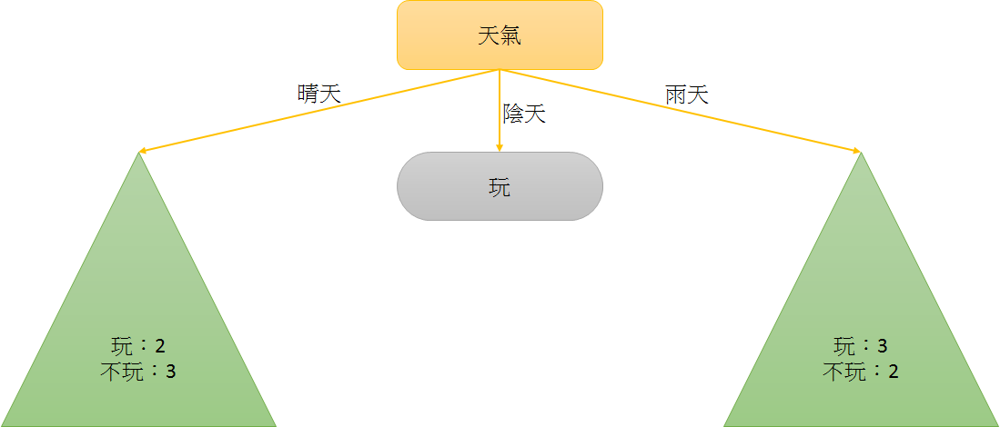
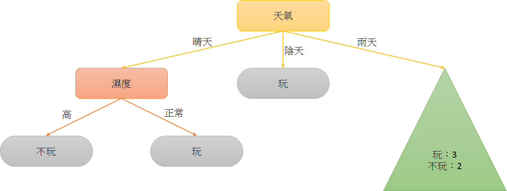
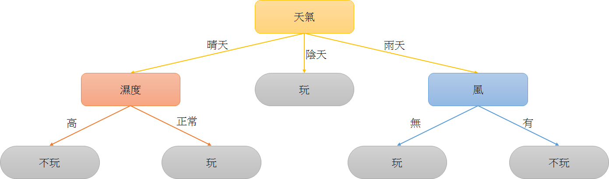

# Homework - Python Spark ML（三）：Decision Tree Survey

> 題目連結：[Python Spark ML（三）：Decision Tree Survey](http://hemingwang.blogspot.tw/2017/09/python-spark-mldecision-tree-survey.html)

【My Answer】

決策樹，學生的理解是將特定領域的一群資料，區分不同的欄位；透過演算法將每個欄位視為一個決策節點，並以目標欄位作為終點建構決策樹。

未來，在相同欄位的規範下，若出現了無目標變數的資料，我們依然可透過走訪之前已建好的決策樹，來預測此資料的結果。

# 例如（範例截取自 References 1 內容）：

<table style="width:75%; text-align:center; vertical-align:middle; border: 5px dotted #BACAC6;">
<tr>
<!------------------------------------------------------>
<th colspan="6" align="center">一千塊小朋友出去玩紀錄</th>
<!------------------------------------------------------>
</tr>
<tr>
<!------------------------------------------------------>
<td>編號												</td>
<td style="width:20%;">天氣							</td>
<td style="width:20%;">溫度							</td>
<td style="width:20%;">濕度							</td>
<td style="width:20%;">風							</td>
<td style="width:20%;">玩／不玩						</td>
<!------------------------------------------------------>
</tr>
<tr>
<!------------------------------------------------------>
<td>1												</td>
<td>晴天												</td>
<td>熱												</td>
<td>高												</td>
<td>無												</td>
<td>不玩												</td>
<!------------------------------------------------------>
</tr>
<tr>
<!------------------------------------------------------>
<td>2												</td>
<td>晴天												</td>
<td>熱												</td>
<td>高												</td>
<td>有												</td>
<td>不玩												</td>
<!------------------------------------------------------>
</tr>
<tr>
<!------------------------------------------------------>
<td>3												</td>
<td>陰天												</td>
<td>熱												</td>
<td>高												</td>
<td>無												</td>
<td>玩												</td>
<!------------------------------------------------------>
</tr>
<tr>
<!------------------------------------------------------>
<td>4												</td>
<td>雨天												</td>
<td>溫和												</td>
<td>高												</td>
<td>無												</td>
<td>玩												</td>
<!------------------------------------------------------>
</tr>
<tr>
<!------------------------------------------------------>
<td>5												</td>
<td>雨天												</td>
<td>冷												</td>
<td>正常												</td>
<td>無												</td>
<td>玩												</td>
<!------------------------------------------------------>
</tr>
<tr>
<!------------------------------------------------------>
<td>6												</td>
<td>雨天												</td>
<td>冷												</td>
<td>正常												</td>
<td>有												</td>
<td>不玩												</td>
<!------------------------------------------------------>
</tr>
<tr>
<!------------------------------------------------------>
<td>7												</td>
<td>陰天												</td>
<td>冷												</td>
<td>正常												</td>
<td>有												</td>
<td>玩												</td>
<!------------------------------------------------------>
</tr>
<tr>
<!------------------------------------------------------>
<td>8												</td>
<td>晴天												</td>
<td>溫和												</td>
<td>高												</td>
<td>無												</td>
<td>不玩												</td>
<!------------------------------------------------------>
</tr>
<tr>
<!------------------------------------------------------>
<td>9												</td>
<td>晴天												</td>
<td>冷												</td>
<td>正常												</td>
<td>無												</td>
<td>玩												</td>
<!------------------------------------------------------>
</tr>
<tr>
<!------------------------------------------------------>
<td>10												</td>
<td>雨天												</td>
<td>溫和												</td>
<td>正常												</td>
<td>無												</td>
<td>玩												</td>
<!------------------------------------------------------>
</tr>
<tr>
<!------------------------------------------------------>
<td>11												</td>
<td>晴天												</td>
<td>溫和												</td>
<td>正常												</td>
<td>有												</td>
<td>玩												</td>
<!------------------------------------------------------>
</tr>
<tr>
<!------------------------------------------------------>
<td>12												</td>
<td>陰天												</td>
<td>溫和												</td>
<td>高												</td>
<td>有												</td>
<td>玩												</td>
<!------------------------------------------------------>
</tr>
<tr>
<!------------------------------------------------------>
<td>13												</td>
<td>陰天												</td>
<td>熱												</td>
<td>正常												</td>
<td>無												</td>
<td>玩												</td>
<!------------------------------------------------------>
</tr>
<tr>
<!------------------------------------------------------>
<td>14												</td>
<td>雨天												</td>
<td>溫和												</td>
<td>高												</td>
<td>有												</td>
<td>不玩												</td>
<!------------------------------------------------------>
</tr>
</table>

註：類別型尺度（是非題）：有 or 無；是否陰天 or 是否晴天 or 是否雨天

註：連續型尺度（數值）：90K、100K、110K、115K

## 藉由計算同質性（Homogeneous）得分，將所有欄位作為節點建構決策樹

### 首先先將「天氣」欄位的資料區分「晴天」、「陰天」及「雨天」，再計算對於「玩／不玩」目標欄位的「玩」及「不玩」數目。

<table style="width:75%; text-align:center; vertical-align:middle; border: 5px dotted #BACAC6;">
<tr>
<!------------------------------------------------------>
<th colspan="6" align="center">天氣					</th>
<!------------------------------------------------------>
</tr>
<tr>
<!------------------------------------------------------>
<td colspan="2">晴天				</td>
<td colspan="2">陰天				</td>
<td colspan="2">雨天				</td>
<!------------------------------------------------------>
</tr>
<tr>
<!------------------------------------------------------>
<td>玩												</td>
<td>2												</td>
<td>玩												</td>
<td>4												</td>
<td>玩												</td>
<td>3												</td>
<!------------------------------------------------------>
</tr>
<tr>
<!------------------------------------------------------>
<td>不玩												</td>
<td>3												</td>
<td>不玩												</td>
<td>0												</td>
<td>不玩												</td>
<td>2												</td>
<!------------------------------------------------------>
</tr>
<tr>
<!------------------------------------------------------>
<td colspan="6">同質性（Homogeneous）得分：4 分		</td>
<!------------------------------------------------------>
</tr>
</table>

### 此時我們可取得同質性（Homogeneous）得分（也有人透過計算 Information Gain 來取得資訊獲利分數，在本文章下方附錄有 Information Gain 計算方式），以這邊為例，同質性得分就是「天氣」「陰天」的資料中，若達成「玩」或「不玩」其中一個為 0，則同質性得分則為另一個數字：4；而「天氣」「晴天」的資料中，卻沒有達成其中一個為 0，所以沒有分數：0；「天氣」「雨天」也是沒有達成其中一個為 0，所以沒有分數；最後在「天氣」欄位的同質性得分為 0 + 4 + 0 = 4。

### 同理，「溫度」同質性（Homogeneous）得分為 0 分。

<table style="width:75%; text-align:center; vertical-align:middle; border: 5px dotted #BACAC6;">
<tr>
<!------------------------------------------------------>
<th colspan="6" align="center">溫度					</th>
<!------------------------------------------------------>
</tr>
<tr>
<!------------------------------------------------------>
<td colspan="2">熱									</td>
<td colspan="2">溫和									</td>
<td colspan="2">冷									</td>
<!------------------------------------------------------>
</tr>
<tr>
<!------------------------------------------------------>
<td>玩												</td>
<td>2												</td>
<td>玩												</td>
<td>4												</td>
<td>玩												</td>
<td>3												</td>
<!------------------------------------------------------>
</tr>
<tr>
<!------------------------------------------------------>
<td>不玩												</td>
<td>2												</td>
<td>不玩												</td>
<td>2												</td>
<td>不玩												</td>
<td>1												</td>
<!------------------------------------------------------>
</tr>
<tr>
<!------------------------------------------------------>
<td colspan="6">同質性（Homogeneous）得分：0 分		</td>
<!------------------------------------------------------>
</tr>
</table>

### 「濕度」同質性（Homogeneous）得分為 0 分。

<table style="width:75%; text-align:center; vertical-align:middle; border: 5px dotted #BACAC6;">
<tr>
<!------------------------------------------------------>
<th colspan="4" align="center">濕度					</th>
<!------------------------------------------------------>
</tr>
<tr>
<!------------------------------------------------------>
<td colspan="2">高									</td>
<td colspan="2">正常									</td>
<!------------------------------------------------------>
</tr>
<tr>
<!------------------------------------------------------>
<td>玩												</td>
<td>3												</td>
<td>玩												</td>
<td>6												</td>
<!------------------------------------------------------>
</tr>
<tr>
<!------------------------------------------------------>
<td>不玩												</td>
<td>4												</td>
<td>不玩												</td>
<td>1												</td>
<!------------------------------------------------------>
</tr>
<tr>
<!------------------------------------------------------>
<td colspan="4">同質性（Homogeneous）得分：0 分		</td>
<!------------------------------------------------------>
</tr>
</table>

### 「風」同質性（Homogeneous）得分為 0 分。

<table style="width:75%; text-align:center; vertical-align:middle; border: 5px dotted #BACAC6;">
<tr>
<!------------------------------------------------------>
<th colspan="4" align="center">風					</th>
<!------------------------------------------------------>
</tr>
<tr>
<!------------------------------------------------------>
<td colspan="2">無									</td>
<td colspan="2">有									</td>
<!------------------------------------------------------>
</tr>
<tr>
<!------------------------------------------------------>
<td>玩												</td>
<td>6												</td>
<td>玩												</td>
<td>3												</td>
<!------------------------------------------------------>
</tr>
<tr>
<!------------------------------------------------------>
<td>不玩												</td>
<td>2												</td>
<td>不玩												</td>
<td>3												</td>
<!------------------------------------------------------>
</tr>
<tr>
<!------------------------------------------------------>
<td colspan="4">同質性（Homogeneous）得分：0 分		</td>
<!------------------------------------------------------>
</tr>
</table>

### 目前各欄位的同質性（Homogeneous）得分狀況如下：

<table style="width:75%; text-align:center; vertical-align:middle; border: 5px dotted #BACAC6;">
<tr>
<!------------------------------------------------------>
<td colspan="1" align="center">						</td>
<td colspan="3" align="center">天氣					</td>
<td colspan="3" align="center">溫度					</td>
<td colspan="2" align="center">濕度					</td>
<td colspan="2" align="center">風					</td>
<!------------------------------------------------------>
</tr>
<tr>
<!------------------------------------------------------>
<td colspan="1" align="center">						</td>
<td colspan="1" align="center">晴天					</td>
<td colspan="1" align="center">陰天					</td>
<td colspan="1" align="center">雨天					</td>
<td colspan="1" align="center">熱					</td>
<td colspan="1" align="center">溫和					</td>
<td colspan="1" align="center">冷					</td>
<td colspan="1" align="center">高					</td>
<td colspan="1" align="center">正常					</td>
<td colspan="1" align="center">無					</td>
<td colspan="1" align="center">有					</td>
<!------------------------------------------------------>
</tr>
<tr>
<!------------------------------------------------------>
<td colspan="1">玩									</td>
<td colspan="1" align="center">2					</td>
<td colspan="1" align="center">4					</td>
<td colspan="1" align="center">3					</td>
<td colspan="1" align="center">2					</td>
<td colspan="1" align="center">4					</td>
<td colspan="1" align="center">3					</td>
<td colspan="1" align="center">3					</td>
<td colspan="1" align="center">6					</td>
<td colspan="1" align="center">6					</td>
<td colspan="1" align="center">3					</td>
<!------------------------------------------------------>
</tr>
<tr>
<!------------------------------------------------------>
<td colspan="1">不玩									</td>
<td colspan="1" align="center">3					</td>
<td colspan="1" align="center">0					</td>
<td colspan="1" align="center">2					</td>
<td colspan="1" align="center">2					</td>
<td colspan="1" align="center">2					</td>
<td colspan="1" align="center">1					</td>
<td colspan="1" align="center">4					</td>
<td colspan="1" align="center">1					</td>
<td colspan="1" align="center">2					</td>
<td colspan="1" align="center">3					</td>
<!------------------------------------------------------>
</tr>
<tr>
<!------------------------------------------------------>
<td colspan="1">同質性得分							</td>
<td colspan="3" align="center">4 分					</td>
<td colspan="3" align="center">0 分					</td>
<td colspan="2" align="center">0 分					</td>
<td colspan="2" align="center">0 分					</td>
<!------------------------------------------------------>
</tr>
</table>

### 因「天氣」的同質性（Homogeneous）最高分，所以優先選用「天氣」來建立決策樹：

### 會發現仍有無法分類的子節點，透過與上方相同的方法，將左邊的子節點再計算一次同質性（Homogeneous）分數（只要看「天氣」「晴天」部份）

<table style="width:75%; text-align:center; vertical-align:middle; border: 5px dotted #BACAC6;">
<tr>
<!------------------------------------------------------>
<th colspan="6" align="center">一千塊小朋友出去玩紀錄</th>
<!------------------------------------------------------>
</tr>
<tr>
<!------------------------------------------------------>
<td>編號												</td>
<td style="width:20%;">天氣							</td>
<td style="width:20%;">溫度							</td>
<td style="width:20%;">濕度							</td>
<td style="width:20%;">風							</td>
<td style="width:20%;">玩／不玩						</td>
<!------------------------------------------------------>
</tr>
<tr style="background-color:#E3EDCD;">
<!------------------------------------------------------>
<td>1												</td>
<td style="background-color:#FDE6E0;">晴天			</td>
<td>熱												</td>
<td>高												</td>
<td>無												</td>
<td>不玩												</td>
<!------------------------------------------------------>
</tr>
<tr style="background-color:#E3EDCD;">
<!------------------------------------------------------>
<td>2												</td>
<td style="background-color:#FDE6E0;">晴天			</td>
<td>熱												</td>
<td>高												</td>
<td>有												</td>
<td>不玩												</td>
<!------------------------------------------------------>
</tr>
<tr>
<!------------------------------------------------------>
<td>3												</td>
<td>陰天												</td>
<td>熱												</td>
<td>高												</td>
<td>無												</td>
<td>玩												</td>
<!------------------------------------------------------>
</tr>
<tr>
<!------------------------------------------------------>
<td>4												</td>
<td>雨天												</td>
<td>溫和												</td>
<td>高												</td>
<td>無												</td>
<td>玩												</td>
<!------------------------------------------------------>
</tr>
<tr>
<!------------------------------------------------------>
<td>5												</td>
<td>雨天												</td>
<td>冷												</td>
<td>正常												</td>
<td>無												</td>
<td>玩												</td>
<!------------------------------------------------------>
</tr>
<tr>
<!------------------------------------------------------>
<td>6												</td>
<td>雨天												</td>
<td>冷												</td>
<td>正常												</td>
<td>有												</td>
<td>不玩												</td>
<!------------------------------------------------------>
</tr>
<tr>
<!------------------------------------------------------>
<td>7												</td>
<td>陰天												</td>
<td>冷												</td>
<td>正常												</td>
<td>有												</td>
<td>玩												</td>
<!------------------------------------------------------>
</tr>
<tr style="background-color:#E3EDCD;">
<!------------------------------------------------------>
<td>8												</td>
<td style="background-color:#FDE6E0;">晴天			</td>
<td>溫和												</td>
<td>高												</td>
<td>無												</td>
<td>不玩												</td>
<!------------------------------------------------------>
</tr>
<tr style="background-color:#E3EDCD;">
<!------------------------------------------------------>
<td>9												</td>
<td style="background-color:#FDE6E0;">晴天			</td>
<td>冷												</td>
<td>正常												</td>
<td>無												</td>
<td>玩												</td>
<!------------------------------------------------------>
</tr>
<tr>
<!------------------------------------------------------>
<td>10												</td>
<td>雨天												</td>
<td>溫和												</td>
<td>正常												</td>
<td>無												</td>
<td>玩												</td>
<!------------------------------------------------------>
</tr>
<tr style="background-color:#E3EDCD;">
<!------------------------------------------------------>
<td>11												</td>
<td style="background-color:#FDE6E0;">晴天			</td>
<td>溫和												</td>
<td>正常												</td>
<td>有												</td>
<td>玩												</td>
<!------------------------------------------------------>
</tr>
<tr>
<!------------------------------------------------------>
<td>12												</td>
<td>陰天												</td>
<td>溫和												</td>
<td>高												</td>
<td>有												</td>
<td>玩												</td>
<!------------------------------------------------------>
</tr>
<tr>
<!------------------------------------------------------>
<td>13												</td>
<td>陰天												</td>
<td>熱												</td>
<td>正常												</td>
<td>無												</td>
<td>玩												</td>
<!------------------------------------------------------>
</tr>
<tr>
<!------------------------------------------------------>
<td>14												</td>
<td>雨天												</td>
<td>溫和												</td>
<td>高												</td>
<td>有												</td>
<td>不玩												</td>
<!------------------------------------------------------>
</tr>
</table>

### 觀察「天氣」「晴天」條件下的「溫度」同質性（Homogeneous）得分狀況如下：

<table style="width:75%; text-align:center; vertical-align:middle; border: 5px dotted #BACAC6;">
<tr>
<!------------------------------------------------------>
<th colspan="6" align="center">「天氣」「晴天」條件下的「溫度」</th>
<!------------------------------------------------------>
</tr>
<tr>
<!------------------------------------------------------>
<td colspan="2">熱									</td>
<td colspan="2">溫和									</td>
<td colspan="2">冷									</td>
<!------------------------------------------------------>
</tr>
<tr>
<!------------------------------------------------------>
<td>玩												</td>
<td>0												</td>
<td>玩												</td>
<td>1												</td>
<td>玩												</td>
<td>1												</td>
<!------------------------------------------------------>
</tr>
<tr>
<!------------------------------------------------------>
<td>不玩												</td>
<td>2												</td>
<td>不玩												</td>
<td>1												</td>
<td>不玩												</td>
<td>0												</td>
<!------------------------------------------------------>
</tr>
<tr>
<!------------------------------------------------------>
<td colspan="6">同質性（Homogeneous）得分：3 分		</td>
<!------------------------------------------------------>
</tr>
</table>

### 觀察「天氣」「晴天」條件下的「濕度」同質性（Homogeneous）得分狀況如下：

<table style="width:75%; text-align:center; vertical-align:middle; border: 5px dotted #BACAC6;">
<tr>
<!------------------------------------------------------>
<th colspan="4" align="center">「天氣」「晴天」條件下的「濕度」</th>
<!------------------------------------------------------>
</tr>
<tr>
<!------------------------------------------------------>
<td colspan="2">高									</td>
<td colspan="2">正常									</td>
<!------------------------------------------------------>
</tr>
<tr>
<!------------------------------------------------------>
<td>玩												</td>
<td>0												</td>
<td>玩												</td>
<td>2												</td>
<!------------------------------------------------------>
</tr>
<tr>
<!------------------------------------------------------>
<td>不玩												</td>
<td>3												</td>
<td>不玩												</td>
<td>0												</td>
<!------------------------------------------------------>
</tr>
<tr>
<!------------------------------------------------------>
<td colspan="4">同質性（Homogeneous）得分：5 分		</td>
<!------------------------------------------------------>
</tr>
</table>

### 觀察「天氣」「晴天」條件下的「風」同質性（Homogeneous）得分狀況如下：

<table style="width:75%; text-align:center; vertical-align:middle; border: 5px dotted #BACAC6;">
<tr>
<!------------------------------------------------------>
<th colspan="4" align="center">「天氣」「晴天」條件下的「風」</th>
<!------------------------------------------------------>
</tr>
<tr>
<!------------------------------------------------------>
<td colspan="2">無									</td>
<td colspan="2">有									</td>
<!------------------------------------------------------>
</tr>
<tr>
<!------------------------------------------------------>
<td>玩												</td>
<td>1												</td>
<td>玩												</td>
<td>1												</td>
<!------------------------------------------------------>
</tr>
<tr>
<!------------------------------------------------------>
<td>不玩												</td>
<td>2												</td>
<td>不玩												</td>
<td>1												</td>
<!------------------------------------------------------>
</tr>
<tr>
<!------------------------------------------------------>
<td colspan="4">同質性（Homogeneous）得分：0 分		</td>
<!------------------------------------------------------>
</tr>
</table>

### 目前各欄位在「天氣」「晴天」條件下的同質性（Homogeneous）得分狀況如下：

<table style="width:75%; text-align:center; vertical-align:middle; border: 5px dotted #BACAC6;">
<tr>
<!------------------------------------------------------>
<td colspan="1" align="center">						</td>
<td colspan="3" align="center">溫度					</td>
<td colspan="2" align="center">濕度					</td>
<td colspan="2" align="center">風					</td>
<!------------------------------------------------------>
</tr>
<tr>
<!------------------------------------------------------>
<td colspan="1" align="center">						</td>
<td colspan="1" align="center">熱					</td>
<td colspan="1" align="center">溫和					</td>
<td colspan="1" align="center">冷					</td>
<td colspan="1" align="center">高					</td>
<td colspan="1" align="center">正常					</td>
<td colspan="1" align="center">無					</td>
<td colspan="1" align="center">有					</td>
<!------------------------------------------------------>
</tr>
<tr>
<!------------------------------------------------------>
<td colspan="1">玩									</td>
<td colspan="1" align="center">0					</td>
<td colspan="1" align="center">1					</td>
<td colspan="1" align="center">1					</td>
<td colspan="1" align="center">0					</td>
<td colspan="1" align="center">2					</td>
<td colspan="1" align="center">1					</td>
<td colspan="1" align="center">1					</td>
<!------------------------------------------------------>
</tr>
<tr>
<!------------------------------------------------------>
<td colspan="1">不玩									</td>
<td colspan="1" align="center">2					</td>
<td colspan="1" align="center">1					</td>
<td colspan="1" align="center">0					</td>
<td colspan="1" align="center">3					</td>
<td colspan="1" align="center">0					</td>
<td colspan="1" align="center">2					</td>
<td colspan="1" align="center">1					</td>
<!------------------------------------------------------>
</tr>
<tr>
<!------------------------------------------------------>
<td colspan="1">同質性得分							</td>
<td colspan="3" align="center">3 分					</td>
<td colspan="2" align="center">5 分					</td>
<td colspan="2" align="center">0 分					</td>
<!------------------------------------------------------>
</tr>
</table>

### 因「天氣」「晴天」條件下的「濕度」的同質性（Homogeneous）最高分，所以優先選用「濕度」來建立左子決策樹：

### 會發現仍有無法分類的子節點，透過與上方相同的方法，將右邊的子節點再計算一次同質性（Homogeneous）分數（只要看「天氣」「雨天」部份）

<table style="width:75%; text-align:center; vertical-align:middle; border: 5px dotted #BACAC6;">
<tr>
<!------------------------------------------------------>
<th colspan="6" align="center">一千塊小朋友出去玩紀錄</th>
<!------------------------------------------------------>
</tr>
<tr>
<!------------------------------------------------------>
<td>編號												</td>
<td style="width:20%;">天氣							</td>
<td style="width:20%;">溫度							</td>
<td style="width:20%;">濕度							</td>
<td style="width:20%;">風							</td>
<td style="width:20%;">玩／不玩						</td>
<!------------------------------------------------------>
</tr>
<tr>
<!------------------------------------------------------>
<td>1												</td>
<td>晴天												</td>
<td>熱												</td>
<td>高												</td>
<td>無												</td>
<td>不玩												</td>
<!------------------------------------------------------>
</tr>
<tr>
<!------------------------------------------------------>
<td>2												</td>
<td>晴天												</td>
<td>熱												</td>
<td>高												</td>
<td>有												</td>
<td>不玩												</td>
<!------------------------------------------------------>
</tr>
<tr>
<!------------------------------------------------------>
<td>3												</td>
<td>陰天												</td>
<td>熱												</td>
<td>高												</td>
<td>無												</td>
<td>玩												</td>
<!------------------------------------------------------>
</tr>
<tr style="background-color:#E3EDCD;">
<!------------------------------------------------------>
<td>4												</td>
<td style="background-color:#FDE6E0;">雨天			</td>
<td>溫和												</td>
<td>高												</td>
<td>無												</td>
<td>玩												</td>
<!------------------------------------------------------>
</tr>
<tr style="background-color:#E3EDCD;">
<!------------------------------------------------------>
<td>5												</td>
<td style="background-color:#FDE6E0;">雨天			</td>
<td>冷												</td>
<td>正常												</td>
<td>無												</td>
<td>玩												</td>
<!------------------------------------------------------>
</tr>
<tr style="background-color:#E3EDCD;">
<!------------------------------------------------------>
<td>6												</td>
<td style="background-color:#FDE6E0;">雨天			</td>
<td>冷												</td>
<td>正常												</td>
<td>有												</td>
<td>不玩												</td>
<!------------------------------------------------------>
</tr>
<tr>
<!------------------------------------------------------>
<td>7												</td>
<td>陰天												</td>
<td>冷												</td>
<td>正常												</td>
<td>有												</td>
<td>玩												</td>
<!------------------------------------------------------>
</tr>
<tr>
<!------------------------------------------------------>
<td>8												</td>
<td>晴天												</td>
<td>溫和												</td>
<td>高												</td>
<td>無												</td>
<td>不玩												</td>
<!------------------------------------------------------>
</tr>
<tr>
<!------------------------------------------------------>
<td>9												</td>
<td>晴天												</td>
<td>冷												</td>
<td>正常												</td>
<td>無												</td>
<td>玩												</td>
<!------------------------------------------------------>
</tr>
<tr style="background-color:#E3EDCD;">
<!------------------------------------------------------>
<td>10												</td>
<td style="background-color:#FDE6E0;">雨天			</td>
<td>溫和												</td>
<td>正常												</td>
<td>無												</td>
<td>玩												</td>
<!------------------------------------------------------>
</tr>
<tr>
<!------------------------------------------------------>
<td>11												</td>
<td>晴天												</td>
<td>溫和												</td>
<td>正常												</td>
<td>有												</td>
<td>玩												</td>
<!------------------------------------------------------>
</tr>
<tr>
<!------------------------------------------------------>
<td>12												</td>
<td>陰天												</td>
<td>溫和												</td>
<td>高												</td>
<td>有												</td>
<td>玩												</td>
<!------------------------------------------------------>
</tr>
<tr>
<!------------------------------------------------------>
<td>13												</td>
<td>陰天												</td>
<td>熱												</td>
<td>正常												</td>
<td>無												</td>
<td>玩												</td>
<!------------------------------------------------------>
</tr>
<tr style="background-color:#E3EDCD;">
<!------------------------------------------------------>
<td>14												</td>
<td style="background-color:#FDE6E0;">雨天			</td>
<td>溫和												</td>
<td>高												</td>
<td>有												</td>
<td>不玩												</td>
<!------------------------------------------------------>
</tr>
</table>

### 觀察「天氣」「雨天」條件下的「溫度」同質性（Homogeneous）得分狀況如下：

<table style="width:75%; text-align:center; vertical-align:middle; border: 5px dotted #BACAC6;">
<tr>
<!------------------------------------------------------>
<th colspan="6" align="center">「天氣」「雨天」條件下的「溫度」</th>
<!------------------------------------------------------>
</tr>
<tr>
<!------------------------------------------------------>
<td colspan="2">熱									</td>
<td colspan="2">溫和									</td>
<td colspan="2">冷									</td>
<!------------------------------------------------------>
</tr>
<tr>
<!------------------------------------------------------>
<td>玩												</td>
<td>0												</td>
<td>玩												</td>
<td>2												</td>
<td>玩												</td>
<td>1												</td>
<!------------------------------------------------------>
</tr>
<tr>
<!------------------------------------------------------>
<td>不玩												</td>
<td>0												</td>
<td>不玩												</td>
<td>1												</td>
<td>不玩												</td>
<td>1												</td>
<!------------------------------------------------------>
</tr>
<tr>
<!------------------------------------------------------>
<td colspan="6">同質性（Homogeneous）得分：0 分		</td>
<!------------------------------------------------------>
</tr>
</table>

### 觀察「天氣」「雨天」條件下的「濕度」同質性（Homogeneous）得分狀況如下：

<table style="width:75%; text-align:center; vertical-align:middle; border: 5px dotted #BACAC6;">
<tr>
<!------------------------------------------------------>
<th colspan="4" align="center">「天氣」「雨天」條件下的「濕度」</th>
<!------------------------------------------------------>
</tr>
<tr>
<!------------------------------------------------------>
<td colspan="2">高									</td>
<td colspan="2">正常									</td>
<!------------------------------------------------------>
</tr>
<tr>
<!------------------------------------------------------>
<td>玩												</td>
<td>1												</td>
<td>玩												</td>
<td>2												</td>
<!------------------------------------------------------>
</tr>
<tr>
<!------------------------------------------------------>
<td>不玩												</td>
<td>1												</td>
<td>不玩												</td>
<td>1												</td>
<!------------------------------------------------------>
</tr>
<tr>
<!------------------------------------------------------>
<td colspan="4">同質性（Homogeneous）得分：0 分		</td>
<!------------------------------------------------------>
</tr>
</table>

### 觀察「天氣」「雨天」條件下的「風」同質性（Homogeneous）得分狀況如下：

<table style="width:75%; text-align:center; vertical-align:middle; border: 5px dotted #BACAC6;">
<tr>
<!------------------------------------------------------>
<th colspan="4" align="center">「天氣」「雨天」條件下的「風」</th>
<!------------------------------------------------------>
</tr>
<tr>
<!------------------------------------------------------>
<td colspan="2">無									</td>
<td colspan="2">有									</td>
<!------------------------------------------------------>
</tr>
<tr>
<!------------------------------------------------------>
<td>玩												</td>
<td>3												</td>
<td>玩												</td>
<td>0												</td>
<!------------------------------------------------------>
</tr>
<tr>
<!------------------------------------------------------>
<td>不玩												</td>
<td>0												</td>
<td>不玩												</td>
<td>2												</td>
<!------------------------------------------------------>
</tr>
<tr>
<!------------------------------------------------------>
<td colspan="4">同質性（Homogeneous）得分：5 分		</td>
<!------------------------------------------------------>
</tr>
</table>

### 目前各欄位在「天氣」「雨天」條件下的同質性（Homogeneous）得分狀況如下：

<table style="width:75%; text-align:center; vertical-align:middle; border: 5px dotted #BACAC6;">
<tr>
<!------------------------------------------------------>
<td colspan="1" align="center">						</td>
<td colspan="3" align="center">溫度					</td>
<td colspan="2" align="center">濕度					</td>
<td colspan="2" align="center">風					</td>
<!------------------------------------------------------>
</tr>
<tr>
<!------------------------------------------------------>
<td colspan="1" align="center">						</td>
<td colspan="1" align="center">熱					</td>
<td colspan="1" align="center">溫和					</td>
<td colspan="1" align="center">冷					</td>
<td colspan="1" align="center">高					</td>
<td colspan="1" align="center">正常					</td>
<td colspan="1" align="center">無					</td>
<td colspan="1" align="center">有					</td>
<!------------------------------------------------------>
</tr>
<tr>
<!------------------------------------------------------>
<td colspan="1">玩									</td>
<td colspan="1" align="center">0					</td>
<td colspan="1" align="center">2					</td>
<td colspan="1" align="center">1					</td>
<td colspan="1" align="center">1					</td>
<td colspan="1" align="center">2					</td>
<td colspan="1" align="center">3					</td>
<td colspan="1" align="center">0					</td>
<!------------------------------------------------------>
</tr>
<tr>
<!------------------------------------------------------>
<td colspan="1">不玩									</td>
<td colspan="1" align="center">0					</td>
<td colspan="1" align="center">1					</td>
<td colspan="1" align="center">1					</td>
<td colspan="1" align="center">1					</td>
<td colspan="1" align="center">1					</td>
<td colspan="1" align="center">0					</td>
<td colspan="1" align="center">2					</td>
<!------------------------------------------------------>
</tr>
<tr>
<!------------------------------------------------------>
<td colspan="1">同質性得分							</td>
<td colspan="3" align="center">0 分					</td>
<td colspan="2" align="center">0 分					</td>
<td colspan="2" align="center">5 分					</td>
<!------------------------------------------------------>
</tr>
</table>

### 因「天氣」「雨天」條件下的「風」的同質性（Homogeneous）最高分，所以優先選用「濕度」來建立右子決策樹：

### 未來若出現未知的資料時，就可以用此決策樹預測小朋友是否會出去玩了：

<table style="width:75%; text-align:center; vertical-align:middle; border: 5px dotted #BACAC6;">
<tr>
<!------------------------------------------------------>
<th colspan="6" align="center">未知的資料預測			</th>
<!------------------------------------------------------>
</tr>
<tr>
<!------------------------------------------------------>
<td>編號												</td>
<td style="width:20%;">天氣							</td>
<td style="width:20%;">溫度							</td>
<td style="width:20%;">濕度							</td>
<td style="width:20%;">風							</td>
<td style="width:20%;">玩／不玩						</td>
<!------------------------------------------------------>
</tr>
<tr>
<!------------------------------------------------------>
<td>15												</td>
<td>晴天												</td>
<td>冷												</td>
<td>正常												</td>
<td>有												</td>
<td>？												</td>
<!------------------------------------------------------>
</tr>
<tr>
<!------------------------------------------------------>
<td>16												</td>
<td>雨天												</td>
<td>熱												</td>
<td>正常												</td>
<td>無												</td>
<td>？												</td>
<!------------------------------------------------------>
</tr>
<tr>
<!------------------------------------------------------>
<td>17												</td>
<td>陰天												</td>
<td>熱												</td>
<td>高												</td>
<td>有												</td>
<td>？												</td>
<!------------------------------------------------------>
</tr>
</table>

## 附錄：如何計算 Information Gain（資訊獲得量）來取得同質性得分（這邊只計算建立決策樹第一層的 Information Gain）。

#### 首先要取得一千塊小朋友出去玩紀錄所有 14 筆資料的 Entropy（熵），計算方式如下：

- Entropy ( 全 ) = - ( 總玩數 / ( 總玩數 + 總不玩數 ) ) * log2 ( 總玩數 / ( 總玩數 + 總不玩數 ) ) - ( 總不玩數 / ( 總玩數 + 總不玩數 ) ) * log2 ( 總不玩數 / ( 總玩數 + 總不玩數 ) ) = - ( 9 / ( 9 + 5 ) ) * log2 ( 9 / ( 9 + 5 ) ) - ( 5 / ( 9 + 5 ) ) * log2 ( 5 / ( 9 + 5 ) ) = 0.940

<table style="width:75%; text-align:center; vertical-align:middle; border: 5px dotted #BACAC6;">
<tr>
<!------------------------------------------------------>
<th colspan="6" align="center">一千塊小朋友出去玩紀錄</th>
<!------------------------------------------------------>
</tr>
<tr>
<!------------------------------------------------------>
<td>編號												</td>
<td style="width:20%;">天氣							</td>
<td style="width:20%;">溫度							</td>
<td style="width:20%;">濕度							</td>
<td style="width:20%;">風							</td>
<td style="width:20%;">玩／不玩						</td>
<!------------------------------------------------------>
</tr>
<tr>
<!------------------------------------------------------>
<td>1												</td>
<td>晴天												</td>
<td>熱												</td>
<td>高												</td>
<td>無												</td>
<td>不玩												</td>
<!------------------------------------------------------>
</tr>
<tr>
<!------------------------------------------------------>
<td>2												</td>
<td>晴天												</td>
<td>熱												</td>
<td>高												</td>
<td>有												</td>
<td>不玩												</td>
<!------------------------------------------------------>
</tr>
<tr>
<!------------------------------------------------------>
<td>3												</td>
<td>陰天												</td>
<td>熱												</td>
<td>高												</td>
<td>無												</td>
<td>玩												</td>
<!------------------------------------------------------>
</tr>
<tr>
<!------------------------------------------------------>
<td>4												</td>
<td>雨天												</td>
<td>溫和												</td>
<td>高												</td>
<td>無												</td>
<td>玩												</td>
<!------------------------------------------------------>
</tr>
<tr>
<!------------------------------------------------------>
<td>5												</td>
<td>雨天												</td>
<td>冷												</td>
<td>正常												</td>
<td>無												</td>
<td>玩												</td>
<!------------------------------------------------------>
</tr>
<tr>
<!------------------------------------------------------>
<td>6												</td>
<td>雨天												</td>
<td>冷												</td>
<td>正常												</td>
<td>有												</td>
<td>不玩												</td>
<!------------------------------------------------------>
</tr>
<tr>
<!------------------------------------------------------>
<td>7												</td>
<td>陰天												</td>
<td>冷												</td>
<td>正常												</td>
<td>有												</td>
<td>玩												</td>
<!------------------------------------------------------>
</tr>
<tr>
<!------------------------------------------------------>
<td>8												</td>
<td>晴天												</td>
<td>溫和												</td>
<td>高												</td>
<td>無												</td>
<td>不玩												</td>
<!------------------------------------------------------>
</tr>
<tr>
<!------------------------------------------------------>
<td>9												</td>
<td>晴天												</td>
<td>冷												</td>
<td>正常												</td>
<td>無												</td>
<td>玩												</td>
<!------------------------------------------------------>
</tr>
<tr>
<!------------------------------------------------------>
<td>10												</td>
<td>雨天												</td>
<td>溫和												</td>
<td>正常												</td>
<td>無												</td>
<td>玩												</td>
<!------------------------------------------------------>
</tr>
<tr>
<!------------------------------------------------------>
<td>11												</td>
<td>晴天												</td>
<td>溫和												</td>
<td>正常												</td>
<td>有												</td>
<td>玩												</td>
<!------------------------------------------------------>
</tr>
<tr>
<!------------------------------------------------------>
<td>12												</td>
<td>陰天												</td>
<td>溫和												</td>
<td>高												</td>
<td>有												</td>
<td>玩												</td>
<!------------------------------------------------------>
</tr>
<tr>
<!------------------------------------------------------>
<td>13												</td>
<td>陰天												</td>
<td>熱												</td>
<td>正常												</td>
<td>無												</td>
<td>玩												</td>
<!------------------------------------------------------>
</tr>
<tr>
<!------------------------------------------------------>
<td>14												</td>
<td>雨天												</td>
<td>溫和												</td>
<td>高												</td>
<td>有												</td>
<td>不玩												</td>
<!------------------------------------------------------>
</tr>
</table>

#### 再來計算「天氣」的 Entropy（熵），計算方式如下：

- Entropy ( 天氣：晴天 ) = - ( 晴天玩數 / ( 晴天玩數 + 晴天不玩數 ) ) * log2 ( 晴天玩數 / ( 晴天玩數 + 晴天不玩數 ) ) - ( 晴天不玩數 / ( 晴天玩數 + 晴天不玩數 ) ) * log2 ( 晴天不玩數 / ( 晴天玩數 + 晴天不玩數 ) ) = - ( 2 / ( 2 + 3 ) ) * log2 ( 2 / ( 2 + 3 ) ) - ( 3 / ( 2 + 3 ) ) * log2 ( 3 / ( 2 + 3 ) ) = 0.971

- Entropy ( 天氣：陰天 ) = - ( 陰天玩數 / ( 陰天玩數 + 陰天不玩數 ) ) * log2 ( 陰天玩數 / ( 陰天玩數 + 陰天不玩數 ) ) - ( 陰天不玩數 / ( 陰天玩數 + 陰天不玩數 ) ) * log2 ( 陰天不玩數 / ( 陰天玩數 + 陰天不玩數 ) ) = - ( 4 / ( 4 + 0 ) ) * log2 ( 4 / ( 4 + 0 ) ) - ( 0 / ( 4 + 0 ) ) * log2 ( 0 / ( 4 + 0 ) ) = 0.000

- Entropy ( 天氣：雨天 ) = - ( 雨天玩數 / ( 雨天玩數 + 雨天不玩數 ) ) * log2 ( 雨天玩數 / ( 雨天玩數 + 雨天不玩數 ) ) - ( 雨天不玩數 / ( 雨天玩數 + 雨天不玩數 ) ) * log2 ( 雨天不玩數 / ( 雨天玩數 + 雨天不玩數 ) ) = - ( 3 / ( 3 + 2 ) ) * log2 ( 3 / ( 3 + 2 ) ) - ( 2 / ( 3 + 2 ) ) * log2 ( 2 / ( 3 + 2 ) ) = 0.971

- Entropy ( 天氣：計算加權後 ) = Entropy ( 天氣：晴天 ) * ( 晴天玩數 + 晴天不玩數 ) / ( 總玩數 + 總不玩數 ) + Entropy ( 天氣：陰天 ) * ( 陰天玩數 + 陰天不玩數 ) / ( 總玩數 + 總不玩數 ) + Entropy ( 天氣：雨天 ) * ( 雨天玩數 + 雨天不玩數 ) / ( 總玩數 + 總不玩數 ) = 0.971 * ( 3 + 2 ) / ( 9 + 5 ) + 0.000 * ( 4 + 0 ) / ( 9 + 5 ) + 0.971 * ( 3 + 2 ) / ( 9 + 5 ) = 0.694

#### 就可以取得「天氣」的 Information Gain（資訊獲得量），計算方式如下：

- Information Gain ( 天氣 ) = Entropy ( 全 ) - Entropy ( 天氣：計算加權後 ) = 0.940 - 0.694 = 0.246

<table style="width:75%; text-align:center; vertical-align:middle; border: 5px dotted #BACAC6;">
<tr>
<!------------------------------------------------------>
<th colspan="6" align="center">天氣					</th>
<!------------------------------------------------------>
</tr>
<tr>
<!------------------------------------------------------>
<td colspan="2">晴天				</td>
<td colspan="2">陰天				</td>
<td colspan="2">雨天				</td>
<!------------------------------------------------------>
</tr>
<tr>
<!------------------------------------------------------>
<td>玩												</td>
<td>2												</td>
<td>玩												</td>
<td>4												</td>
<td>玩												</td>
<td>3												</td>
<!------------------------------------------------------>
</tr>
<tr>
<!------------------------------------------------------>
<td>不玩												</td>
<td>3												</td>
<td>不玩												</td>
<td>0												</td>
<td>不玩												</td>
<td>2												</td>
<!------------------------------------------------------>
</tr>
<tr>
<!------------------------------------------------------>
<td colspan="6">同質性（Homogeneous）得分：4 分		</td>
<!------------------------------------------------------>
</tr>
<tr>
<!------------------------------------------------------>
<td colspan="6">Information Gain（資訊獲得量）：0.246	</td>
<!------------------------------------------------------>
</tr>
</table>

#### 接著計算「溫度」的 Entropy（熵），計算方式如下：

- Entropy ( 溫度：熱 ) = - ( 熱玩數 / ( 熱玩數 + 熱不玩數 ) ) * log2 ( 熱玩數 / ( 熱玩數 + 熱不玩數 ) ) - ( 熱不玩數 / ( 熱玩數 + 熱不玩數 ) ) * log2 ( 熱不玩數 / ( 熱玩數 + 熱不玩數 ) ) = - ( 2 / ( 2 + 2 ) ) * log2 ( 2 / ( 2 + 2 ) ) - ( 2 / ( 2 + 2 ) ) * log2 ( 2 / ( 2 + 2 ) ) = 1.000

- Entropy ( 溫度：溫和 ) = - ( 溫和玩數 / ( 溫和玩數 + 溫和不玩數 ) ) * log2 ( 溫和玩數 / ( 溫和玩數 + 溫和不玩數 ) ) - ( 溫和不玩數 / ( 溫和玩數 + 溫和不玩數 ) ) * log2 ( 溫和不玩數 / ( 溫和玩數 + 溫和不玩數 ) ) = - ( 4 / ( 4 + 2 ) ) * log2 ( 4 / ( 4 + 2 ) ) - ( 2 / ( 4 + 2 ) ) * log2 ( 2 / ( 4 + 2 ) ) = 0.918

- Entropy ( 溫度：冷 ) = - ( 冷玩數 / ( 冷玩數 + 冷不玩數 ) ) * log2 ( 冷玩數 / ( 冷玩數 + 冷不玩數 ) ) - ( 冷不玩數 / ( 冷玩數 + 冷不玩數 ) ) * log2 ( 冷不玩數 / ( 冷玩數 + 冷不玩數 ) ) = - ( 3 / ( 3 + 1 ) ) * log2 ( 3 / ( 3 + 1 ) ) - ( 1 / ( 3 + 1 ) ) * log2 ( 1 / ( 3 + 1 ) ) = 0.811

- Entropy ( 溫度：計算加權後 ) = Entropy ( 溫度：熱 ) * ( 熱玩數 + 熱不玩數 ) / ( 總玩數 + 總不玩數 ) + Entropy ( 溫度：溫和 ) * ( 溫和玩數 + 溫和不玩數 ) / ( 總玩數 + 總不玩數 ) + Entropy ( 溫度：冷 ) * ( 冷玩數 + 冷不玩數 ) / ( 總玩數 + 總不玩數 ) = 1.000 * ( 2 + 2 ) / ( 9 + 5 ) + 0.918 * ( 4 + 2 ) / ( 9 + 5 ) + 0.811 * ( 3 + 1 ) / ( 9 + 5 ) = 0.911

#### 就可以取得「溫度」的 Information Gain（資訊獲得量），計算方式如下：

- Information Gain ( 溫度 ) = Entropy ( 全 ) - Entropy ( 溫度：計算加權後 ) = 0.940 - 0.911 = 0.029

<table style="width:75%; text-align:center; vertical-align:middle; border: 5px dotted #BACAC6;">
<tr>
<!------------------------------------------------------>
<th colspan="6" align="center">溫度					</th>
<!------------------------------------------------------>
</tr>
<tr>
<!------------------------------------------------------>
<td colspan="2">熱									</td>
<td colspan="2">溫和									</td>
<td colspan="2">冷									</td>
<!------------------------------------------------------>
</tr>
<tr>
<!------------------------------------------------------>
<td>玩												</td>
<td>2												</td>
<td>玩												</td>
<td>4												</td>
<td>玩												</td>
<td>3												</td>
<!------------------------------------------------------>
</tr>
<tr>
<!------------------------------------------------------>
<td>不玩												</td>
<td>2												</td>
<td>不玩												</td>
<td>2												</td>
<td>不玩												</td>
<td>1												</td>
<!------------------------------------------------------>
</tr>
<tr>
<!------------------------------------------------------>
<td colspan="6">同質性（Homogeneous）得分：0 分		</td>
<!------------------------------------------------------>
</tr>
<tr>
<!------------------------------------------------------>
<td colspan="6">Information Gain（資訊獲得量）：0.029	</td>
<!------------------------------------------------------>
</tr>
</table>

#### 接著計算「濕度」的 Entropy（熵），計算方式如下：

- Entropy ( 濕度：高 ) = - ( 高玩數 / ( 高玩數 + 高不玩數 ) ) * log2 ( 高玩數 / ( 高玩數 + 高不玩數 ) ) - ( 高不玩數 / ( 高玩數 + 高不玩數 ) ) * log2 ( 高不玩數 / ( 高玩數 + 高不玩數 ) ) = - ( 3 / ( 3 + 4 ) ) * log2 ( 3 / ( 3 + 4 ) ) - ( 4 / ( 3 + 4 ) ) * log2 ( 4 / ( 3 + 4 ) ) = 0.985

- Entropy ( 濕度：正常 ) = - ( 正常玩數 / ( 正常玩數 + 正常不玩數 ) ) * log2 ( 正常玩數 / ( 正常玩數 + 正常不玩數 ) ) - ( 正常不玩數 / ( 正常玩數 + 正常不玩數 ) ) * log2 ( 正常不玩數 / ( 正常玩數 + 正常不玩數 ) ) = - ( 6 / ( 6 + 1 ) ) * log2 ( 6 / ( 6 + 1 ) ) - ( 1 / ( 6 + 1 ) ) * log2 ( 1 / ( 6 + 1 ) ) = 0.592

- Entropy ( 濕度：計算加權後 ) = Entropy ( 濕度：高 ) * ( 高玩數 + 高不玩數 ) / ( 總玩數 + 總不玩數 ) + Entropy ( 濕度：正常 ) * ( 正常玩數 + 正常不玩數 ) / ( 總玩數 + 總不玩數 ) = 0.985 * ( 3 + 4 ) / ( 9 + 5 ) + 0.592 * ( 6 + 1 ) / ( 9 + 5 ) = 0.789

#### 就可以取得「濕度」的 Information Gain（資訊獲得量），計算方式如下：

- Information Gain ( 濕度 ) = Entropy ( 全 ) - Entropy ( 濕度：計算加權後 ) = 0.940 - 0.789 = 0.151

<table style="width:75%; text-align:center; vertical-align:middle; border: 5px dotted #BACAC6;">
<tr>
<!------------------------------------------------------>
<th colspan="4" align="center">濕度					</th>
<!------------------------------------------------------>
</tr>
<tr>
<!------------------------------------------------------>
<td colspan="2">高									</td>
<td colspan="2">正常									</td>
<!------------------------------------------------------>
</tr>
<tr>
<!------------------------------------------------------>
<td>玩												</td>
<td>3												</td>
<td>玩												</td>
<td>6												</td>
<!------------------------------------------------------>
</tr>
<tr>
<!------------------------------------------------------>
<td>不玩												</td>
<td>4												</td>
<td>不玩												</td>
<td>1												</td>
<!------------------------------------------------------>
</tr>
<tr>
<!------------------------------------------------------>
<td colspan="4">同質性（Homogeneous）得分：0 分		</td>
<!------------------------------------------------------>
</tr>
<tr>
<!------------------------------------------------------>
<td colspan="6">Information Gain（資訊獲得量）：0.151	</td>
<!------------------------------------------------------>
</tr>
</table>

#### 接著計算「風」的 Entropy（熵），計算方式如下：

- Entropy ( 風：無 ) = - ( 無玩數 / ( 無玩數 + 無不玩數 ) ) * log2 ( 無玩數 / ( 無玩數 + 無不玩數 ) ) - ( 無不玩數 / ( 無玩數 + 無不玩數 ) ) * log2 ( 無不玩數 / ( 無玩數 + 無不玩數 ) ) = - ( 6 / ( 6 + 2 ) ) * log2 ( 6 / ( 6 + 2 ) ) - ( 2 / ( 6 + 2 ) ) * log2 ( 2 / ( 6 + 2 ) ) = 0.811

- Entropy ( 風：有 ) = - ( 有玩數 / ( 有玩數 + 有不玩數 ) ) * log2 ( 有玩數 / ( 有玩數 + 有不玩數 ) ) - ( 有不玩數 / ( 有玩數 + 有不玩數 ) ) * log2 ( 有不玩數 / ( 有玩數 + 有不玩數 ) ) = - ( 3 / ( 3 + 3 ) ) * log2 ( 3 / ( 3 + 3 ) ) - ( 3 / ( 3 + 3 ) ) * log2 ( 3 / ( 3 + 3 ) ) = 1.000

- Entropy ( 風：計算加權後 ) = Entropy ( 風：無 ) * ( 無玩數 + 無不玩數 ) / ( 總玩數 + 總不玩數 ) + Entropy ( 風：有 ) * ( 有玩數 + 有不玩數 ) / ( 總玩數 + 總不玩數 ) = 0.811 * ( 6 + 2 ) / ( 9 + 5 ) + 1.000 * ( 3 + 3 ) / ( 9 + 5 ) = 0.892

#### 就可以取得「風」的 Information Gain（資訊獲得量），計算方式如下：

- Information Gain ( 風 ) = Entropy ( 全 ) - Entropy ( 風：計算加權後 ) = 0.940 - 0.892 = 0.048

<table style="width:75%; text-align:center; vertical-align:middle; border: 5px dotted #BACAC6;">
<tr>
<!------------------------------------------------------>
<th colspan="4" align="center">風					</th>
<!------------------------------------------------------>
</tr>
<tr>
<!------------------------------------------------------>
<td colspan="2">無									</td>
<td colspan="2">有									</td>
<!------------------------------------------------------>
</tr>
<tr>
<!------------------------------------------------------>
<td>玩												</td>
<td>6												</td>
<td>玩												</td>
<td>3												</td>
<!------------------------------------------------------>
</tr>
<tr>
<!------------------------------------------------------>
<td>不玩												</td>
<td>2												</td>
<td>不玩												</td>
<td>3												</td>
<!------------------------------------------------------>
</tr>
<tr>
<!------------------------------------------------------>
<td colspan="4">同質性（Homogeneous）得分：0 分		</td>
<!------------------------------------------------------>
</tr>
<tr>
<!------------------------------------------------------>
<td colspan="6">Information Gain（資訊獲得量）：0.048	</td>
<!------------------------------------------------------>
</tr>
</table>

### 目前各欄位的同質性（Homogeneous）得分狀況如下：

<table style="width:75%; text-align:center; vertical-align:middle; border: 5px dotted #BACAC6;">
<tr>
<!------------------------------------------------------>
<td colspan="1" align="center">						</td>
<td colspan="3" align="center">天氣					</td>
<td colspan="3" align="center">溫度					</td>
<td colspan="2" align="center">濕度					</td>
<td colspan="2" align="center">風					</td>
<!------------------------------------------------------>
</tr>
<tr>
<!------------------------------------------------------>
<td colspan="1" align="center">						</td>
<td colspan="1" align="center">晴天					</td>
<td colspan="1" align="center">陰天					</td>
<td colspan="1" align="center">雨天					</td>
<td colspan="1" align="center">熱					</td>
<td colspan="1" align="center">溫和					</td>
<td colspan="1" align="center">冷					</td>
<td colspan="1" align="center">高					</td>
<td colspan="1" align="center">正常					</td>
<td colspan="1" align="center">無					</td>
<td colspan="1" align="center">有					</td>
<!------------------------------------------------------>
</tr>
<tr>
<!------------------------------------------------------>
<td colspan="1">玩									</td>
<td colspan="1" align="center">2					</td>
<td colspan="1" align="center">4					</td>
<td colspan="1" align="center">3					</td>
<td colspan="1" align="center">2					</td>
<td colspan="1" align="center">4					</td>
<td colspan="1" align="center">3					</td>
<td colspan="1" align="center">3					</td>
<td colspan="1" align="center">6					</td>
<td colspan="1" align="center">6					</td>
<td colspan="1" align="center">3					</td>
<!------------------------------------------------------>
</tr>
<tr>
<!------------------------------------------------------>
<td colspan="1">不玩									</td>
<td colspan="1" align="center">3					</td>
<td colspan="1" align="center">0					</td>
<td colspan="1" align="center">2					</td>
<td colspan="1" align="center">2					</td>
<td colspan="1" align="center">2					</td>
<td colspan="1" align="center">1					</td>
<td colspan="1" align="center">4					</td>
<td colspan="1" align="center">1					</td>
<td colspan="1" align="center">2					</td>
<td colspan="1" align="center">3					</td>
<!------------------------------------------------------>
</tr>
<tr>
<!------------------------------------------------------>
<td colspan="1">同質性得分							</td>
<td colspan="3" align="center">4 分					</td>
<td colspan="3" align="center">0 分					</td>
<td colspan="2" align="center">0 分					</td>
<td colspan="2" align="center">0 分					</td>
<!------------------------------------------------------>
</tr>
<tr>
<!------------------------------------------------------>
<td colspan="1">資訊獲得量							</td>
<td colspan="3" align="center">0.246				</td>
<td colspan="3" align="center">0.029				</td>
<td colspan="2" align="center">0.151				</td>
<td colspan="2" align="center">0.048				</td>
<!------------------------------------------------------>
</tr>
</table>

### 因「天氣」的資訊獲得量（Information Gain）最高分，所以優先選用「天氣」來建立決策樹…

### 結論：由此可見，若每一個欄位的同質性（Homogeneous）得分都為 0 的話，可使用資訊獲得量（Information Gain）來決定最佳節點。

【References】

1. [資料科學家 ShareCourse 線上免費課程 - 輔大杜逸寧老師](http://www.sharecourse.net/sharecourse/course/view/courseInfo/962)

2. [Artificial Intelligence Lecture 11: Learning: Identification Trees, Disorder - MIT Open Course](https://ocw.mit.edu/courses/electrical-engineering-and-computer-science/6-034-artificial-intelligence-fall-2010/lecture-videos/lecture-11-learning-identification-trees-disorder/)（看圖說故事可知概念）

3. [wilson8507 同學的作業 01 答案](https://github.com/wilson8507/PythonSparkMLGroupHW/blob/master/PythonSparkML-HW1.md?fref=gc&dti=197223143437)：對決策樹的說明（是非題）

4. [AI - Ch14 機器學習 (2), 決策樹 Decision Tree](http://mropengate.blogspot.tw/2015/06/ai-ch13-2-decision-tree.html)

5. [決策樹學習 - 國立聯合大學 資訊管理學系 陳士傑教師](ftp://140.118.199.9:2100/public9/zTEMP/ZZproject/zx_%B5%7B%A6%A1%B3]%ADp-Programming/%B3%AF%A4h%B3%C7_AI-MachineLearning/Course%206%B3%AF%A4h%B3%C7.ppt)

6. [程式 | 決策樹演算法筆記](http://iamkyc0312.pixnet.net/blog/post/339857156-%E7%A8%8B%E5%BC%8F%7C-%E6%B1%BA%E7%AD%96%E6%A8%B9%E6%BC%94%E7%AE%97%E6%B3%95%E7%AD%86%E8%A8%98)