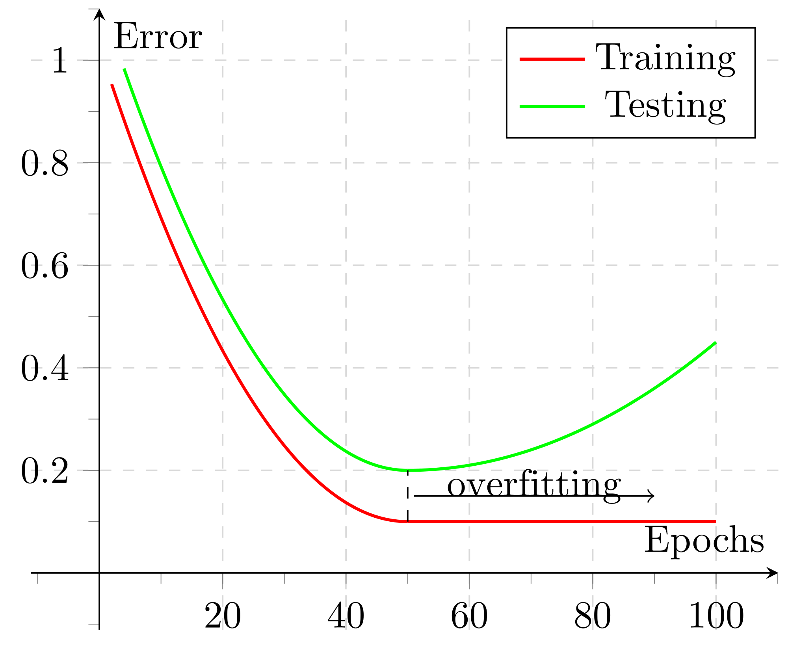

# Homework - Python Spark ML（六）：Decision Tree Algorithm Survey

## 【題目連結】
### [Python Spark ML（六）：Decision Tree Algorithm Survey](http://hemingwang.blogspot.tw/2017/09/python-spark-mldecision-tree-algorithm.html)

<table style="width:95%; text-align:center; vertical-align:middle; border: 5px dotted #BACAC6;">
<tr>
<!------------------------------------------------------>
<th colspan="7" align="center">Comparison of Classification Tree Methods. A Check Mark Indicates Presence of a Feature[12]</th>
<!------------------------------------------------------>
</tr>
<tr>
<!------------------------------------------------------>
<td style="width:25%;">Feature						</td>
<td style="width:25%;">C4.5							</td>
<td style="width:25%;">CART（Classification And Regression Tree）	</td>
<td style="width:25%;">CHAID						</td>
<td style="width:25%;">CRUISE（Classification Rule with Unbiased Interaction Selection and Estimation）	</td>
<td style="width:25%;">GUIDE （Generalized, Unbiased, Interaction Detection and Estimation）	</td>
<td style="width:25%;">QUEST（Quick, Unbiased, Efficient, Statistical Tree）	</td>
<!------------------------------------------------------>
</tr>
<tr>
<!------------------------------------------------------>
<td>Unbiased Splits（切割是否不偏倚）					</td>
<td>												</td>
<td>												</td>
<td>												</td>
<td>✓												</td>
<td>✓												</td>
<td>✓												</td>
<!------------------------------------------------------>
</tr>
<tr>
<!------------------------------------------------------>
<td>Split Type（切割方式）							</td>
<td>Univariate										</td>
<td>Univariate、	Linear								</td>
<td>Univariate										</td>
<td>Univariate、	Linear								</td>
<td>Univariate、	Linear								</td>
<td>Univariate、	Linear								</td>
<!------------------------------------------------------>
</tr>
<tr>
<!------------------------------------------------------>
<td>Branches／Split（可允許的分支數或分割數）			</td>
<td>≧ 2												</td>
<td>2												</td>
<td>≧ 2												</td>
<td>≧ 2												</td>
<td>2												</td>
<td>2												</td>
<!------------------------------------------------------>
</tr>
<tr>
<!------------------------------------------------------>
<td>Interaction Tests								</td>
<td>												</td>
<td>												</td>
<td>												</td>
<td>✓												</td>
<td>✓												</td>
<td>												</td>
<!------------------------------------------------------>
</tr>
<tr>
<!------------------------------------------------------>
<td>Pruning（是否可修剪）								</td>
<td>✓												</td>
<td>✓												</td>
<td>												</td>
<td>✓												</td>
<td>✓												</td>
<td>✓												</td>
<!------------------------------------------------------>
</tr>
<tr>
<!------------------------------------------------------>
<td>User-Specified Costs							</td>
<td>												</td>
<td>✓												</td>
<td>✓												</td>
<td>✓												</td>
<td>✓												</td>
<td>✓												</td>
<!------------------------------------------------------>
</tr>
<tr>
<!------------------------------------------------------>
<td>User-Specified Priors							</td>
<td>												</td>
<td>✓												</td>
<td>												</td>
<td>✓												</td>
<td>✓												</td>
<td>✓												</td>
<!------------------------------------------------------>
</tr>
<tr>
<!------------------------------------------------------>
<td>Variable Importance Ranking						</td>
<td>												</td>
<td>✓												</td>
<td>												</td>
<td>												</td>
<td>✓												</td>
<td>												</td>
<!------------------------------------------------------>
</tr>
<tr>
<!------------------------------------------------------>
<td>Node Models										</td>
<td>Constant										</td>
<td>Constant										</td>
<td>Constant										</td>
<td>Constant、Linear Discriminant					</td>
<td>Constant、Kernel Density、Nearest Neighbor		</td>
<td>Constant										</td>
<!------------------------------------------------------>
</tr>
<tr>
<!------------------------------------------------------>
<td>Bagging（Bootstrap Aggregating）& Ensemble Methods	</td>
<td>												</td>
<td>												</td>
<td>												</td>
<td>												</td>
<td>✓												</td>
<td>												</td>
<!------------------------------------------------------>
</tr>
<tr>
<!------------------------------------------------------>
<td>Missing Values									</td>
<td>Probability Weights								</td>
<td>Surrogate Splits								</td>
<td>Missing Value Branch							</td>
<td>Missing Value Imputation、Surrogate Splits		</td>
<td>Missing Value Category							</td>
<td>Missing Value Imputation						</td>
<!------------------------------------------------------>
</tr>
</table>

## 【My Answer】

> 因自身是機器學習初學者，此份作業參考各方資料並加入自己的理解，若有誤還請多指教（建立 Github Issue 來協助我修正），謝謝。

### Unbiased Splits

[01] Breiman 等人（1984）注意到，當使用吉尼係數作為切割方法時，“會偏向於具有更多價值的變數作為切割變數”。例如，如果目標變數是序數或名義尺度，則變數選擇會偏向較高數量類別。

[02] CART 偏向於選擇具有更多遺漏值（Missing Values）的變數。此問題不是 CART 獨有的。在設計演算法時，必須注意考慮遺漏值（Missing Values）對選擇偏差（Bias）的影響。

Loh 和 Shih（1997）表明，要避免選擇偏差（Bias）的關鍵是「將變數選擇與切割點選擇區分開來」。例如，為了找到 X ∈ S 形式的二元分割，需先選擇 X，然後再搜尋集合 S。此法與同時去找 X 和 S 的貪婪搜尋法（節點亂度（Impurity）最小化）不同。

[03]「QUEST（Quick, Unbiased, Efficient, Statistical Tree）快速不偏有效統計樹」
此方法為 Loh and Shih 於 1997 年提出的分類樹，此法修正了二元判別分析，改善了 CART 的缺點，提升效率且變數切割上能夠不偏倚（Unbiased）。

[04] QUEST 方法在切割的時候， 連續數值切割（e.g.：氣溫、高度、體重等）和 FACT 方法一樣基於 F-Test， 但是離散數值切割（e.g.：大中小、是或否、0 或 1 等）是基於 χ2-Test 的。 在 QUEST 中遺漏值（Missing Value）處理比較簡單，就是用插值（Imputation）法。

[04]「CRUISE（Classification Rule with Unbiased Interaction Selection and Estimation）具不偏互動選拔估值分類法則之統計樹」
此法繼承了 QUEST 的 F-Test（連續數值）和 χ2-Test（離散數值）的切割， 且引入了 2D 的特徵劃分方式：兩兩屬性間都要進行 5 次測試（2 次 Marginal Tests 和 3 次 Interaction Tests）。屬性切割也有所改進， 先進行 Box-Cox Transformation（可將屬性切割成二元或多個分支）預處理， 再進行 Linear Discriminant Analysis 切割。CRUISE 採用 CART 處理 Missing Value 的 Surrogate Splitting 方法。

[04]「GUIDE （Generalized, Unbiased, Interaction Detection and Estimation）泛化不偏互動檢驗估值統計樹」
GUIDE 更像 QUEST 和 CART 的 Bagging 版。GUIDE 繼承了 QUEST 和 CRUISE 的特徵切割方法，但加入了 Variable Importance 的排序（按閾值選擇部分特徵集）。且 GUIDE 和 CART 類似可使用 Regression 算法。 由於受到 Random Forest 的影響，GUIDE 內建了 Bagging 二種機制（Random Forest 和 Extremely Randomized Trees）。 但 GUIDE 中的 Missing Value 處理並非採 CART 的處理方式， 而是將 Missing Value 看成一類特殊的單獨類別，此類別根據自身的數據類型，視為具有插值的 mean（連續型數值屬性），或是常量（符號型 or 類別屬性）。

### Split Type（切割方式）

[04] 是參考一個屬性還是參考多個屬性來進行切割
參考一個屬性進行切割的有：C4.5、CART、CHAID、QUEST、CRUISE
參考多個屬性進行切割的有：CART、QUEST、CRUISE

### Branches／Split

決策樹進行節點切割後可允許的分支數或分割數。

### Interaction Tests

[05] 可否檢測不同屬性間是否相依。
例如：不同物種間於不同氣溫下的體溫變化、中風的嚴重程度和治療時恢復的影響、烘培溫度和時間對餅乾的影響。

### Pruning（是否可修剪）

[06] 在決策樹建立後，是否可用樹的修剪（tree-pruning）步驟來縮減決策樹的大小。決策樹如果太大，很容易造成過度學習（overfitting）。所以修剪樹將有助於改善決策樹預測的能力。
[07] 根據簡單原則（又稱奧卡姆剃刀原則 Occam's Razor），如果兩個模型具有相同的整體錯誤率（or 母體錯誤率），此時選擇較簡單的模型是較佳的，且較複雜的模型有可能是資料雜訊所造成的過度配適（Overfitting）現象。如果發生過度配適（Overfitting）問題，則可使用事後修剪法（Post-Pruning）或事前修剪法（Pre-Pruning）來修正。
事後修剪法（Post-Pruning）：所有的修剪決策是基於一棵已建構完的決策樹，所以需要花費額外的計算成本。
事前修剪法（Pre-Pruning）：在建構決策樹的過程中就中斷建構，雖計算成本較低，但必須承擔較差的終止所造成的影響。而實務上使用此修剪法。

### User-Specified Costs 及 User-Specified Priors

[08][09] 允許使用者手動調整 Misclassification Costs（分類錯誤成本）及 Class Prior Probabilities（類別先驗概率），調整後會改變建構決策樹節點的切割方式和類別分配
我們可以根據不同類別預期用途，來調整 Misclassification Costs（分類錯誤成本）。
我們可以根據被抽樣對象的屬性特徵，來調整 Class Prior Probabilities（類別先驗概率）。

### Variable Importance Ranking

[04] CART 首先提出並使用了 Variable Importance Ranking 衡量屬性特徵權重的概念。此法可幫助我們選擇出重要的特徵。但需注意的是 Variable Importance Ranking 權重是隨著樹的變化而不同的， 所以不同樹間的 Variable Importance Ranking 無法互相比較。
會對屬性進行重要性排序的演算法為：CART、GUIDE。
不會對屬性進行重要性排序的演算法：C4.5、CHAID、QUEST、CRUISE。

### Node Models

[10] 由於決策樹的整體複雜度 = 決策樹的結構複雜度 + 決策樹子集節點模型（Node Models）複雜度，所以隨著決策樹子集節點模型（Node Models）的複雜度增加，決策樹的結構的複雜度會降低。因此，我們可以透過選擇不同的子集節點模型（Node Models），來調整決策樹的結構複雜度。

一般情況下，所有的算法的每個節點都適合使用 Constant Model 來分割，而 CRUISE 可以選擇 Linear Discriminant Model 來切割，GUIDE 可以選擇 Kernel Density Model 和 Nearest Neighbor Models 來分割。

### Bagging（Bootstrap Aggregating）& Ensemble Methods

[10][11] Ensemble Methods（集成法）：根據簡單原則（又稱奧卡姆剃刀原則 Occam's Razor）：「簡單的方法，勝過複雜的方法」。而 Ensembles 是一種將多個簡單模型（如：ID3、C4.5、CART 等方法）組合起來以取得更好表現的一種方法，它的效果比一個複雜的模型更佳。

[12] GUIDE 可使用 Bagging[13] 及 Random Forest[14] 方法來產生 Ensemble 模型。

[15]
Bagging（Bootstrap Aggregating，裝袋算法）：使用訓練樣本的多組子集合來建立多棵決策樹的方法。
Random Forest（隨機森林法）：是 bagged 決策樹的一個延伸。從訓練樣本中使用可放回的抽樣法來構建決策樹，但減少每個分類器之間的相關度。也就是說，不是貪婪地選取最佳的分割點，而是隨機地選擇特徵子集合來建立切割點。

[16]
Bagging（裝袋算法）：相當於多個專家投票表決，對於多次測試，每個樣本返回的是多次預測結果較多的那個。
Random Forest（隨機森林法）：是多個隨機決策樹平均組合起來，以達到較優分類準確率的模型。

### Missing Values

[17] 在處理遺漏值（Missing Value）時，大多數的人都會「直接移除資料」或是用「平均值來填補遺漏值」，但前者會讓資料減少，後者則不會產生任何資訊。
因此遺漏值處理最推崇「k-Nearest Neighbours」或「mice（Multivariate Imputation via Chained Equations）」方法進行「模擬遺漏值」後，再進行「填補（impute）」。

[09][10] 一般情況下，所有的算法都支援不同的遺漏值（Missing Value）處理。
CART 和 CRUISE 使用 Surrogate Splits：透過觀察 Missing Value 的切割值，會在切割效果不佳時使用其他的變數來取代分割。
CRUISE 及 QUEST 使用 Missing Value Imputation：透過插值法來處理 Missing Value。
C4.5 使用 Probability Weights：透過計算 Missing Value 在不同分支中的權重，找到最佳切割位置。
GUIDE 使用 Missing Value Category：將 Missing Value 視為獨立的特殊類別。
CHAID 使用 Missing Value Branch：將 Missing Value 視為獨立的特殊分支。

## 【References】

- [01] Strobl, Boulesteix, Augustin, "Unbiased split selection for classification trees based on the Gini Index", 2005, [https://epub.ub.uni-muenchen.de/1833/1/paper_464.pdf](https://epub.ub.uni-muenchen.de/1833/1/paper_464.pdf "https://epub.ub.uni-muenchen.de/1833/1/paper_464.pdf")
- [02] Hyunjoong Kim and Wei-Yin Loh, "Classification Trees With Unbiased Multiway Splits", 2001, [http://www.stat.wisc.edu/~loh/treeprogs/cruise/cruise.pdf](http://www.stat.wisc.edu/~loh/treeprogs/cruise/cruise.pdf "http://www.stat.wisc.edu/~loh/treeprogs/cruise/cruise.pdf")
- [03] 雲端資料分析暨導引系統，「快速不偏有效統計樹」，[http://www.r-web.com.tw/stat/step1.php?method=tree_quest](http://www.r-web.com.tw/stat/step1.php?method=tree_quest "http://www.r-web.com.tw/stat/step1.php?method=tree_quest")
- [04] CodingFish，「決策樹會有哪些特性？」，[http://www.jianshu.com/p/338939130b24](http://www.jianshu.com/p/338939130b24 "http://www.jianshu.com/p/338939130b24")
- [05] Wikipedia, Interaction (statistics), [https://en.wikipedia.org/wiki/Interaction_(statistics)](https://en.wikipedia.org/wiki/Interaction_(statistics) "https://en.wikipedia.org/wiki/Interaction_(statistics)")
- [06] Pang-Ning Tan、Michael Steinbach、Vipin Kumar 著，施雅月、賴錦慧譯，「資料探勘」，歐亞書局，ISBN-13：9789861546575
- [07] 杜逸寧博士，ShareCourse SP31009 資料科學家，[http://www.sharecourse.net/sharecourse/course/view/courseInfo/1137](http://www.sharecourse.net/sharecourse/course/view/courseInfo/1137 "http://www.sharecourse.net/sharecourse/course/view/courseInfo/1137")
- [08] "Discrimination Among Groups Classification (and Regression) Trees", Page 36-38, [http://www.umass.edu/landeco/teaching/multivariate/schedule/discriminate3.pdf](http://www.umass.edu/landeco/teaching/multivariate/schedule/discriminate3.pdf "http://www.umass.edu/landeco/teaching/multivariate/schedule/discriminate3.pdf")
- [09] Wei-Yin Loh, "Classification and Regression Tree Methods", [http://www.stat.wisc.edu/~loh/treeprogs/guide/eqr.pdf](http://www.stat.wisc.edu/~loh/treeprogs/guide/eqr.pdf "http://www.stat.wisc.edu/~loh/treeprogs/guide/eqr.pdf")
- [10] Wayne Chen，「SlideShare - Ensembling & Boosting 概念介紹」，[https://www.slideshare.net/wjmuse/ensembling-boosting](https://www.slideshare.net/wjmuse/ensembling-boosting "https://www.slideshare.net/wjmuse/ensembling-boosting")
- [11] Wikipedia, "Decision tree learning", [https://en.wikipedia.org/wiki/Decision_tree_learning](https://en.wikipedia.org/wiki/Decision_tree_learning "https://en.wikipedia.org/wiki/Decision_tree_learning")
- [12] Wei-Yin Loh, "Classification and regression trees", [http://www.stat.wisc.edu/~loh/treeprogs/guide/wires11.pdf](http://www.stat.wisc.edu/~loh/treeprogs/guide/wires11.pdf "http://www.stat.wisc.edu/~loh/treeprogs/guide/wires11.pdf")
- [13] 維基百科，「Random Forests 隨機森林」，[https://zh.wikipedia.org/wiki/随机森林](https://zh.wikipedia.org/wiki/%E9%9A%8F%E6%9C%BA%E6%A3%AE%E6%9E%97 "https://zh.wikipedia.org/wiki/%E9%9A%8F%E6%9C%BA%E6%A3%AE%E6%9E%97")
- [14] 維基百科，「Bagging 引導聚集算法／裝袋算法」，[https://zh.wikipedia.org/wiki/Bagging算法](https://zh.wikipedia.org/wiki/Bagging%E7%AE%97%E6%B3%95 "https://zh.wikipedia.org/wiki/Bagging%E7%AE%97%E6%B3%95")
- [15] coolspider2015，「簡書 - scikit-learn系列之如何做算法集成」，[http://www.jianshu.com/p/15a6611f1896](http://www.jianshu.com/p/15a6611f1896 "http://www.jianshu.com/p/15a6611f1896")
- [16] 劉帝偉，「機器學習-組合算法總結」，[http://www.csuldw.com/2015/07/22/2015-07-22%20%20ensemble/](http://www.csuldw.com/2015/07/22/2015-07-22%20%20ensemble/ "http://www.csuldw.com/2015/07/22/2015-07-22%20%20ensemble/")
- [17] skydome20，「R 筆記 –（10）遺漏值處理（Impute Missing Value）」，2016，[https://rpubs.com/skydome20/R-Note10-Missing_Value](https://rpubs.com/skydome20/R-Note10-Missing_Value "https://rpubs.com/skydome20/R-Note10-Missing_Value")
- [18] Mirage Chung，「Python Spark ML 作業六解答」，[https://github.com/mirage7714/python_spark_ml/wiki/python_spark_ml-homework-4:-Decision-Tree-Syntax](https://github.com/mirage7714/python_spark_ml/wiki/python_spark_ml-homework-4:-Decision-Tree-Syntax "https://github.com/mirage7714/python_spark_ml/wiki/python_spark_ml-homework-4:-Decision-Tree-Syntax")
- [19] 吳政龍，「Python Spark ML 作業六解答」，[https://raw.githubusercontent.com/ZhengLungWu/For_MachineLearning/master/hw5%20for%20ML.txt](https://raw.githubusercontent.com/ZhengLungWu/For_MachineLearning/master/hw5%20for%20ML.txt "https://raw.githubusercontent.com/ZhengLungWu/For_MachineLearning/master/hw5%20for%20ML.txt")
