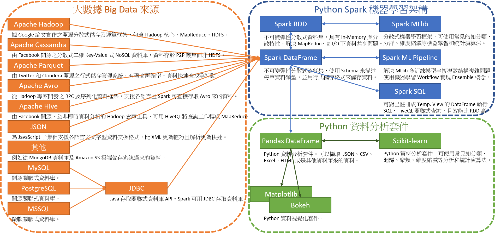
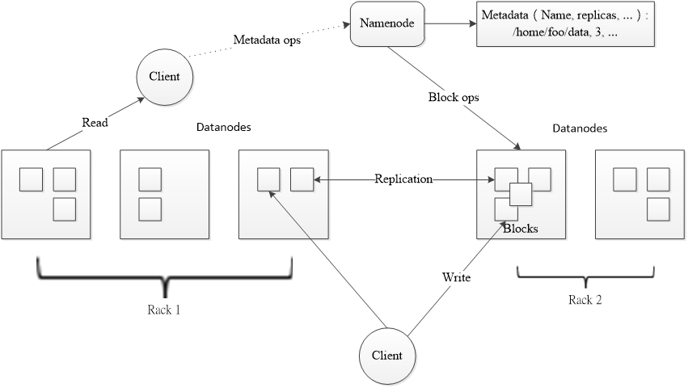
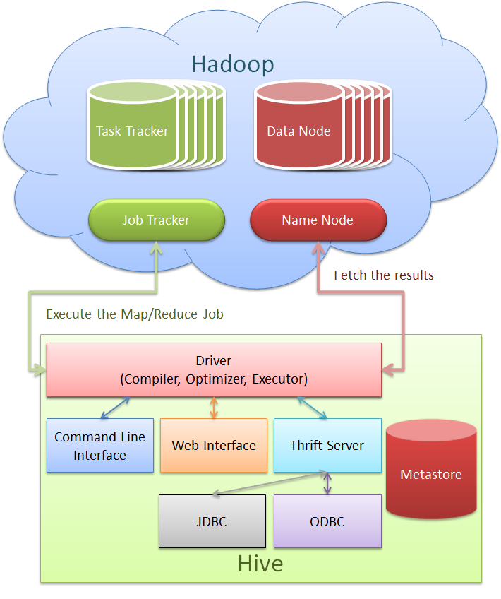

# Homework - Python Spark ML（七）：Python Hadoop Spark

## 【題目連結】
### [Python Spark ML（七）：Python Hadoop Spark](http://hemingwang.blogspot.tw/2017/09/python-spark-mlpython-hadoop-spark.html)

## 【My Answer】

> 因自身是機器學習初學者，此份作業參考各方資料並加入自己的理解，若有誤還請多指教（建立 Github Issue 來協助我修正），謝謝。

### Spark RDD（Resilient Distributed Datasets）[04][05][06][08]

1. RDD 資料儲存在叢集 Memory 內。使用 Lineage、Checkpoint 機制來進行容錯。
2. Lineage：因 RDD 為 Immutable（被建立後即無法被修改）資料集，當某個 Memory 節點故障，RDD 可透過 Lineage 機制找回此故障節點 RDD 與其父代 RDD reference 間的關聯運算方式，經重新計算後取得失去的資料。
3. Checkpoint：使用者可視所需（如高成本運算、Spark Streaming 中的 Update 操作等）指定 Checkpoint 節點，Checkpoint 節點會將 Memory 資料複製至檔案系統中，故障發生後據此節點恢復資料。但 RDD 於 20140831 無自動設置 Checkpoint 節點機制
4. RDD 可進行「轉換（Transformation）」、「動作（Action）」及「持久化（Persistence）」三種操作。
5. 「轉換（Transformation）」：透過 Lazy 算法（當 Action 進行時才會實際執行 Transformation）將當前 RDD 轉換傳遞至另一個 RDD 節點，但不會真正執行運算。如 reduceByKey 方法函數。
6. 「動作（Action）」：在 RDD 上進行運算後，將結果傳回至 Spark 的驅動程序，或寫至檔案系統內。如 reduce 方法函數。
7. 「持久化（Persistence）」：對於經常使用的 RDD，可以使用 Persistence 操作讓 RDD 常駐在記憶體中。
8. Spark 2.0 之後 Spark Session 包含了 Spark Context、Streaming Context、SQL Context、Hive Context 功能，即可統一使用 Spark Session 創建 RDD 或 DataFrame。

### Spark DataSet[01][02][09][10]

1. 類似於 Spark RDD 彈性分散式資料集。
2. 使用專門的 Encoder（而非 Java Serialization 或 Kryo）將資料動態序列化（Serialize）成 Bytes 型式，以透過網路進行傳輸及處理。但使用者不需額外將 Bytes 反序列化回原始資料，即可透過 Spark 進行過濾（Filtering）、排序（Sorting）和雜湊（Hashing）等操作。
3. 因 Spark 2.0 之後 Spark DataFrame 成為 Spark Dataset 的子集合。故 API 使用順序建議為 Spark DataSet → Spark DataFrame → Spark RDD，但 Python、R 非編譯時類型安全（No Compile Time Type Safety）語言，故只能使用 Spark DataFrame API（Scala、Java 則可使用 Spark DataSet API）。

### Spark DataFrame[03][07][08][11][20]

1. 受 Python Pandas 套件啟發，所設計的資料處理架構。
2. 為不可變彈性分散式資料集，儲存資料的方式與關聯式資料庫中的 Table、Python Pandas DataFrame 或 Excel 裡的 Sheet 類似。
3. 需先使用 Schema 來描述每筆資料類型，並用列式儲存格式來儲存資料。
4. 可對已存在的 RDD、Apache Parquet 文件、JSON 數據、Apache Hive Table 或其他資料來源來建立 Spark DataFrame。
5. 可使用類似 SQL 的方法（如 select()、groupby()、count()）進行操作。
6. 因 Spark DataFrame 使用 Catalyst 優化器優化，執行效能比直接操作 RDD 更快。
7. Spark 2.0 之後 Spark DataFrame 成為 Spark Dataset 的子集合。但 Python、R 非編譯時類型安全（No Compile Time Type Safety）語言，故只能使用 Spark DataFrame API（Scala、Java 則可使用 Spark DataSet API）。
8. Spark 2.0 之後 Spark Session 包含了 Spark Context、Streaming Context、SQL Context、Hive Context 功能，即可統一使用 Spark Session 創建 RDD 或 DataFrame。

### Spark SQL[03][07][11]

1. Spark SQL 模組核心為 Spark DataFrame（之前叫 Spark SchemaRDD）。
2. Spark SQL 允許對已註冊為 SQL Temporary View 的 Spark DataFrame 執行 SQL、HiveQL 等關聯式查詢。
3. 因 Spark SQL 使用 Catalyst 優化器優化，執行效能比直接操作 RDD 更快。

### Spark MLlib - RDD-based API[11]

1. 是 Spark 上分散式機器學習框架。
2. MLlib 可使用許多常見的機器學習和統計演算法，包含：

	- 彙總統計、相關性、分層抽樣、假設檢定、隨機資料生成
	- 分類與回歸：支援向量機、回歸、線性回歸、決策樹、樸素貝葉斯
	- 協同過濾：ALS
	- 分群：k-平均演算法
	- 維度縮減：奇異值分解（SVD），主成分分析（PCA）
	- 特徵提取和轉換：TF-IDF、Word2Vec、StandardScaler
	- 最佳化：隨機梯度下降法（SGD）、L-BFGS

### Spark ML Pipeline[13][20][21]

1. 受 Python Scikit-Learn 套件啟發，所設計機器學習架構。
2. ML Pipeline 解決了 MLlib 多個訓練模型串接導致結構複雜的問題，ML Pipeline 可輕易實現 Ensemble（集成學習）[19]多個機器學習算法順序執行的思想。
3. DataFrame：ML Pipeline 的訓練資料、測試資料、預測結果、資料的特徵向量、標籤等數據均儲存在 Spark DataFrame 中。
4. Transformer：將一個 DataFrame 轉換至另一個 DataFrame，如將原始資料 DataFrame 轉換至特徵向量 DataFrame。
5. Estimator：使用 fit 方法在 DataFrame 內執行 Transformer。一個機器學習演算法即一個 Estimator，會在 DataFrame 上進行訓練以取得新的 DataFrame。
6. Pipeline：串聯多個 Transformer 與 Estimator 形成 ML 機器學習的 Workflow 工作流程。
7. Parameter：所有的 Transformer 和 Estimator 共享一個公用的 Parameter API 來指定參數。
8. ML Pipeline 每一個階段（Stages）都會有一個唯一的 ID（Unique Pipeline Stage）。

### Spark GraphX[11]

1. 是 Spark 上的分散式圖形處理框架。
2. 可用於表達圖表計算，並可以模擬 Pregel 抽象化。GraphX 還對這種抽象化提供了優化運行。

### Spark Streaming[11]

1. 充分利用 Spark 核心的快速排程能力來執行串流分析。
2. Spark Streaming 擷取小批次資料並對之執行 RDD 轉換（Transformation）操作。
3. 可使用專門用於批次分析而設計的程式，來進行即時串流分析。從而實現了 Lambda 即時大數據處理架構[12]。
4. 對即時資料串流的處理具有可擴充性、高吞吐量、可容錯性等特點。

### Python Pandas 套件 DataFrame 資料結構[22][23]

1. Spark DataFrame 受 Python Pandas 套件啟發，設計出 DataFrame 資料處理架構。
2. Pandas 為 2009 年底開源的 Python 的數據分析 Library，提供 Series（處理時間序列數據）與 DataFrame（處理結構化數據）資料結構。
3. Pandas DataFrame 可以擷取  JSON、CSV、Excel、HTML 或是其他資料庫來的資料。
4. Pandas DataFrame 可以使用 Row 或 Column 存取資料，以快速進行如資料補值，去除空值或取代等資料的前處理。
5. Pandas DataFrame 可以將處理後的資料存回至其他資料庫。

### Python Scikit-learn 套件[24]

1. 是一個 Python 機器學習領域的開源套件。
2. Python Scikit-learn 可使用許多常見的機器學習和統計演算法，包含：分類（Classification），迴歸（Regression）和聚類（Clustering，如支援向量機、隨機森林、梯度提升、k- mean、DBSCAN 等）、維度縮減（Dimensionality reduction）、模型選定（Model selection）、資料預處理（Preprocessing）等演算法。

### Python Matplotlib 套件[25]

1. 是一個 Python 繪圖及 NumPy 的擴展套件。

### Python Bokeh 套件[26]

1. 是一個 Python 互動式視覺化套件。

### Apache Hadoop

1. Apache Hadoop 是一款支援大型叢集內運作的資料密集型分散式應用程式。
2. Hadoop 根據 Google 發表的 MapReduce 和 Google 檔案系統的論文自行實作而成。
3. 所有的 Hadoop 模組都有一個基本假設，即硬體故障是常見情況，應該由框架自動處理。

### Hadoop HDFS

1. 對於分散式的資源與檔案管理系統 HDFS 具有高容錯性，且可部署於低價的硬體裝置上，處理大量資料的讀寫。
2. HDFS 是一個主/從（Master／Slave）的結構，Master 的伺服器上作為一個名稱節點（Namenode），負責維護與管理檔案系統的操作，例如：檔案的建立、刪除等，都是透過 Namenode 來管制。
3. 其餘實際儲存檔案區塊（Block）及記錄檔案區塊中介資料（Metadata）的 Slave 伺服器則為資料節點（Datanode）。
4. Namenode、Datanode、及 Client 是以 TCP／IP 協定進行通訊，當 Client 寫入資料時，先於本機快取資料。一旦快取的資料達到預設的區塊單位時，Client 通知 Namenode，由 Namenode 安排適當的 Datanode 儲存區塊資料，並將 Datanode 的位置資訊及對應的資料區塊告知 Client，Client 即可有效的寫入與讀取資料。
5. HDFS 對資料是以串流式的方式存取，且存取的特性為單次寫入多次讀取（Write-Once-Read-Many），檔案，一旦建立就不允許修改。將檔案以區塊為單位分散儲存與異地備份，可確保資料的正確性。
6. HDFS 的設計有考慮資料的位置，因此資料的運算作業可以移至資料所在位置進行，效能遠高於將資料移動到運算端，可提升整體資料運算的服務質量。

### Hadoop MapReduce

1. MapReduce  可簡化分散式程式模型的設計，提升分散式計算資料的分散與整合的反應速度。MapReduce 的設計模式是將要執行的程式分為映射（Map）及化簡（Reduce）兩種函數：

	- Map ( K_1, V_1 ) → List ( K_2, V_2 )

	- Reduce ( K_2, List ( V_2 ) ) → List ( V_2 )

2. 先透過 Map 函數將資料切割成無關聯性的區塊，分配給分散式環境中的伺服器進行平行計算。Map 函數的輸入是一個 Key／Value 序對，輸出則為另一組 Intermediate Key／Value 序對。
3. Reduce 函數將相同的 Intermediate Key 合併其所有相關聯的 Intermediate Value，並產生輸出結果的 Key／Value 序對，即為計算處理的結果。
4. 未經處理的資料（V_1）經過 Map 函數的處理後，再經 Reduce 函數處理即成為精簡明確的資料（V_2）。
5. 以 MapReduce 設計的程式交由 Master  與 Worker，並由 Master 配置執行 Map 及 Reduce 的 Worker。
6. 當處理的資料輸入時，將資料以區塊方式分配置執行 Map 的 Worker 處理並儲存。
7. 執行 Reduce 的 Worker 則遠端讀取 Map 的結果，進行 Reduce 的工作，彙整與排序資料後，輸出運算完成的資料。
8. 為了提升 MapReduce 的效能及 Bug 修復，從 Hadoop 0.23.0 起重建了 MapReduce 的架構，並更名為 Hadoop Yarn[27]。

### Hadoop HBase

1. HBase 為 Hadoop 平台中的資料儲存系統，其實作了 Google 所提出的分散式結構化資料儲存系統 – Bigtable，為一種在分散環境中儲存大量資料的有效機制，是以物件導向的原理設計，運行於 HDFS。
2. 在 HBase 中，資料儲存的結構是以類似表格的方式，將資料組織成行、列、表等多維度的資料表，具有良好的延伸性與可用性。
3. 在 HBase 中的資料表可切割成數份，儲存或部署至數個運算節點上，由數個 HDFS 檔案與區塊所組成。
4. 關聯式資料庫（Relational Database）適用做資料異動，例如：新增（CREATE）、更新（UPDATE）、刪除（DELETE）等操作，這些動作主要在記憶體中進行。對於大量的資料分析，資料分散在多個節點的情況下，關聯式資料庫系統就較不適用。因此，HBase 的設計並非傳統的關聯式資料庫系統，在許多設計上簡化耗記憶體資源的操作，例如：表格只有一個索引，沒有 Join 的功能、不提供 SQL 語法執行、且只有位元組（Byte）一種資料型態，以符合分散式的巨量資料有效即時的讀取。
5. 因為 HBase 的限制，對於傳統資料庫開發人員有許多不利的影響，諸如要花費額外的教育訓練來了解不同的資料表架構；故亦有提出支援 SQL 結構化查詢語言的雲端資料庫，如 Hive。

### Hadoop Hive

1. Hive 為社群網站 Facebook 捐贈給 Apache 之 Hadoop 專案的子項目，建立於 Hadoop 之上。
2. Hive 資料庫會將使用者所建立的表（Table）整理成檔案型式儲存於 Hadoop 檔案系統（HDFS）之中，透過 Hive 所提供的工具，可以輕易地分析 HDFS 中大規模的資料庫檔案。
3. Hive 亦定義了 HiveQL – 一種類似 SQL 結構化查詢語言；允許熟悉 SQL 的使用者查詢資料，並將使用者所提出的查詢請求拆解成不同的 Map／Reduce 工作，快速回覆結果。但是由於資料庫建立在 HDFS 之中，所以遵守了「Write-Once-Read-Many」，單一檔案建立之後了就不允許再修改的限制，故 HiveQL 在設計上即不支援 SQL 語言中單筆資料的上傳、插入與刪除語法。

## 【References】

- [01] Apache Spark, "Spark SQL, DataFrames and Datasets Guide", [https://spark.apache.org/docs/latest/sql-programming-guide.html](https://spark.apache.org/docs/latest/sql-programming-guide.html)
- [02] JackieYeah，「【Spark 2.0官方文檔】Spark SQL、DataFrames以及Datasets指南」，[https://my.oschina.net/jackieyeah/blog/745314](https://my.oschina.net/jackieyeah/blog/745314)
- [03]「GitBook - Spark 編程指南繁體中文版」，[https://www.gitbook.com/book/taiwansparkusergroup/spark-programming-guide-zh-tw/details](https://www.gitbook.com/book/taiwansparkusergroup/spark-programming-guide-zh-tw/details)
- [04] yjhyjhyjh0，「痞客邦 - Spark RDD (Resilient Distributed Datasets) 詳細圖文介紹」，[http://yjhyjhyjh0.pixnet.net/blog/post/411468760-spark-rdd-%28resilient-distributed-datasets%29-詳細圖文介](http://yjhyjhyjh0.pixnet.net/blog/post/411468760-spark-rdd-%28resilient-distributed-datasets%29-%E8%A9%B3%E7%B4%B0%E5%9C%96%E6%96%87%E4%BB%8B)
- [05] 張逸，「InfoQ - 理解Spark的核心RDD」，[http://www.infoq.com/cn/articles/spark-core-rdd/](http://www.infoq.com/cn/articles/spark-core-rdd/)
- [06] 王建興，「分散式計算的新角色Spark」，[https://www.ithome.com.tw/voice/94139](https://www.ithome.com.tw/voice/94139)
- [07] litaotao，「7. 使用 Spark DataFrame 進行大數據分析」，[http://litaotao.github.io/spark-dataframe-introduction](http://litaotao.github.io/spark-dataframe-introduction)
- [08] 俠天，「Apache Spark 2.0 三種 API 的傳說：RDD，DataFrame 和 Dataset」，[https://toutiao.io/posts/sxr241/preview](https://toutiao.io/posts/sxr241/preview)
- [09] 明翼，「簡書 - Spark SQL DataFrame和DataSet」，[http://www.jianshu.com/p/a19486f5a0ea](http://www.jianshu.com/p/a19486f5a0ea)
- [10] 足下，「且談Apache Spark的API三劍客：RDD、DataFrame和Dataset」，[http://www.infoq.com/cn/articles/three-apache-spark-apis-rdds-dataframes-and-datasets](http://www.infoq.com/cn/articles/three-apache-spark-apis-rdds-dataframes-and-datasets)
- [11] 維基百科，「Apache Spark」，[https://zh.wikipedia.org/wiki/Apache_Spark](https://zh.wikipedia.org/wiki/Apache_Spark)
- [12] 星環科技，「技術｜深入淺出解析大數據 Lambda 架構」，[https://ask.hellobi.com/blog/transwarp/5107](https://ask.hellobi.com/blog/transwarp/5107)
- [13] shohokuooo，「簡書 - Spark MLlib學習——綜述和Pipeline」，[http://www.jianshu.com/p/27db1f14e21a](http://www.jianshu.com/p/27db1f14e21a)
- [14] AETHS，「Spark.ML之PipeLine學習筆記」，[http://www.cnblogs.com/kongchung/p/5776727.html](http://www.cnblogs.com/kongchung/p/5776727.html)
- [15] 足下，「用Apache Spark做大數據處理——第五部分：Spark機器學習數據流水線」，[http://www.infoq.com/cn/articles/apache-sparkml-data-pipelines](http://www.infoq.com/cn/articles/apache-sparkml-data-pipelines)
- [16] 王龍，「使用 ML Pipeline 構建機器學習工作流」，[https://www.ibm.com/developerworks/cn/opensource/os-cn-spark-practice5/index.html](https://www.ibm.com/developerworks/cn/opensource/os-cn-spark-practice5/index.html)
- [17] 劉玲源，「Pipeline詳解及Spark MLlib使用」，[https://zhuanlan.zhihu.com/p/24311565](https://zhuanlan.zhihu.com/p/24311565)
- [18] JackieYeah，「【Spark 2.0系列】：Spark Session API和Dataset API」，[https://bigdata-ny.github.io/2016/08/15/spark-two-series-part-1/](https://bigdata-ny.github.io/2016/08/15/spark-two-series-part-1/)
- [19] Mirage Chung，「Python Spark ML 作業六解答」，[https://github.com/mirage7714/python_spark_ml/wiki/python_spark_ml-homework-4:-Decision-Tree-Syntax](https://github.com/mirage7714/python_spark_ml/wiki/python_spark_ml-homework-4:-Decision-Tree-Syntax "https://github.com/mirage7714/python_spark_ml/wiki/python_spark_ml-homework-4:-Decision-Tree-Syntax")
- [20] 林大貴，「博碩出版社 - Python+Spark 2.0+Hadoop機器學習與大數據分析實戰」，ISBN-13：9789864341535
- [21] 小白二號，「ML Pipelines（ML管道）」，[http://cwiki.apachecn.org/pages/viewpage.action?pageId=2886339](http://cwiki.apachecn.org/pages/viewpage.action?pageId=2886339)
- [22] Ben Shiue，「[Python] Pandas 基礎教學」，[https://oranwind.org/python-pandas-ji-chu-jiao-xue/](https://oranwind.org/python-pandas-ji-chu-jiao-xue/)
- [23] Jerry，「傑瑞窩在這 - [Python] 使用 Pandas 來撈資料」，[https://jerrynest.io/python-pandas-get-data/](https://jerrynest.io/python-pandas-get-data/)
- [24]「scikit-learn」，[http://scikit-learn.org/stable/index.html](http://scikit-learn.org/stable/index.html)
- [25] 維基百科，「matplotlib」，[https://zh.wikipedia.org/wiki/Matplotlib](https://zh.wikipedia.org/wiki/Matplotlib)
- [26]「Bokeh」，[https://bokeh.pydata.org/en/latest/](https://bokeh.pydata.org/en/latest/)
- [27] 唐清原，「Hadoop 新 MapReduce 框架 Yarn 詳解」，[https://www.ibm.com/developerworks/cn/opensource/os-cn-hadoop-yarn/#_3.3_hadoop_%20官方简介](https://www.ibm.com/developerworks/cn/opensource/os-cn-hadoop-yarn/#_3.3_hadoop_%20官方简介)
- [28] 維基百科，「Apache Hadoop」，[https://zh.wikipedia.org/wiki/Apache_Hadoop](https://zh.wikipedia.org/wiki/Apache_Hadoop)
- [29] 維基百科，「Apache Hive」，[https://zh.wikipedia.org/wiki/Apache_Hive](https://zh.wikipedia.org/wiki/Apache_Hive)
- [30] 維基百科，「Apache Avro」，[https://zh.wikipedia.org/wiki/Apache_Avro](https://zh.wikipedia.org/wiki/Apache_Avro)
- [31] 維基百科，「Apache Cassandra」，[https://zh.wikipedia.org/wiki/Cassandra](https://zh.wikipedia.org/wiki/Cassandra)
- [32] 維基百科，「JSON」，[https://zh.wikipedia.org/wiki/JSON](https://zh.wikipedia.org/wiki/JSON)
- [33] 維基百科，「MySQL」，[https://zh.wikipedia.org/wiki/MySQL](https://zh.wikipedia.org/wiki/MySQL)
- [34] 維基百科，「PostgreSQL」，[https://zh.wikipedia.org/wiki/PostgreSQL](https://zh.wikipedia.org/wiki/PostgreSQL)
- [35] 維基百科，「Microsoft SQL Server」，[https://zh.wikipedia.org/wiki/Microsoft_SQL_Server](https://zh.wikipedia.org/wiki/Microsoft_SQL_Server)
- [36] 維基百科，「JDBC」，[https://zh.wikipedia.org/wiki/Java数据库连接](https://zh.wikipedia.org/wiki/Java%E6%95%B0%E6%8D%AE%E5%BA%93%E8%BF%9E%E6%8E%A5)
- [37] 梁堰波，「InfoQ - 深入分析 Parquet 列式存儲格式」，[http://www.infoq.com/cn/articles/in-depth-analysis-of-parquet-column-storage-format](http://www.infoq.com/cn/articles/in-depth-analysis-of-parquet-column-storage-format)
- [38] 仲浩，「CSDN 極客頭條 - 對比Pig、Hive和SQL，淺看大數據工具之間的差異」，[http://geek.csdn.net/news/detail/50849](http://geek.csdn.net/news/detail/50849)