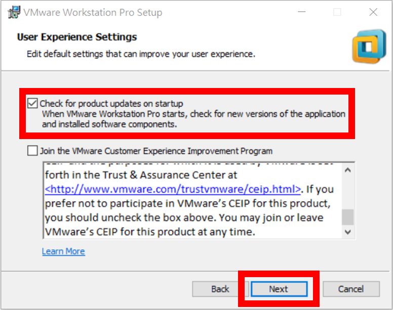
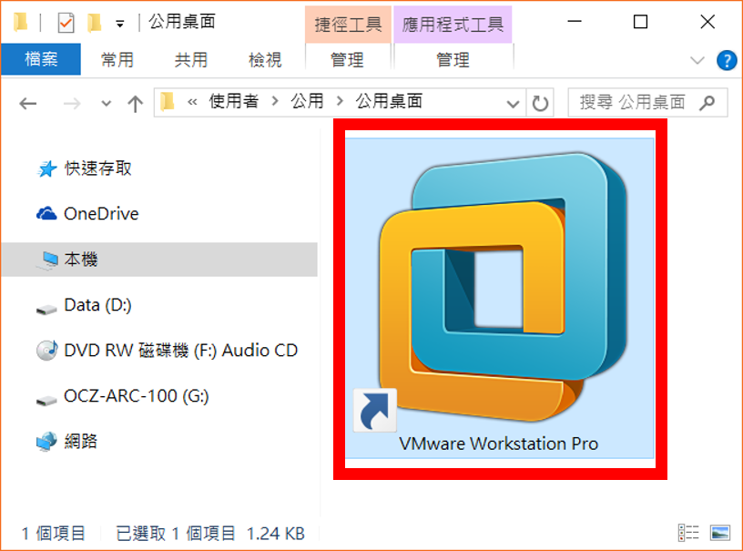

# Homework - Python Spark ML（八）：Hadoop 的安裝
# § VMware Workstation 虛擬機器軟體安裝 §

### 【[按此回上一頁](https://github.com/oneleo/PythonSparkMLBookClub/tree/master/Homework-PythonSparkML_08)】

## 【題目連結】
### [Python Spark ML（八）：Hadoop 的安裝](http://hemingwang.blogspot.tw/2017/10/python-spark-mlhadoop.html)

## 【My Answer】

> 因自身是機器學習初學者，此份作業參考各方資料並加入自己的理解，若有誤還請多指教（建立 Github Issue 來協助我修正），謝謝。

### 01、至 [VMware Workstation 產品官網](https://www.vmware.com/tw/products/workstation.html)下載最新版本 VMware Worksation 虛擬機器軟體。

注意：此處安裝之 VMware Workstation Pro 需購買序號開通，否則僅能試用 30 天。或使用免費版本的 [VMware Workstation Player](https://www.vmware.com/go/downloadplayer)。

### 02、執行 VMware Workstation 安裝程式【C:\Users\one_leo\Downloads\VMware-workstation-full-14.0.0-6661328.exe】。

### 03、點選【Next】。

### 04、點選【I accept the terms in the License Agreement】同意使用者條款→【Next】。

### 05、點選【Enhanced Keyboard Driver (a reboot will be required to use this feature)】安裝鍵盤驅動程式→【Next】。

### 06、點選【Check for product updates on startup】開啟程式時檢查更新→【Next】。

### 07、點選【Desktop】、【Start Menu Programs Folder】在桌面及開始功能表建立執行捷徑→【Next】。

### 08、點選【Install】開始安裝 VMware Workstation。

### 09、點選【Finish】完成安裝。

### 10、確定其他程式已存檔及關閉後，點選【Yes】重新啟動電腦。

### 11、點選【C:\Program Files (x86)\VMware\VMware Workstation\vmware.exe】或桌面捷徑執行程式。

### 12、在【I have a license key for VMware Workstation 14:】處輸入啟動序號→【Continue】。

### 13、認證完畢，請點選【Finish】繼續。

## 【References】

- [01] 林大貴，「博碩出版社 - Python+Spark 2.0+Hadoop機器學習與大數據分析實戰」，ISBN-13：9789864341535

### 【[按此回上一頁](https://github.com/oneleo/PythonSparkMLBookClub/tree/master/Homework-PythonSparkML_08)】