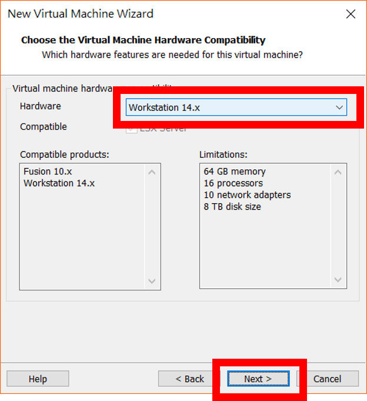
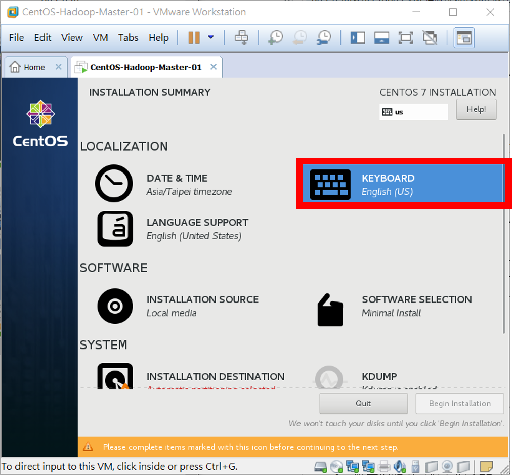
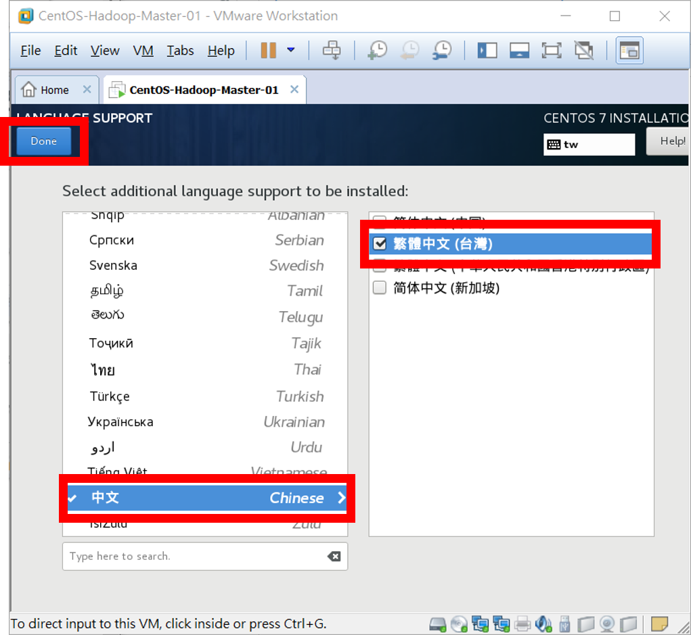

# Homework - Python Spark ML（八）：Hadoop 的安裝
# § 002 - CenOS Linux 作業系統安裝 §

### 【[按此回上一頁](https://github.com/oneleo/PythonSparkMLBookClub/tree/master/Homework-PythonSparkML_08)】

## 【題目連結】
### [Python Spark ML（八）：Hadoop 的安裝](http://hemingwang.blogspot.tw/2017/10/python-spark-mlhadoop.html)

## 【My Answer】

> 因自身是機器學習初學者，此份作業參考各方資料並加入自己的理解，若有誤還請多指教（建立 Github Issue 來協助我修正），謝謝。

### 01、至 [CentOS Project 官網](https://www.centos.org/)下載最新版本 CentOS Linux 作業系統。點選【Get CentOS Now】鈕。

### 02、我們選擇下載含有常用工具的【DVD ISO】版映象檔。
* Everything ISO 版含所有工具但會佔用較大空間，Minimal ISO 則大多數的工具需至網路下載。

### 03、點選官網偵測較佳的下載位置開始下載映象檔。

### 04、執行 VMware Workstation。

### 05、點選【File】→【New Virtual Machine...】建立一個新的 VM（Virtual Machine）。

### 06、點選【Custom】進階設置→【Next >】。

### 07、確認此 VM 使用的是最新的「Workstation 14.x」虛擬環境→【Next >】。

### 08、我們要使用剛才的光碟映象檔來安裝 VM，點選【Installer disc image file (iso)】→【Browse...】。

### 09、選到剛才下載的【CentOS-7-x86_64-DVD-1708.iso】→【開啟(O)】。

### 10、【Next >】。

### 11、為此 VM 設置名稱及存放位置，這邊以取名為「CentOS-Hadoop-Master-01」，存放位置在「C:\one_leo\Documents\Virtual Machines\CentOS-Hadoop-Master-01\」為例。
* 設定「Virtual machine name:」=【CentOS-Hadoop-Master-01】
* 若想要更改存放此 VM 的位置，請點選【Browse...】來設定。
* 最後點選【Next >】繼續。

### 12、設定此 VM 會使用幾個實體處理器數量及每個處理器虛擬核心數量，這邊採預設值。
* 「Number of processors:」=【1】
* 「Number of cores per processor:」=【1】
* →【Next >】

### 13、設定此 VM 會使用到的實體記憶體，這邊設置為 768 MB。
* 「Memory for the Virtual Machine」=【768】MB
* →【Next >】 

### 14、設定此 VM 使用的網路，這邊點選【Use network address transtation (NAT)】→【Next >】。
* VMware Workstation 網路架構圖可以參考：[附錄 - VMware Workstaion 網路架構圖](https://github.com/oneleo/PythonSparkMLBookClub/tree/master/Homework-PythonSparkML_08/Appendix-001-VMwareWorkstationNetwork)

### 15、設定此 VM 使用的硬碟控制器，這邊選擇效能較佳預設的【LSI Logic】控制器→【Next >】。

### 16、設定此 VM 使用的磁碟介面，這邊選擇預設的【SCSI】→【Next >】。
* 關於硬碟控制器及磁碟介可以參考官網介紹：[02][VMware Docs, "Selecting the I/O Controller Type for a Virtual Machine"](https://docs.vmware.com/en/VMware-Workstation-Pro/12.0/com.vmware.ws.using.doc/GUID-A0438F6C-6651-4A38-853A-0A7A494E23DF.html)。

### 17、建立一個新的虛擬磁碟【Create a new virtual disk】→【Next >】。

### 18、設定虛擬磁碟大小，這邊設定為【100.0】GB，並且儲存成單一檔案【Store virtual disk as a single file】→【Next >】。

### 19、設定虛擬磁碟的名稱及儲存位置，這邊採預設的與 VM 相同的名稱及位置及可→【Next >】。

### 20、根據課本[01]設計，每一臺 VM 都有 2 張網卡，所以我們需把按下 Finish 後將 VM開機「Power on this virtual machine after creation」選項【取消勾選】→【Finish】。
* 未來也可在 VM 關機後再增加像是虛擬網路卡、虛擬磁碟等設備。

### 21、再來點選【Edit virtual machine settings】進入 VM 設置選單。

### 22、可以看到目前只有一張 NAT 網卡，點選【Add...】。

### 23、選擇【Network Adapter】→【Finish】。

### 24、點選剛才新增的【Network Adapter 網卡】並設置成只能存取到其他 NAT VM【Host-only】模式→【OK】。

### 25、點選【Power on this virtual machine】將 VM 開機。

### 26、點選【Install CentOS 7】開始安裝 CentOS 7 Linux。
* 要注意若滑鼠被鎖定在 VM 內時，請按下鍵盤上的【Ctrl】+【Alt】鍵解除鎖定。
* 為了畫面清爽，我們可以將左邊 VM 清單，及下方的安裝提示關閉。

### 27、安裝時的介面語言選擇（並非選擇作業系統語系），這邊選擇預設的【English (United States)】→【Continue】。
* 下方提示為是否要在 CentOS 內安裝 VMware Workstaion 驅動程式 VMware Tools，但因為我們尚未安裝好 CentOS 作業系統，所以點選稍後提醒我【Remind Me Later】。

### 28、點選【DATE & TIME】設定 CentOS 所在的時區。

### 29、點選地圖上的【Taipei】→【Done】。

### 30、點選【KEYBOARD】來設定臺灣所使用的鍵盤格式（不同國家的鍵盤，標點符號的位置都不相同）。

### 31、點選下方新增【+】鈕。

### 32、找到【Taiwan, Province of China (Taiwanese)】→【Add】。

### 33、並將用不到的【English (US)】鍵盤刪除【-】。

### 34、完成【Done】。

### 35、點選【LANGUAGE SUPPORT】設定 CentOS 支援的語系。

### 36、預設下已選擇了【English (United States)】。

### 37、我們還需要新增中文語系，請在左側找到【中文 Chinese】→並在右側點選【繁體中文 (台灣)】→【Done】。

### 38、點選【SOFTWARE SELECTION】設定我們要預先安裝的 CentOS 環境及軟體。

### 39、點選【GNOME Desktop】桌面環境→【Done】。
* 使用者可以根據需求選擇所需的軟體，這邊為減少佔據較大的硬碟空間，不選擇其他附加軟體，當有需要時再行安裝。

### 40、點選【INSTALLATION DESTINATION】來設定硬碟分配及檔案系統。

### 41、這邊我們採用較高彈性的 BTRFS 檔案系統，移到下方點選【I will configure partitioning】來手動設置→【Done】。

### 42、首先點選下方【Btrfs】→再選擇【Click here to create them automatically.】讓安裝程式自動分配硬碟分割。
* 此時若不小心先點選了【Click here to create them automatically.】，可以將所有的磁碟分割刪除【-】後，再做一次。

### 43、完成【Done】。

### 44、同意【Accept Changes】。

### 45、點選【NETWORK & HOST NAME】查看是否可連線至網際網路取得更新。

### 46、點選在 VMware NAT 模式下的【Ethernet (ens33)】網卡→點選【ON】從 VMware 虛擬 DHCP Server 取得 IP→【Done】。

### 47、設定完成，開始安裝【Begin Installation】。

### 48、點選【ROOT PASSWORD】設定 Linux 最高管理者 root 密碼。

### 49、請自行設置高強度密碼，因不常使用 root 登入，故需記住此密碼，
* 「Root Rassword:」=【<輸入高強度密碼>】
* 「Confirm:」=【<再次輸入高強度密碼>】
* 完成【Done】

### 50、點選【USER CREATION】設置新的使用者帳號及密碼。

### 51、這邊設定【centos】帳號的密碼為【centos】，並且設定為具有管理者權限。
* 「User name」=【centos】
* 「Make this user administrator」=【打勾】
* 「Password」=【centos】
* 「Confirm password」=【ecntos】
* 完成【Done】

### 52、待 CentOS 作業系統安裝完成後，點選【Reboot】重新開機並進入系統。

### 53、進入作業系統前還需同意使用條款，點選【LICENSE INFORMATION】。

### 54、【勾選】「I accept the License agreement」→【Done】。

### 55、點選【FINISH CONFIGURATION】完成。

### 56、選擇我們建立好的【centos】帳號。

### 57、輸入【centos】密碼→【Sign in】進入 CentOS 桌面。

### 58、接下來要設置「centos」使用者的環境，因為在安裝時已經都選擇好，故使用預設的即可，點選【Next】。

### 59、點選【Next】。

### 60、點選【Next】。

### 61、是否要綁定其他服務帳號，這邊我們選擇略過【Skip】。

### 62、完成【Start using CentOS Linux】。

### 63、接著我們要為這個 VM 建立快照，以便未來不小心將此 VM 搞壞了還可以快速回復。首先要先將 VM 關機，點選右上角【電源】圖示→點選【重啟及關機】圖示。

### 64、點選【Power Off】。

### 65、因為關機動作需使用管理者權限進行，輸入「centos」使用者密碼【centos】→【Authenticate】繼續。

### 66、再做一次，點選右上角【電源】圖示→點選【重啟及關機】圖示。

### 67、點選【Power Off】將 VM 關機。

### 68、在 VM「CentOS-Hadoop-Master-01」上按滑鼠【右鍵】→【Snapshot】→【Take Snapshot...】。

### 69、在「Name:」內輸入此次 Snapshot 名稱【Initial Snapshot】→【Take Snapshot】。

### 70、未來若想將此 VM 回復到現在 Snapshot 狀態（將會刪除 Snapshot 到現在的所有資料） ，在 VM「CentOS-Hadoop-Master-01」上按滑鼠【右鍵】→【Snapshot】→【1 Initial Snapshot】。

### 71、點選【Yes】，完成回復。

## 【References】

- [01] 林大貴，「博碩出版社 - Python+Spark 2.0+Hadoop機器學習與大數據分析實戰」，ISBN-13：9789864341535

- [02] VMware Docs, "Selecting the I/O Controller Type for a Virtual Machine", [https://docs.vmware.com/en/VMware-Workstation-Pro/12.0/com.vmware.ws.using.doc/GUID-A0438F6C-6651-4A38-853A-0A7A494E23DF.html](https://docs.vmware.com/en/VMware-Workstation-Pro/12.0/com.vmware.ws.using.doc/GUID-A0438F6C-6651-4A38-853A-0A7A494E23DF.html)