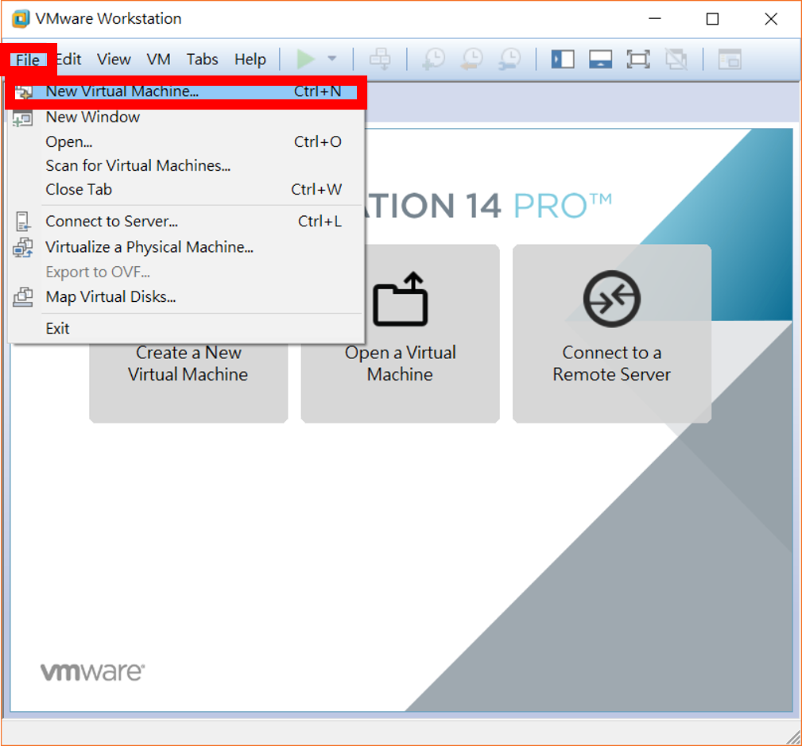
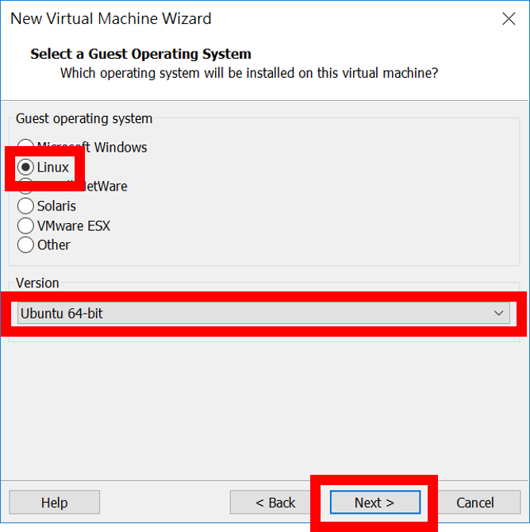
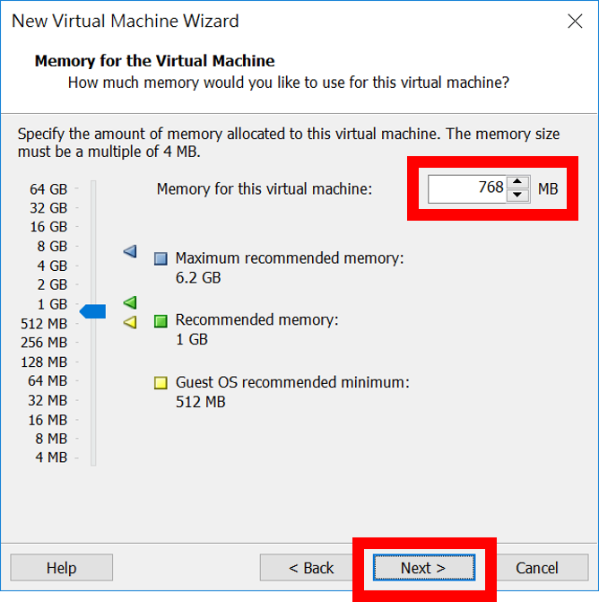
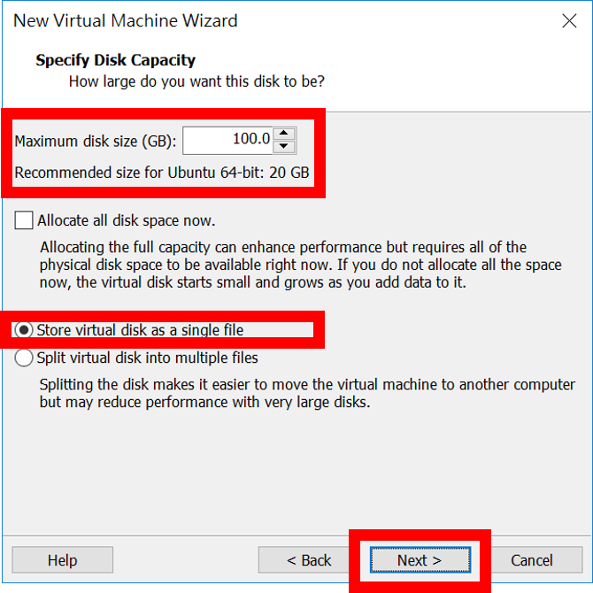
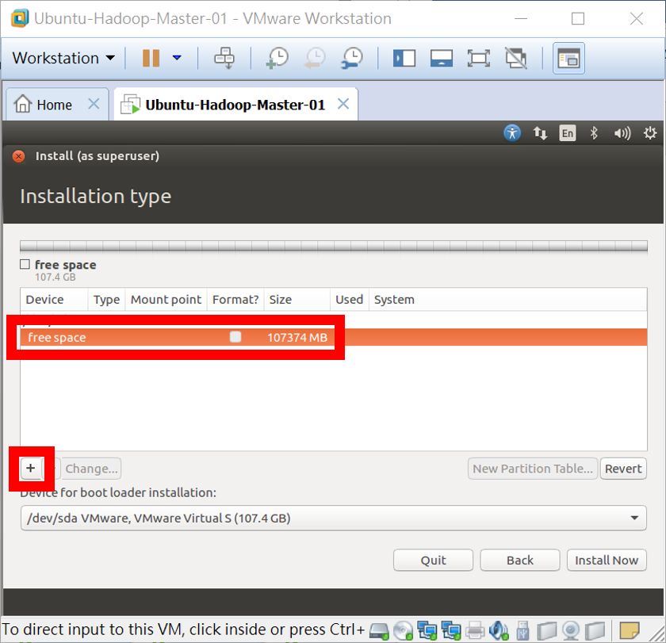

# Homework - Python Spark ML（八）：Hadoop 的安裝
# § 003 - Ubuntu Linux 作業系統安裝 §

## 【題目連結】
### [Python Spark ML（八）：Hadoop 的安裝](http://hemingwang.blogspot.tw/2017/10/python-spark-mlhadoop.html)
### [按此回上一頁](https://github.com/oneleo/PythonSparkMLBookClub/tree/master/Homework-PythonSparkML_08)

## 【My Answer】

> 因自身是機器學習初學者，此份作業參考各方資料並加入自己的理解，若有誤還請多指教（建立 Github Issue 來協助我修正），謝謝。

### 01、至 [Ubuntu 官網](https://www.ubuntu-tw.org/modules/tinyd0/)下載最新版本 Ubuntu Linux 作業系統。點選【Ubuntu 桌面版本】→【16.04 LTS（支援至 2021 年 04 月）】→【64 位元版本】→【開始下載】。

### 02、網站應會自動開始下載，若無自動下載請手動點選官網偵測較佳的下載位置開始下載映象檔。

### 03、執行 VMware Workstation。

### 04、點選【File】→【New Virtual Machine...】建立一個新的 VM（Virtual Machine）。

### 05、點選【Custom】進階設置→【Next >】。

### 06、確認此 VM 使用的是最新的「Workstation 14.x」虛擬環境→【Next >】。

### 07、若使用「Installer disc image file (iso)」選 Ubuntu 映象檔方式來安裝的話，VMware Workstation 會自動進行無人職守安裝（均為預設值），故我們先點選【I will the operating system later】之後再來自訂安裝→【Next >】

### 08、等一下要安裝的 Ubuntu 為【Linux】且為 64 位元的【Ubuntu 64-bit】→【Next >】。 

### 09、為此 VM 設置名稱及存放位置，這邊以取名為「Ubuntu-Hadoop-Master-01」，存放位置在「C:\oneleo\Documents\Virtual Machines\Ubuntu-Hadoop-Master-01\」為例。
* 設定「Virtual machine name:」=【Ubuntu-Hadoop-Master-01】
* 若想要更改存放此 VM 的位置，請點選【Browse...】來設定。
* 最後點選【Next >】繼續。

### 10、設定此 VM 會使用幾個實體處理器數量及每個處理器虛擬核心數量，這邊採預設值。
* 「Number of processors:」=【1】
* 「Number of cores per processor:」=【1】
* →【Next >】

### 11、設定此 VM 會使用到的實體記憶體，這邊設置為 768 MB。
* 「Memory for the Virtual Machine」=【768】MB
* →【Next >】 

### 12、設定此 VM 使用的網路，這邊點選【Use network address transtation (NAT)】→【Next >】。
* VMware Workstation 網路架構圖可以參考：[附錄 - VMware Workstaion 網路架構圖](https://github.com/oneleo/PythonSparkMLBookClub/tree/master/Homework-PythonSparkML_08/Appendix-001-VMwareWorkstationNetwork)

### 13、設定此 VM 使用的硬碟控制器，這邊選擇效能較佳預設的【LSI Logic】控制器→【Next >】。

### 14、設定此 VM 使用的磁碟介面，這邊選擇預設的【SCSI】→【Next >】。
* 關於硬碟控制器及磁碟介可以參考官網介紹：[02][VMware Docs, "Selecting the I/O Controller Type for a Virtual Machine"](https://docs.vmware.com/en/VMware-Workstation-Pro/12.0/com.vmware.ws.using.doc/GUID-A0438F6C-6651-4A38-853A-0A7A494E23DF.html)。

### 15、建立一個新的虛擬磁碟【Create a new virtual disk】→【Next >】。

### 16、設定虛擬磁碟大小，這邊設定為【100.0】GB，並且儲存成單一檔案【Store virtual disk as a single file】→【Next >】。

### 17、設定虛擬磁碟的名稱及儲存位置，這邊採預設的與 VM 相同的名稱及位置及可→【Next >】。

### 18、完成【Finish】。

### 19、再來點選【Edit virtual machine settings】進入 VM 設置選單。

### 20、此時將剛才下載好的 Ubuntu 映象檔放入此 VM 的虛擬光碟機內，點選左方【CD/DVD (SATA)】→點選右方當 VM 開機時自動掛載光碟機【Connect at power on】→使用映象檔【Use ISO Image file:】→【Browse...】。

### 21、選擇剛才下載好的【ubuntu-16.04.3-desktop-amd64.iso】→【開啟(O)】。

### 22、根據課本[01]設計，每一臺 VM 都有 2 張網卡，目前只有一張 NAT 網卡，故還需要增加一張 Host-only 網卡，點選【Add...】。

### 23、選擇【Network Adapter】→【Finish】。

### 24、點選剛才新增的【Network Adapter 網卡】並設置成只能存取到其他 NAT VM【Host-only】模式→【OK】。

### 25、點選【Power on this virtual machine】將 VM 開機。

### 26、安裝時的介面語言選擇（並非選擇作業系統語系），這邊選擇預設的【English (United States)】→【Continue】。
* 要注意若滑鼠被鎖定在 VM 內時，請按下鍵盤上的【Ctrl】+【Alt】鍵解除鎖定。
* 為了畫面清爽，我們可以將下方的安裝提示關閉。

### 27、下方提示為是否要在 Ubuntu 內安裝 VMware Workstaion 驅動程式 VMware Tools，但因為我們尚未安裝好 Ubuntu 作業系統，所以點選稍後提醒我【Remind Me Later】。

### 28、點選安裝作業系統時下載更更【Download updates while installing Ubuntu】→【Continue】。

### 29、這邊可以自行設定硬碟分配及檔案系統。選擇【Something else】來進行→【Continue】。

### 30、因為只偵測到一顆磁碟，我們直接點選【New Partition Table...】將此磁碟清空。

### 31、點繼【Continue】繼續。

### 32、接著我們要來分割磁碟以及設置檔案系統，首先點選【free space】→【+】。

### 33、第一個磁碟分割為虛擬記憶體，當實體記憶體（RAM）空間快沒有時，就會使用虛擬記憶體讓作業系統得以正常運作。
* 「Size:」=【4096】MB
* 「Type for the new partition:」=【Primary】（主要磁碟區）
* 「Location for the new partition:」=【Beginning of this space】（放置於磁碟物理位置的最前方）
* 「Use as:」=【swap area】（虛擬記憶體）
* 點選【OK】

### 34、再來點選剩下的磁碟空間【free space】→【+】。

### 35、將剩下的空間我們都給整個作業系統使用（稱之為「/」）。且我們採用較高彈性的 BTRFS 檔案系統。
* 因為我們使用 VM（Virtual Machine），剩下的空間都給作業系統沒有太大差別，但若我們是將作業系統安裝在實體機，建議將只讀不寫的開機區（稱之為「/boot」）也保留 1 GB 空間。
* 「Size:」=【103278】MB（系統自動填寫）
* 「Type for the new partition:」=【Primary】（主要磁碟區）
* 「Location for the new partition:」=【Beginning of this space】（放置於磁碟物理位置的最前方）
* 「Use as:」=【btrfs journaling file system】（BTRFS）
* 「Mount point:」=【/】
* 點選【OK】

### 36、準備就緒後，點選【Install Now】開始安裝。

### 37、點選【Continue】繼續。

### 38、設定 VM 所在的時區。點選地圖上的【Taipei】→【Continue】。

### 39、設定臺灣所使用的鍵盤格式（不同國家的鍵盤，標點符號的位置都不相同）。找到【Taiwan】→【Continue】。
* 這邊要注意 Continue 按鈕跑到視窗外了，請多使用【Tab】鍵，將準心移到「Continue」鈕後，再按下【Enter】鍵。

### 40、設置新的使用者帳號及密碼。這邊設定【ubuntu】帳號的密碼為【ubuntu】。此帳號預設已為具有管理者權限。
* 「Your computer's name:」=【ubuntu-virtual-machine】（預設值）
* 「Pick a username:」=【ubuntu】
* 「Choose a password:」=【ubuntu】
* 「Confirm your password:」=【ubuntu】
* 「Require my password to log in」=【勾選】
* 點選【Continue】繼續
* 這邊要注意 Continue 按鈕也跑到視窗外了，請多使用【Tab】鍵，將準心移到「Continue」鈕後，再按下【Enter】鍵。
* 

### 41、Ubuntu 已完成安裝，點選【Restart Now】重新開機。

### 42、這邊提醒 Ubuntu 已完成安裝，建議將實體光碟取出，避免重開機後再次進到光碟安裝介面，但我們使用的是虛擬環境，我們可以直接點選【Enter】鍵，VMware Workstation 會自動將映象檔取出。

### 43、輸入 ubuntu 使用者密碼【ubuntu】→按下【Enter】鍵。

### 44、接著我們要為這個 VM 建立快照，以便未來不小心將此 VM 搞壞了還可以快速回復。首先要先將 VM 關機，點選右上角【系統設定】圖示→點選【Shut Down...】。

### 45、點選【Shut Down】關機。

### 46、在 VM「Ubuntu-Hadoop-Master-01」上按滑鼠【右鍵】→【Snapshot】→【Take Snapshot...】。

### 47、在「Name:」內輸入此次 Snapshot 名稱【Initial Snapshot】→【Take Snapshot】。

### 48、未來若想將此 VM 回復到現在 Snapshot 狀態（將會刪除 Snapshot 到現在的所有資料） ，在 VM「Ubuntu-Hadoop-Master-01」上按滑鼠【右鍵】→【Snapshot】→【1 Initial Snapshot】。

### 49、點選【Yes】，完成回復。

## 【References】

- [01] 林大貴，「博碩出版社 - Python+Spark 2.0+Hadoop機器學習與大數據分析實戰」，ISBN-13：9789864341535
- [02] VMware Docs, "Selecting the I/O Controller Type for a Virtual Machine", [https://docs.vmware.com/en/VMware-Workstation-Pro/12.0/com.vmware.ws.using.doc/GUID-A0438F6C-6651-4A38-853A-0A7A494E23DF.html](https://docs.vmware.com/en/VMware-Workstation-Pro/12.0/com.vmware.ws.using.doc/GUID-A0438F6C-6651-4A38-853A-0A7A494E23DF.html)