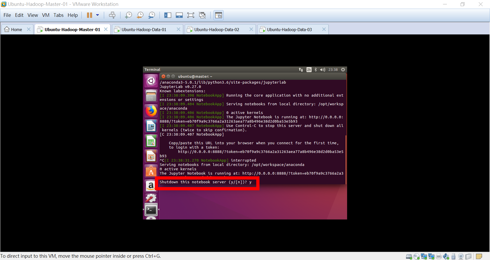

# Homework - Python Spark ML（八）：Hadoop 的安裝
# § 005 - Hadoop Multi Node Cluster 安裝 §

### 【[按此回上一頁目錄](https://github.com/oneleo/PythonSparkMLBookClub/tree/master/Homework-PythonSparkML_08)】

## 【題目連結】
### [Python Spark ML（八）：Hadoop 的安裝](http://hemingwang.blogspot.tw/2017/10/python-spark-mlhadoop.html)

## 【My Answer】

> 因自身是機器學習初學者，此份作業參考各方資料並加入自己的理解，若有誤還請多指教（建立 Github Issue 來協助我修正），謝謝。

----------

### 01、建立另外三臺 Data VM

#### 01-001、將[上一章節](./004-HadoopSingleNodeOnUbuntu)設置好的 Master VM 複製成另外三臺 Data VM。
* 請在「Ubuntu-Hadoop-Master-01」標籤上按滑鼠【右鍵】→【Manage】→【Clone...】。


#### 01-002、點選【下一步(N) >】繼續。


#### 01-003、點選【The current state in the virtual machine】使用目前狀態→點選【下一步(N) >】繼續。


#### 01-004、點選【Create a full clone】完整複製→點選【下一步(N) >】繼續。


#### 01-005、設置名稱及存放位置，這邊取名為「Ubuntu-Hadoop-Data-01」，存放位置以「C:\oneleo\Documents\Virtual Machines\Ubuntu-Hadoop-Data-01\」為例。
* 設定「Virtual machine name:」=【Ubuntu-Hadoop-Data-01】
* 若想要更改存放此 VM 的位置，請點選【Browse...】來設定。
* 最後點選【完成】開始複製。


#### 01-006、複製完成後點選【Close】結束。


#### 01-007、待所有所需 VM 複製好後，要設置 VMware Workstation DHCP Server 以指定 VM IP。先在剛複製好的 VM「Ubuntu-Hadoop-Data-01」上點滑鼠【右鍵】→【Settings...】。


#### 01-008、點選左側的【Network Adapter 2 Host only】→點選右側的【Advanced...】。


#### 01-009、點選【Generate】重建一個新的網路卡 MAC，再將現在 Data-01 的網路卡「MAC Address」記下來，在這邊以【```00:50:56:2D:A3:33```】為例→點選【OK】確定生效。


#### 01-010、再重複以上方式複製 VM，複製的第二臺 VM 取做【Ubuntu-Hadoop-Data-02】。


#### 01-011、重建 Data-02 的網路卡「MAC Address」並記下來，在這邊以【```00:50:56:25:B7:32```】為例→點選【OK】確定生效。


#### 01-012、再重複以上方式複製 VM，複製的第三臺 VM 取做【Ubuntu-Hadoop-Data-03】。


#### 01-013、重建 Data-03 的網路卡「MAC Address」並記下來，在這邊以【```00:50:56:27:F2:7F```】為例→點選【OK】確定生效。


#### 01-014、設置【C:\ProgramData\VMware\vmnetdhcp.conf】VMware Workstation DHCP Server 設定檔如下。

> 	…（前略）
> 	host VMnet1 {
> 	    hardware ethernet 00:50:56:C0:00:01;
> 	    fixed-address 192.168.206.1;
> 	    option domain-name-servers 0.0.0.0;
> 	    option domain-name "";
> 	}
> 	host master {
> 	    hardware ethernet 00:0C:29:71:83:F9;
> 	    fixed-address 192.168.206.10;
> 	}
> 	host data1 {
> 	    hardware ethernet 00:50:56:2D:A3:33;
> 	    fixed-address 192.168.206.11;
> 	}
> 	host data2 {
> 	    hardware ethernet 00:50:56:25:B7:32;
> 	    fixed-address 192.168.206.12;
> 	}
> 	host data3 {
> 	    hardware ethernet 00:50:56:27:F2:7F;
> 	    fixed-address 192.168.206.13;
> 	}
> 	# End
> 	…（後略）


#### 01-015、接下來我們要重新啟動 VMware Workstation DHCP 服務，使設置生效。在左下角「Windows」符號上按滑鼠【右鍵】→【電腦管理(G)】。


#### 01-016、點選左側【電腦管理 (本機)】→【服務與應用程式】→【服務】，在右側【VMware DHCP Service】上點選滑鼠【右鍵】→【重新啟動(E)】。


#### 01-011、點選左側【電腦管理 (本機)】→【服務與應用程式】→【服務】，在右側【VMware NAT Service】上點選滑鼠【右鍵】→【重新啟動(E)】。


#### 01-013、在「Ubuntu-Hadoop-Data-03」標籤上按滑鼠【右鍵】→【Power】→【Start Up Guest】將 VM 開機。


#### 01-014、在「Ubuntu-Hadoop-Data-02」標籤上按滑鼠【右鍵】→【Power】→【Start Up Guest】將 VM 開機。


#### 01-015、在「Ubuntu-Hadoop-Data-01」標籤上按滑鼠【右鍵】→【Power】→【Start Up Guest】將 VM 開機。


#### 01-016、點選「Ubuntu-Hadoop-Master-01」標籤，點選【Power on this virtual machine】將 VM 開機。


#### 01-017、開機並登入 Master VM 後，開啟 Terminal 程式，我們要測試所有 VM 都有正確得到指定 IP。
* 【ping】：是一種電腦網路工具，用來測試數據包能否透過 IP 協議到達特定主機。
* 【-c】參數：指定測試次數。

``` Bash
$ ping 192.168.206.11 -c 2
$ ping 192.168.206.12 -c 2
$ ping 192.168.206.13 -c 2
```


#### 01-018、設置 data1、data2、data3 VM 的 Hostname。
* 目的：為了讓「hdfs.include」、「hdfs.exclude」、「yarn.include」、「yarn.exclude」僅能辨視 VM hostname，而非「/etc/hosts」名稱解析。

``` Bash
$ ssh "$USER"@data1 sudo hostnamectl set-hostname 'data1'
$ ssh "$USER"@data2 sudo hostnamectl set-hostname 'data2'
$ ssh "$USER"@data3 sudo hostnamectl set-hostname 'data3'
```

#### 01-019、整體 Hadoop 叢集的網路架構圖。


----------

### 02、啟動 Hadoop 及 Spark 叢集

#### 02-001、格式化 HDFS 檔案系統。
* 此時將會在 /home/$USER/hadoop 底下建立 dfs 目錄。

``` Bash
$ ssh "$USER"@master hdfs namenode -format
```

#### 02-002、啟動叢集版 HDFS 儲存用 Java 程式。

``` Bash
$ ssh "$USER"@master start-dfs.sh
```

	Starting namenodes on [master]
	master: starting namenode, logging to /opt/logs/hadoop/hadoop-ubuntu-namenode-master.out
	data2: starting datanode, logging to /opt/logs/hadoop/hadoop-ubuntu-datanode-data2.out
	data3: starting datanode, logging to /opt/logs/hadoop/hadoop-ubuntu-datanode-data3.out
	data1: starting datanode, logging to /opt/logs/hadoop/hadoop-ubuntu-datanode-data1.out
	Starting secondary namenodes [master]
	master: starting secondarynamenode, logging to /opt/logs/hadoop/hadoop-ubuntu-secondarynamenode-master.out

#### 02-003、啟動叢集版 Yarn 運算用 Java 程式。

``` Bash
$ ssh "$USER"@master start-yarn.sh
```

	starting yarn daemons
	starting resourcemanager, logging to /opt/logs/yarn/yarn-ubuntu-resourcemanager-master.out
	data2: starting nodemanager, logging to /opt/logs/yarn/yarn-ubuntu-nodemanager-data2.out
	data1: starting nodemanager, logging to /opt/logs/yarn/yarn-ubuntu-nodemanager-data1.out
	data3: starting nodemanager, logging to /opt/logs/yarn/yarn-ubuntu-nodemanager-data3.out

#### 02-004、啟動叢集版 Spark 運算用 Java 程式。

``` Bash
$ ssh "$USER"@master /opt/spark/sbin/start-all.sh
```

	starting org.apache.spark.deploy.master.Master, logging to /opt/logs/spark/spark-ubuntu-org.apache.spark.deploy.master.Master-1-master.out
	data3: starting org.apache.spark.deploy.worker.Worker, logging to /opt/logs/spark/spark-ubuntu-org.apache.spark.deploy.worker.Worker-1-data3.out
	data2: starting org.apache.spark.deploy.worker.Worker, logging to /opt/logs/spark/spark-ubuntu-org.apache.spark.deploy.worker.Worker-1-data2.out
	data1: starting org.apache.spark.deploy.worker.Worker, logging to /opt/logs/spark/spark-ubuntu-org.apache.spark.deploy.worker.Worker-1-data1.out

#### 02-005、查看目前 master VM 啟動的 Java 程式。

``` Bash
$ ssh "$USER"@master jps
```

	4241 Jps
	3395 NameNode
	3603 SecondaryNameNode
	4100 Master
	3788 ResourceManager

#### 02-006、查看目前 data1、data2、data3 VM 啟動的 Java 程式。

``` Bash
$ ssh "$USER"@data1 jps
$ ssh "$USER"@data2 jps
$ ssh "$USER"@data3 jps
```

	19937 Worker
	19778 NodeManager
	20022 Jps
	19647 DataNode

#### 02-007、我們可在 Windows 使用瀏覽器查看 Hadoop HDFS 運算服務：[http://192.168.133.139:50070/](http://192.168.133.139:50070/)
* 在這邊以 master 的第一張 NAT 網路卡 IP 為「172.168.133.139」為例。


#### 02-008、我們可在 Windows 使用瀏覽器查看 Hadoop Yarn 運算服務：[http://192.168.133.139:8088/](http://192.168.133.139:8088/)


#### 02-009、我們可在 Windows 使用瀏覽器查看 Spark 運算服務：[http://192.168.133.139:8080/](http://192.168.133.139:8080/)


#### 02-010、我們可在 Windows 使用瀏覽器查看 Spark 運算服務：[http://192.168.133.139:8080/](http://192.168.133.139:8080/)

----------

### 03、使用 Jupyter Notebook 進行 PySpark on Yarn 測試

#### 03-001、為增加 Hadoop 叢集執行 PySpark 效率，先將 PySpark 函式庫複製到 HDFS 內。
* 注意：請觀察「/opt/spark/conf/spark-defaults.conf」檔內設置，在這邊我們指定將函式庫放在「hdfs://master:9000/hadoop/jars」目錄內。
* 【hadoop】：執行 Hadoop 相關指令。
* 【fs】指令：執行與檔案系統相關指令。
* 【-mkdir】指令：在 HDFS 中建立資料夾，如同 Linux 內的 mkdir 指令。
* 【-p /A/B/C】：遞迴建立，建立 C 目錄時，若 A 及 B 目錄不存在則一同建置。
* 【-put A B】：將 A 檔案複製到 B 目錄。A 檔案可以是多個來源。

``` Bash
$ ssh "$USER"@master hadoop fs -mkdir -p "/hadoop/jars"
$ ssh "$USER"@master hadoop fs -put "/opt/spark/jars/*" "/hadoop/jars"
```

#### 03-002、在 HDFS 中建立資料夾，並將測試檔從本地端複製檔案進去。
* 【-copyFromLocal A B】指令：將本地的 A 檔案複製到 HDFS 內的 B 目錄內，或成為 B 檔案。A 檔案只能是單一個檔案。
* 【-f】參數：若已存在則強制覆蓋不詢問。

``` Bash
$ ssh "$USER"@master hadoop fs -mkdir -p "/user/$USER/wordcount/input"
$ ssh "$USER"@master hadoop fs -copyFromLocal -f "/opt/hadoop/LICENSE.txt" "/user/$USER/wordcount/input"
```

#### 03-003、使用 Jupyter Notebook 進行 PySpark on Yarn。
* 【--master】：選擇 PySpark 要執行在哪一個模式下，這邊為 Hadoop Yarn 下進行運算。

``` Bash
$ pyspark --master yarn
```

	[I 22:52:12.822 NotebookApp] JupyterLab alpha preview extension loaded from /opt/anaconda3-5.0.1/lib/python3.6/site-packages/jupyterlab
	JupyterLab v0.27.0
	Known labextensions:
	[I 22:52:12.827 NotebookApp] Running the core application with no additional extensions or settings
	[I 22:52:12.838 NotebookApp] Serving notebooks from local directory: /opt/workspace/anaconda
	[I 22:52:12.839 NotebookApp] 0 active kernels 
	[I 22:52:12.839 NotebookApp] The Jupyter Notebook is running at: http://0.0.0.0:8888/?token=f27ac64536328d25a7fbe2ef3ab13f2525904ea9abe64f58
	[I 22:52:12.839 NotebookApp] Use Control-C to stop this server and shut down all kernels (twice to skip confirmation).
	[C 22:52:12.839 NotebookApp] 
	    
	    Copy/paste this URL into your browser when you connect for the first time,
	    to login with a token:
	        http://0.0.0.0:8888/?token=f27ac64536328d25a7fbe2ef3ab13f2525904ea9abe64f58

#### 03-004、使用 Windows 瀏覽器進入 Jupyter Notebook。
* 在這邊為例，使用 Windows 瀏覽器進入「[http://192.168.133.139:8888/?token=f27ac64536328d25a7fbe2ef3ab13f2525904ea9abe64f58](http://192.168.133.139:8888/?token=f27ac64536328d25a7fbe2ef3ab13f2525904ea9abe64f58)」進行認證


#### 03-005、進入 Jupyter Notebook 後亦可至 Hadoop Yarn 頁面 [http://192.168.133.139:8088](http://192.168.133.139:8088) 看到 Spark 執行狀況。


#### 03-006、點選【New】→【Python 3】建立一個新的 Python Notebook。


#### 03-007、進行 Spark 簡單測試，查看目前 Spark 模式。
* 在「In [1]:」中輸入【sc.master】→按下【Shift】+【Enter】開始運算。

		Out[1]: 'yarn'


#### 03-008、使用 Spark Standalone 叢集計算 /opt/hadoop/LICENSE.txt 檔內文字列數。
* 在「In [2]:」中輸入【textFile=sc.textFile("hdfs://master:9000/user/ubuntu/wordcount/input/LICENSE.txt")】→按下【Enter】。
* 接著輸入【textFile.count()】→按下【Shift】+【Enter】開始運算。

		Out[2]: 1975


#### 03-009、測試正確無誤後，將目前 Python Notebook 關閉。
* 點選【File】→【Close and Halt】離開。
* 注意：請一定要使用此法關閉 Python Notebook，若只是將瀏覽器關閉，在將 Jupyter Notebook 關閉時會因為 Python Notebook 仍在運作而出現錯誤。 


#### 03-010、關閉 Jupyter Notebook 服務。
* 按下鍵盤的【Ctrl】+【c】→輸入【y】→按下【Enter】完成關閉。


----------

### 04、使用 Jupyter Notebook 進行 PySpark Stand Alone 測試

#### 04-001、使用 Jupyter Notebook 進行 PySpark Stand Alone。
* 【--num-executors】：設置執行程式的程序數量。
* 【--total-executor-cores】：設置執行程式的總核心數量。
* 【--executor-memory】：設置執行程式的總記憶體大小。

``` Bash
$ pyspark --master spark://master:7077 --num-executors 1 --total-executor-cores 3 --executor-memory 512m
```

	[I 23:28:52.029 NotebookApp] JupyterLab alpha preview extension loaded from /opt/anaconda3-5.0.1/lib/python3.6/site-packages/jupyterlab
	JupyterLab v0.27.0
	Known labextensions:
	[I 23:28:52.033 NotebookApp] Running the core application with no additional extensions or settings
	[I 23:28:52.039 NotebookApp] Serving notebooks from local directory: /opt/workspace/anaconda
	[I 23:28:52.042 NotebookApp] 0 active kernels 
	[I 23:28:52.042 NotebookApp] The Jupyter Notebook is running at: http://0.0.0.0:8888/?token=2ce935031773dc36735ba23aab2e0c96186c669514b88a5e
	[I 23:28:52.042 NotebookApp] Use Control-C to stop this server and shut down all kernels (twice to skip confirmation).
	[C 23:28:52.043 NotebookApp] 
	    
	    Copy/paste this URL into your browser when you connect for the first time,
	    to login with a token:
	        http://0.0.0.0:8888/?token=2ce935031773dc36735ba23aab2e0c96186c669514b88a5e

#### 04-002、使用 Windows 瀏覽器進入 Jupyter Notebook。
* 在這邊為例，使用 Windows 瀏覽器進入「[http://192.168.133.139:8888/?token=2ce935031773dc36735ba23aab2e0c96186c669514b88a5e](http://192.168.133.139:8888/?token=2ce935031773dc36735ba23aab2e0c96186c669514b88a5e)」進行認證


#### 04-003、點選【New】→【Python 3】建立一個新的 Python Notebook。


#### 04-004、進行 Spark 簡單測試，查看目前 Spark 模式。
* 在「In [1]:」中輸入【sc.master】→按下【Shift】+【Enter】開始運算。

		Out[1]: 'spark://master:7077'


#### 04-005、使用 Spark Standalone 叢集計算 /opt/hadoop/LICENSE.txt 檔內文字列數。
* 在「In [2]:」中輸入【textFile=sc.textFile("hdfs://master:9000/user/ubuntu/wordcount/input/LICENSE.txt")】→按下【Enter】。
* 接著輸入【textFile.count()】→按下【Shift】+【Enter】開始運算。

		Out[2]: 1975


#### 04-006、此時可以進入 Spark Stand Alone 頁面 [http://192.168.133.139:8080](http://192.168.133.139:8080) 看到 Spark 執行狀況。


#### 04-007、測試正確無誤後，將目前 Python Notebook 關閉。
* 點選【File】→【Close and Halt】離開。


#### 04-008、關閉 Jupyter Notebook 服務。
* 按下鍵盤的【Ctrl】+【c】→輸入【y】→按下【Enter】完成關閉。



----------

### 05、測試完畢，停止所有 Java 程式

#### 05-001、停止叢集版 Spark 運算用 Java 程式。

``` Bash
$ ssh "$USER"@master /opt/spark/sbin/stop-all.sh
```

	data2: stopping org.apache.spark.deploy.worker.Worker
	data1: stopping org.apache.spark.deploy.worker.Worker
	data3: stopping org.apache.spark.deploy.worker.Worker
	stopping org.apache.spark.deploy.master.Master

#### 05-002、停止叢集版 Hadoop Yarn 運算用 Java 程式。

``` Bash
$ ssh "$USER"@master stop-yarn.sh
```

	stopping yarn daemons
	stopping resourcemanager
	data1: stopping nodemanager
	data1: nodemanager did not stop gracefully after 5 seconds: killing with kill -9
	data2: stopping nodemanager
	data2: nodemanager did not stop gracefully after 5 seconds: killing with kill -9
	data3: stopping nodemanager
	data3: nodemanager did not stop gracefully after 5 seconds: killing with kill -9
	no proxyserver to stop

#### 05-003、停止叢集版 Hadoop HDFS 儲存用 Java 程式。

``` Bash
$ ssh "$USER"@master stop-dfs.sh
```

	Stopping namenodes on [master]
	master: stopping namenode
	data1: stopping datanode
	data2: stopping datanode
	data3: stopping datanode
	Stopping secondary namenodes [master]
	master: stopping secondarynamenode

#### 05-004、查看目前啟動的 Spark Java 程式。

``` Bash
$ ssh "$USER"@master jps
```

	7466 Jps

#### 05-005、透過遠端的方式將所有 VM 進行安全關機。

``` Bash
$ ssh "$USER"@data3 'sudo sync; sudo sync; sudo sync; sudo sync; sudo sync; sudo sync; sudo sync; sudo shutdown -h now;'
$ ssh "$USER"@data2 'sudo sync; sudo sync; sudo sync; sudo sync; sudo sync; sudo sync; sudo sync; sudo shutdown -h now;'
$ ssh "$USER"@data1 'sudo sync; sudo sync; sudo sync; sudo sync; sudo sync; sudo sync; sudo sync; sudo shutdown -h now;'
$ ssh "$USER"@master 'sudo sync; sudo sync; sudo sync; sudo sync; sudo sync; sudo sync; sudo sync; sudo shutdown -h now;'
```

----------

## 【References】

- [01] 林大貴，「博碩出版社 - Python+Spark 2.0+Hadoop機器學習與大數據分析實戰」，ISBN-13：9789864341535
- [02] VMware Docs, "VMware Workstation 14 Pro Product Documentation", [https://docs.vmware.com/en/VMware-Workstation-Pro/14.0/com.vmware.ws.using.doc/GUID-0EE752F8-C159-487A-9159-FE1F646EE4CA.html](https://docs.vmware.com/en/VMware-Workstation-Pro/14.0/com.vmware.ws.using.doc/GUID-0EE752F8-C159-487A-9159-FE1F646EE4CA.html)
- [03] 陳松林老師，「Big Data 研究室」，[http://bigdatahome.blogspot.tw/](http://bigdatahome.blogspot.tw/)
- [04] Apache Hadoop，「Hadoop Docs」，[http://hadoop.apache.org/docs/current/](http://hadoop.apache.org/docs/current/)
- [05] 國家高速網路與計算中心，「NCHC 雲端運算基礎課程(Hadoop簡介、安裝與實作) 課程錄影上線」，[http://www.hadoop.tw/2009/09/nchc-hadoop.html](http://www.hadoop.tw/2009/09/nchc-hadoop.html)
- [06] 鳥哥的 Linux 私房菜，「第十二章、學習 Shell Scripts」，[http://linux.vbird.org/linux_basic/0340bashshell-scripts.php#test](http://linux.vbird.org/linux_basic/0340bashshell-scripts.php#test)
- [07] stack overflow, "Why does an SSH remote command get fewer environment variables then when run manually?", [https://stackoverflow.com/questions/216202/why-does-an-ssh-remote-command-get-fewer-environment-variables-then-when-run-man](https://stackoverflow.com/questions/216202/why-does-an-ssh-remote-command-get-fewer-environment-variables-then-when-run-man)
- [08] LIBFEIHU ，「ssh連接遠程主機執行腳本的環境變量問題」，[http://feihu.me/blog/2014/env-problem-when-ssh-executing-command-on-remote/](http://feihu.me/blog/2014/env-problem-when-ssh-executing-command-on-remote/)
- [09] Fenriswolf 程式筆記，「Hadoop 參數設定」，[https://fenriswolf.me/](https://fenriswolf.me/)

### 【[按此回上一頁目錄](https://github.com/oneleo/PythonSparkMLBookClub/tree/master/Homework-PythonSparkML_08)】