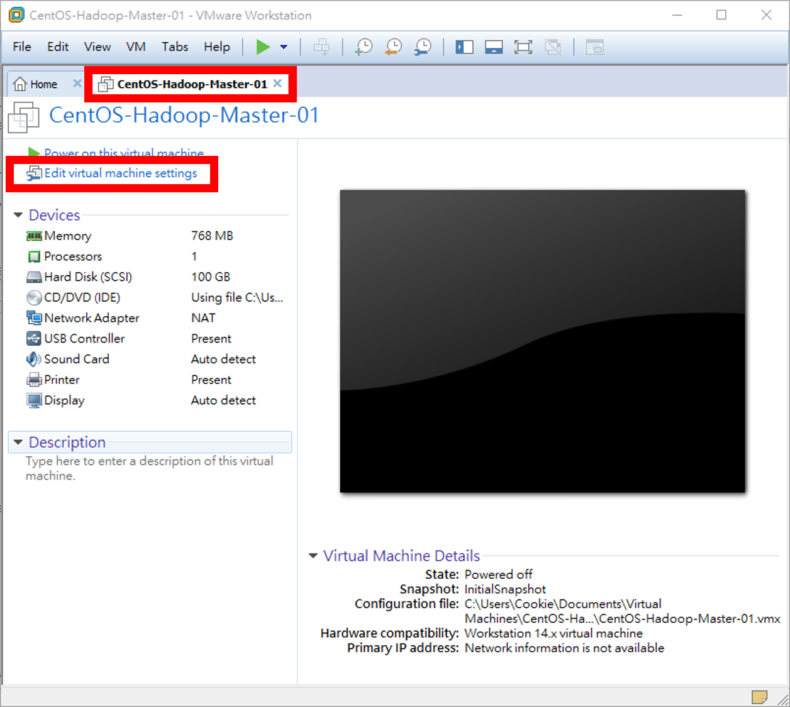
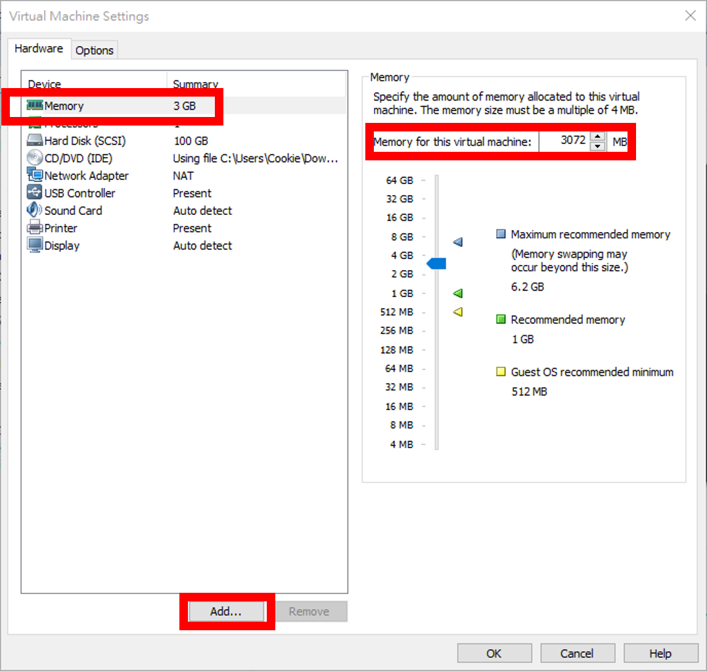
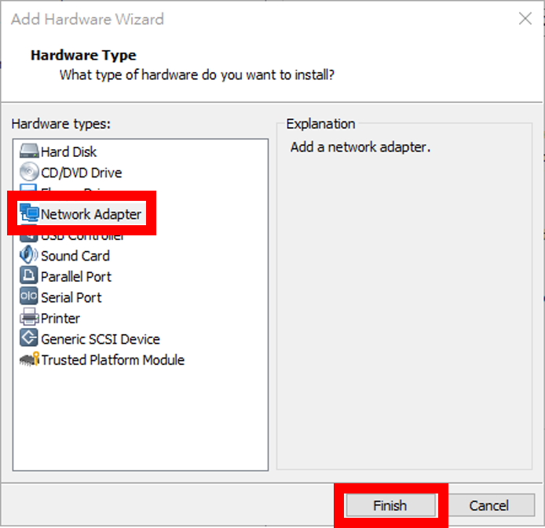
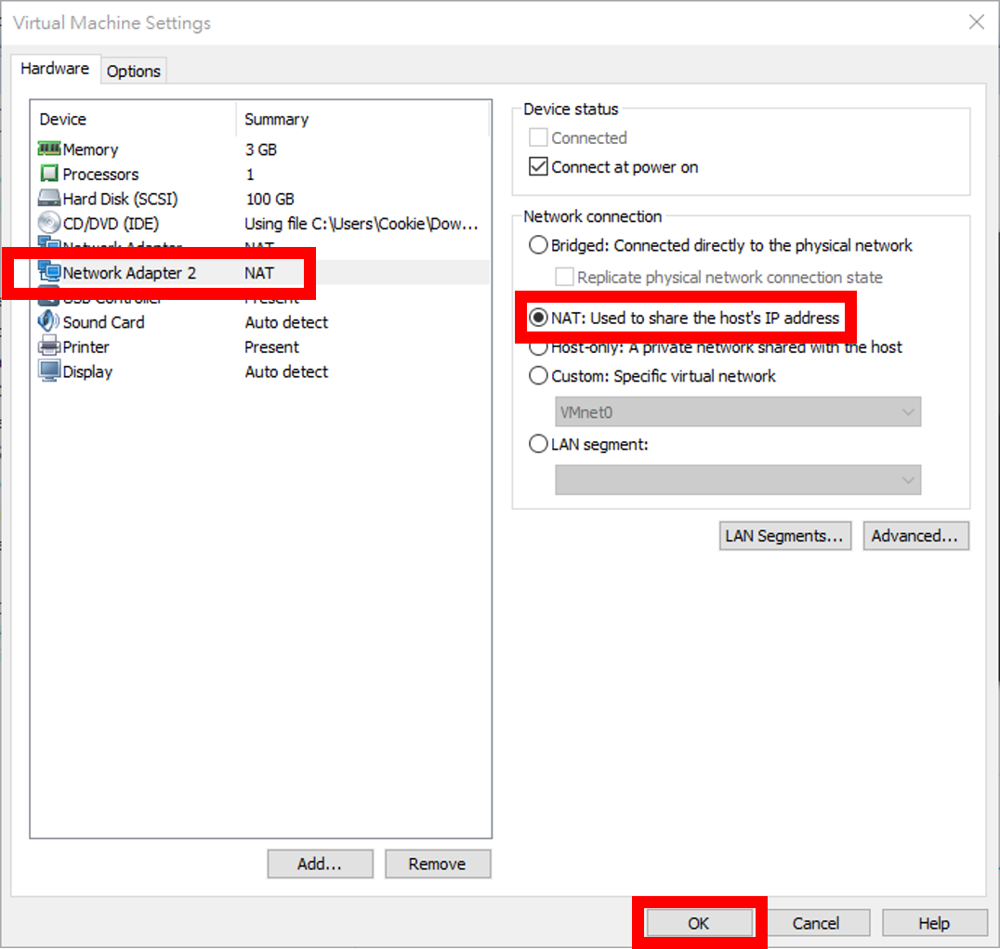
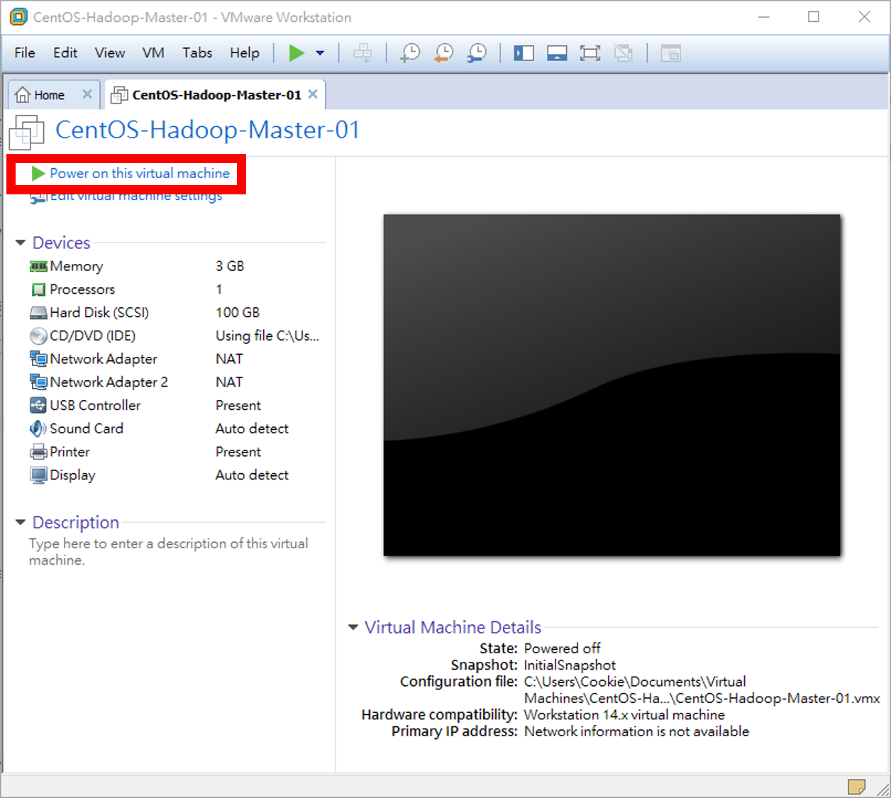
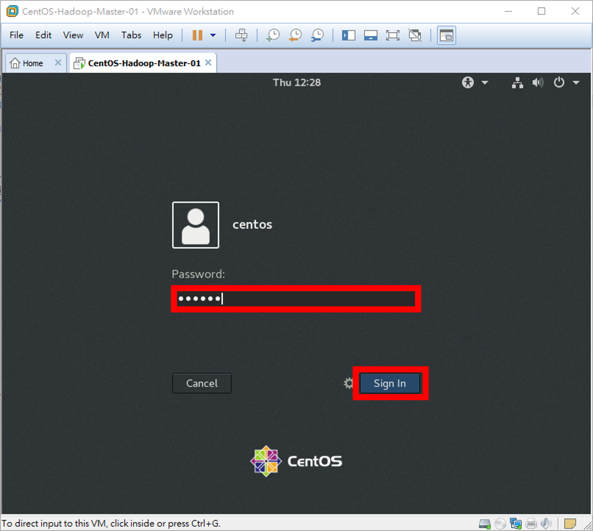
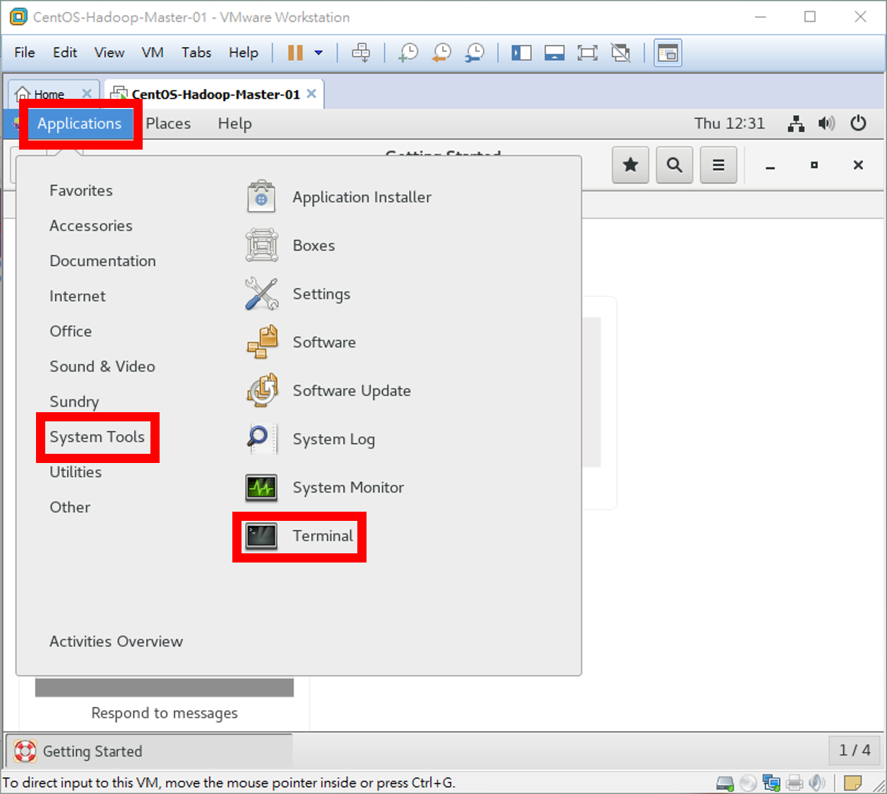
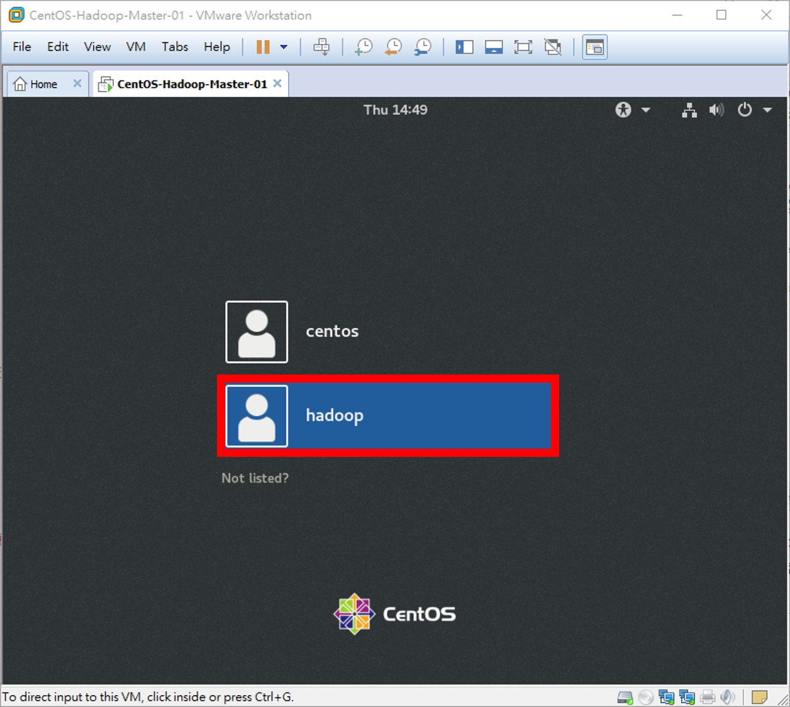
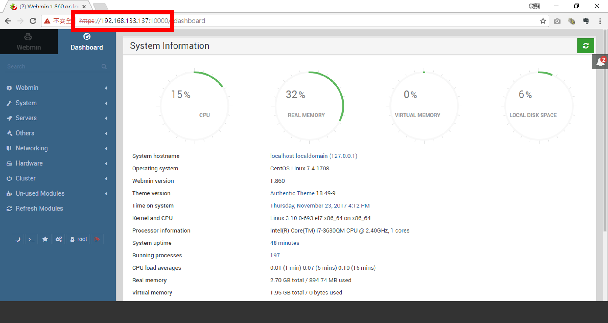

# Homework - Python Spark ML（八）：Hadoop 的安裝
# § 006 - Hadoop & Spark 工作用 Docker Image 的製作 §

### 【[按此回上一頁目錄](https://github.com/oneleo/PythonSparkMLBookClub/tree/master/Homework-PythonSparkML_08)】

## 【原始題目連結】
### [Python Spark ML（八）：Hadoop 的安裝](http://hemingwang.blogspot.tw/2017/10/python-spark-mlhadoop.html)

## 【My Answer】

> 因自身是機器學習初學者，此份作業參考各方資料並加入自己的理解，若有誤還請多指教（建立 Github Issue 來協助我修正），謝謝。

----------

### 01、CentOS 與 Ubuntu 的比較及想法

#### 01-001、想法
* 前面[第四](./004-HadoopSingleNodeOnUbuntu)及[第五](./005-HadoopMultipleNodeOnUbuntu)章節以多個 VM 來模擬叢集，較佔資源，若採一個 VM 多個 Container 容器來模叢集，會有較大的效率，故從本章節將會介紹架設 Docker 軟體貨櫃環境。

#### 01-002 Ubuntu 優缺點
* 1、平均每 6 個月釋出一新版（頻率高），更新支援最長為釋出後 5 年內（較短），新硬體支援度高，容易上手，圖形化介面較友善，佔據儲存空間較多，社群活躍，系統比 CentOS 不穩定，預設安全政策寬鬆。（參考：[https://zh.wikipedia.org/wiki/Ubuntu](https://zh.wikipedia.org/wiki/Ubuntu)）
* 2、新技術框架（Deep Learning、CUDA 等）、個人用戶首選。
* 3、IBM LinuxOne MainFrame 大型主機系統使用 Ubuntu 作業系統。（參考：[http://www-03.ibm.com/systems/tw/linuxone/open-source/ubuntu.html](http://www-03.ibm.com/systems/tw/linuxone/open-source/ubuntu.html)）
* 4、其他要注意的是：Ubuntu 16.04 LTS 起使用 systemd 代替舊的 SysVinit 啟動程式，像 Docker 等軟體在使用 apt-get install 安裝後卻無法順利讀取其設定檔。（參考：[http://orchidflower.oschina.io/2017/06/22/Using-DOCKER-OPTS-on-Ubuntu-16-04-LTS/](http://orchidflower.oschina.io/2017/06/22/Using-DOCKER-OPTS-on-Ubuntu-16-04-LTS/)）

#### 01-003 CentOS 優缺點
* 1、平均每 3 年釋出一新版（頻率低），更新支援最長為釋出後 10 年內（較長），新硬體支援度低，不易上手，圖形化介面較陽春，佔用儲存空間較少，社群較少，系統比 Ubuntu 穩定，預設安全政策嚴謹。（參考：[https://zh.wikipedia.org/wiki/CentOS](https://zh.wikipedia.org/wiki/CentOS)）
* 2、中小企業架站伺服器、IDC 機房作業系統首選。（參考：[https://ddnews.me/tech/tlst2g2u.html](https://ddnews.me/tech/tlst2g2u.html)）

#### 01-004、決定
* 因 CentOS 安全政策嚴謹，且 Ubuntu 支援度高，故決定使用[第二章節](./002-InstallCentOS)安裝的 CentOS 建置 Docker 軟體貨櫃環境，並使用 Ubuntu Container 容器，來架設 Hadoop 叢集環境。
* 附註：考量 Docker 需要高安全性環境，亦有多人選用 [CoreOS Linux](https://coreos.com/) 作為 Docker 的作業環境。

### 02、建立 Docker 環境

#### 02-001、在 CentOS VM 開機前，我們先設置 VM 的記憶體，以及我們再追加一張 NAT 網路卡（原本已經有一張 NAT 網路卡）
* 第二張 NAT 網路卡 未來可供 master Container 對外連入服務使用。
* 在「CentOS-Hadoop-Master-01」 VM 內點選【Edit virtual machine settings】。



#### 02-002、點選左側【Memory】→在右側「Memory for this virtual machine:」輸入【3072】MB→再點選【Add...】準備再新增一張網路卡。



#### 02-002、點選左側【Network Adapter】→點選【Finish】。



#### 02-002、此時會新增第二張網路卡，確定右側為預設的【NAT】模式即可→點選【OK】完成。



#### 02-001、在「CentOS-Hadoop-Master-01」 VM 內點選【Power on this virtual machine】將 VM 開機。



#### 02-002、輸入 centos 使用者密碼【centos】→按下【Enter】鍵。



#### 02-003、現在要執行終端機（Terminal）。點選左上角【Applications】→【System Tools】→【Terminal】（接下來的操作步驟我們都將在「Terminal」內進行）。



----------

### 03、建置 Ubuntu Container 的前置動作

#### 03-001、目前可能尚無法將指令透過複製貼上的方式來輸入指令，所以首先先安裝 VMware 驅動程式 VMware Tools。

```Bash
$ sudo yum install -y open-vm-tools open-vm-tools-desktop
```

#### 03-002、新增一名 UID 為 10000 的使用者 hadoop，其主要群組為 hadoop，次要群組為 sudo。
* 因為我們要用的 Docker Container 的 hadoop 使用者 UID 為 10000，因為 Docker Container 的特性是，Container 裡的使用者權限會和 CentOS VM 宿主主機同一個 UID 的使用者權限一致。
* 若未來需使用 Ubuntu 建立使用者請用 ```$ sudo useradd -m -u 10000 -G sudo -s /bin/bash hadoop``` 指令。
* 【-m】：強制建立使用者家目錄。在這邊家目錄為 /home/ubuntu。
* 【-u】：指定 UID。在這邊為 10000。
* 【-G】：指定次要群組，在這邊為 wheel（CentOS Linux 中可以使用 sudo 指令的群組）。
* 【-s】：指定此使用者使用的使用者介面 Shell。

```Bash
$ sudo useradd -m -u 10000 -G wheel -s /bin/bash hadoop
```

#### 03-003、設定 hadoop 使用者密碼為 hadoop

```Bash
$ sudo passwd hadoop
```

	Changing password for user hadoop.
	New password: hadoop
	BAD PASSWORD: The password is shorter than 8 characters
	Retype new password: hadoop
	passwd: all authentication tokens updated successfully.

#### 03-004、為了使 VMware Tools 驅動程式生效，接著要使用指令的方式來進行安全的重新開機。

```Bash
$ sudo sync; sudo sync; sudo sync; sudo sync; sudo sync; sudo sync; sudo sync; sudo reboot;
```

#### 03-005、重新開機後請使用剛新建的使用者 hadoop 登入。
* 注意：登入後因為此 hadoop 使用者為第一次使用所以會進行第一次設置，可參考[第二篇文章](./002-InstallCentOS)設置。操作順序為：語系選擇【English】→【Next】→鍵盤擇【Taiwanese】→【Next】→安全性預設【ON】→【Next】→連結帳號時選略過【Skip】→點選【Start using CentOS Linux】完成。



#### 03-006、開啟 Terminal 程式，接著為避免 yum 被桌面版更新程式 packagekit 鎖住，將 packagekit 設成開機時不啟動（此為桌面版 CentOS 專屬狀況）。
* 我們可以使用 ```$ sudo systemctl list-units --type service | grep running``` 指令來查看系統服務啟動清單。
* 【packagekit】：CentOS 桌面版更新程式。

```Bash
$ sudo systemctl stop packagekit
$ sudo systemctl disable packagekit
```

#### 03-007、自動刪除不需要的應用程式以及刪除舊的應用程式版本列表。
* 【yum】：CentOS 的包裝工具，可使用此來進行更新（update）、安裝套件（install）等動作，與 Ubuntu 的 apt-get 包裝工具類似。
* 【clean all】指令：刪除舊的應用程式版本列表。

```Bash
$ sudo yum -y autoremove && sudo yum clean all
$ sudo rm -rf /var/cache/yum
```

#### 03-008、更新應用程式版本列表及更新。

```Bash
$ sudo yum check-update && sudo yum -y update
```

#### 03-009、接著我們要讓 sudo 的群組成員，在執行 ```sudo xxx``` 命令時，不再需要輸入密碼。

```Bash
$ sudo vim /etc/sudoers
```

> 	…（前略）
> 	## Allows people in group wheel to run all commands
> 	%wheel ALL=(ALL) ALL
> 	
> 	## Same thing without a password
> 	# %wheel ALL=(ALL) NOPASSWD: ALL
> 	…（後略）
> 	
> ↑ 第 99 列及 102 列修改成 ↓
> 	
> 	…（前略）
> 	## Allows people in group wheel to run all commands
> 	#%wheel ALL=(ALL) ALL
> 	
> 	## Same thing without a password
> 	%wheel ALL=(ALL) NOPASSWD: ALL
> 	…（後略）

#### 03-010、安裝 SSH 遠端程式、下載程式、文字編輯軟體、網路除錯工具、系統工具、Python 語言。軟體貨櫃軟體。

```Bash
$ sudo yum install -y openssh wget vim gedit nano net-tools iputils traceroute curl bind-utils sudo man tree python docker
```

#### 03-011、安裝常用靜態資料庫（Native Library）

```Bash
$ sudo yum install -y openssl-devel snappy-devel bzip2-devel
```

#### 03-012、設定 SSH Server 連線設置。

```Bash
$ sudo vim /etc/ssh/sshd_config
```

> 	…（上略）
> 	# Authentication:
> 	
> 	#LoginGraceTime 2m
> 	#PermitRootLogin yes
> 	#StrictModes yes
> 	…（中略）
> 	#UsePrivilegeSeparation sandbox
> 	#PermitUserEnvironment no
> 	#Compression delayed
> 	#UsePrivilegeSeparation sandbox
> 	#PermitUserEnvironment no
> 	#Compression delayed
> 	#ClientAliveInterval 0
> 	#ClientAliveCountMax 3
> 	#ShowPatchLevel no
> 	#UseDNS yes
> 	#PidFile /var/run/sshd.pid
> 	…（下略）
> 	
> ↑ 第 38 列、110 列及 115 列修改成 ↓
> 	
> 	…（上略）
> 	# Authentication:
> 	
> 	#LoginGraceTime 2m
> 	#PermitRootLogin yes
> 	PermitRootLogin no
> 	#StrictModes yes
> 	…（中略）
> 	#UsePrivilegeSeparation sandbox
> 	#PermitUserEnvironment no
> 	#Compression delayed
> 	#UsePrivilegeSeparation sandbox
> 	#PermitUserEnvironment no
> 	PermitUserEnvironment yes
> 	#Compression delayed
> 	#ClientAliveInterval 0
> 	#ClientAliveCountMax 3
> 	#ShowPatchLevel no
> 	#UseDNS yes
> 	UseDNS no
> 	#PidFile /var/run/sshd.pid
> 	…（下略）

#### 03-013、設定 SSH Client 連線設置，第 35 列。

```Bash
$ sudo vim /etc/ssh/ssh_config
```

> 	…（略）
> 	# StrictHostKeyChecking ask
> 	…（略）
> 	
> ↑ 第 35 列修改成 ↓
> 	
> 	…（略）
> 	# StrictHostKeyChecking ask
> 	StrictHostKeyChecking no
> 	…（略）

#### 03-014、設定開機後自動啟動 SSH，以及重新啟動 SSH 服務。

```Bash
$ sudo systemctl enable sshd
$ sudo systemctl restart sshd
```

#### 03-015、接下來要開通防火牆讓外部 IP 可 SSH 至此 CentOS VM。
* 【--permanen】參數：表示本次設置要永久生效（重開機亦會生效）。
* 【firewall-cmd】：CentOS 防火牆設置指令。
* 【--zone】：選擇要在哪一個網路環境執行防火牆規則，總共有 9 種環境可供選擇，預設為 Public Zone。
* 【--add-service】：要允許連入的服務。在這邊為 SSH，我們可使用 ```$ sudo firewall-cmd --get-services``` 指令來查詢可選擇哪些服務。

```Bash
$ sudo firewall-cmd --permanent --zone=public --add-service=ssh
```

#### 03-016、查詢目前 Public Zone 所開通的永久服務。

```Bash
$ sudo firewall-cmd --permanent --zone=public --list-all
```

	public
	  target: default
	  icmp-block-inversion: no
	  interfaces: 
	  sources: 
	  services: ssh dhcpv6-client
	  ports: 
	  protocols: 
	  masquerade: no
	  forward-ports: 
	  source-ports: 
	  icmp-blocks: 
	  rich rules:

#### 03-017、建立 docker 群組，使得使用 docker 指令時不需使用 sudo 執行。
* 【groupadd】：增加群組。
* 【-r】：此為系統群組（群組識別編號 GID 小於 1000）。
* 【-g A】：指定 GID 為 A。

```Bash
$ sudo groupadd -r -g 823 docker
```

#### 03-018、將目前 hadoop 使用者加入至 docker 群組。
* 【usermod】：修改使用者資訊指令。
* 【-aG A B】：將使用者 B 加入到 A 群組。

```Bash
$ sudo usermod -aG docker hadoop
```

#### 03-019、將目前 hadoop 帳號將 docker 群組切換至第一順位（hadoop:docker）。

```Bash
$ newgrp docker
```

#### 03-020、查看目前帳號包含哪些群組。

```Bash
$ groups
```

	docker wheel hadoop

```Bash
$ cat /etc/group | grep 'docker'
```

	dockerroot:x:985:
	docker:x:823:hadoop

#### 03-021、設定開機後自動啟動 docker，以及立即啟動 docker 服務。

```Bash
$ sudo systemctl enable docker
$ sudo systemctl start docker
```

----------

### 04、安裝 Webmin 監控軟體（可自行選擇不一定要安裝）

#### 04-001、為使我們容易監控 CentOS VM 狀態，安裝 Webmin 監控軟體，可參考 [Webmin 官網](http://www.webmin.com/rpm.html)說明。
* 首先要新增 Webmin yum 下載站點。

```Bash
$ sudo vim /etc/yum.repos.d/webmin.repo
```

> 	[Webmin]
> 	name=Webmin Distribution Neutral
> 	#baseurl=http://download.webmin.com/download/yum
> 	mirrorlist=http://download.webmin.com/download/yum/mirrorlist
> 	enabled=1

#### 04-002、下載 Webmin 應用程式授權金鑰。

```Bash
$ cd /tmp && wget http://www.webmin.com/jcameron-key.asc
```

#### 04-003、安裝 Webmin 授權金鑰，安裝好後刪除安裝檔。

```Bash
$ sudo rpm --import jcameron-key.asc
$ sudo rm -rf /tmp/jcameron-key.asc
```

#### 04-004、更新應用程式列表，並開始安裝 Webmin。

```Bash
$ sudo yum check-update
$ sudo yum install -y webmin
```

#### 04-005、設定開機後自動啟動 Webmin。

```Bash
$ sudo systemctl enable webmin
```

#### 04-006、允許防火牆讓 Webmin 用的 10000 埠通過。
* 【--add-port】：欲開通的連接埠（0 ~ 65535）及協定（TCP、UDP）。

```Bash
$ sudo firewall-cmd --permanent --zone=public --add-port=10000/tcp
```

#### 04-007、查看目前 Public Zone 所開通的永久 Port。

```Bash
$ sudo firewall-cmd --permanent --zone=public --list-ports
```

	10000/tcp

#### 04-008、查看 CentOS VM 第一張 ens33 網路卡的 IP（請依自己 VM 網路卡名稱查詢）。
* 在這邊將以「192.168.133.137」 IP 作為 CentOS VM 對外 IP。

```Bash
$ ifconfig ens33
```

	ens33: flags=4163<UP,BROADCAST,RUNNING,MULTICAST>  mtu 1500
	        inet 192.168.133.137  netmask 255.255.255.0  broadcast 192.168.133.255
	        inet6 fe80::1d83:ea90:3b47:1df7  prefixlen 64  scopeid 0x20<link>
	        ether 00:0c:29:ff:d3:72  txqueuelen 1000  (Ethernet)
	        RX packets 300  bytes 21832 (21.3 KiB)
	        RX errors 0  dropped 0  overruns 0  frame 0
	        TX packets 57  bytes 7064 (6.8 KiB)
	        TX errors 0  dropped 0 overruns 0  carrier 0  collisions 0

#### 04-009、此時可在 Windows 內使用瀏覽器查看 ```https://&lt;VM-IP&gt;:10000```（本處即為「```https://192.168.133.137:10000```」）並使用 root:centos 帳密進行登入。



----------

### 05、建置 Hadoop 叢集用之容器 Container

#### 05-001、取得最新的 Ubuntu Docker Image。
* 此 Ubuntu Docker Image 可作為模版來建立 Ubuntu Container，就像是使用 Ubuntu 光碟片來安裝 Ubuntu。
* 【docker】：執行軟體貨櫃相關指令。
* 【pull】指令：下載指定的 Docker Image。
* 【A:B】參數：下載 B 版本的 A Docker Image，在這邊是下載最新的（Latest）的 Ubuntu Docker 光碟片。

```Bash
$ sudo docker pull ubuntu:latest
```

	Trying to pull repository docker.io/library/ubuntu ... 
	latest: Pulling from docker.io/library/ubuntu
	660c48dd555d: Pull complete 
	4c7380416e78: Pull complete 
	421e436b5f80: Pull complete 
	e4ce6c3651b3: Pull complete 
	be588e74bd34: Pull complete 
	Digest: sha256:7c67a2206d3c04703e5c23518707bdd4916c057562dd51c74b99b2ba26af0f79

#### 05-002、查看已下載的 Docker Image 光碟片。

```Bash
$ sudo docker images
```

	REPOSITORY          TAG                 IMAGE ID            CREATED             SIZE
	docker.io/ubuntu    latest              20c44cd7596f        6 days ago          122.8 MB

#### 05-003、建立一個乾淨的 Container 名叫 worker。
* 【docker run】：建立新的 Container。
* 【--name】：設定 Container 的別名，此別名並非 Container Host Name（Container 本身不會知道此別名，只有宿主 CentOS 才看得到）。
* 【-it】：分配 pseudo-TTY 綁在 Container 的標準輸入上，讓使用者可與之互動。
* 【-d】=【--detach】：Container 建立後即推到背景執行。
* 【/bin/bash】：讓此 Container 執行 /bub/bash Shell 使用者介面程式。

```Bash
$ sudo docker run --name="worker" -itd ubuntu:latest /bin/bash
```

	97dcc6a1dd29b7780b00289d05127c4aa2fdf0ae6accf4426307ad3930f84460

#### 05-004、查看已建立的 Container 容器及其狀態。
* 【docker ps】：查看 Container 的狀態。
* 【-a】：顯示開啟及關閉的所有 Container。

```Bash
$ sudo docker ps -a
```

	CONTAINER ID        IMAGE               COMMAND             CREATED             STATUS              PORTS               NAMES
	97dcc6a1dd29        ubuntu:latest       "/bin/bash"         4 minutes ago       Up 4 minutes                            worker

#### 05-005、進入至此 Ubuntu Container 容器。
* 【docker attach A】：進入一個正在執行的 Container 容器 A。
* 注意：進入後請再按下【Enter】鍵才能繼續操作。
* 注意：若要離開目前的 Container 容器（而不是關閉它），請按下鍵盤的【Ctrl + P】→【Ctrl + Q】來離開。
* 注意：若使用 ```root@xxxxxxxxxxxx:/# exit``` 指令來離開 Container 容器，實際上是將 Container 容器關閉。

```Bash
$ sudo docker attach worker
```

#### 05-006、將此容器進行更新。

```Bash
root@xxxxxxxxxxxx:/# apt-get update && apt-get upgrade -y && apt-get dist-upgrade -y
```

#### 05-007、接著我們要讓 sudo 的群組成員，在執行 ```sudo xxx``` 命令時，不再需要輸入密碼。

```Bash
root@xxxxxxxxxxxx:/# vim /etc/sudoers
```

> 	…（前略）
> 	# Allow members of group sudo to execute any command
> 	%sudo   ALL=(ALL:ALL) ALL
> 	
> 	# See sudoers(5) for more information on "#include" directives:
> 	…（後略）
> 	
> ↑ 第 26 列修改成 ↓
> 	
> 	…（前略）
> 	# Allow members of group sudo to execute any command
> 	#%sudo  ALL=(ALL:ALL) ALL
> 	%sudo   ALL=(ALL:ALL) NOPASSWD: ALL
> 	
> 	# See sudoers(5) for more information on "#include" directives:
> 	…（後略）

#### 05-008、安裝此 Ubuntu Container 所需的基本套件：SSH 遠端程式、下載程式、文字編輯軟體、網路除錯工具、系統工具、Scala 語言。

```Bash
root@xxxxxxxxxxxx:/# apt-get install -y ssh wget python-software-properties vim gedit nano deborphan net-tools iputils-ping traceroute curl dnsutils locales sudo man tree deborphan scala python python3
```

#### 05-009、安裝所需的靜態資料庫（Native Library）

```Bash
root@xxxxxxxxxxxx:/# apt-get install -y libssl-dev libsnappy-dev libbz2-dev
```

#### 05-010、安裝互動式語系安裝／移除工具 localepurge。
* localepurge 可以在保留需要的區域配置的前提之下刪除其他那些系統中存在的無用的區域配置文件，會騰出不少磁盤空間。
* 安裝後我們先點選【OK】→點選【Yes】→點選【Yes】→最後選【OK】。
* 未來若需重新執行此語系設定，請執行 ```root@xxxxxxxxxxxx:/# dpkg-reconfigure locales``` 指令。

```Bash
root@xxxxxxxxxxxx:/# apt-get install -y localepurge
```

#### 05-011、為了安裝 Oracle Java 語言，我們需使用 software-properties-common 工具，但使用此工具前要先裝 python-software-properties 套件，故沒有先和上述套件一起安裝。

```Bash
root@xxxxxxxxxxxx:/# apt-get install -y software-properties-common
```

#### 05-012、加入目前最新的 Java 版本到 Ubuntu 的 apt-get 倉庫 repository 內。```root@xxxxxxxxxxxx:/# add-apt-repository``` 指令要在安裝 software-properties-common 套件後才可使用。
* 注意：安裝時請按下【Enter】鍵繼續安裝。

```Bash
root@xxxxxxxxxxxx:/# add-apt-repository ppa:webupd8team/java
```

#### 05-013、更新套件資料庫後安裝 Hadoop 須用到的 Java 語言，在這邊我們先將 Java 8 與 Java 9 安裝起來。
* 注意：安裝過程中請按下【OK】→【Yes】。

``` Bash
root@xxxxxxxxxxxx:/# apt-get update && apt-get install -y oracle-java9-installer oracle-java8-installer
```

#### 05-014、因剛才安裝了 Java 8 與 Java 9，所以要設置哪一個為預設值，在這邊以設置 Java 8 為預設語言。
* 未來若需使用到 Java 9，可使用 ```root@xxxxxxxxxxxx:/# sudo apt-get install -y oracle-java9-set-default``` 指令來設置。

``` Bash
root@xxxxxxxxxxxx:/# apt-get install -y oracle-java8-set-default
```

#### 05-015、使用下面指令查看 Java 版本。

``` Bash
root@xxxxxxxxxxxx:/# java -version
```

	java version "1.8.0_151"
	Java(TM) SE Runtime Environment (build 1.8.0_151-b12)
	Java HotSpot(TM) 64-Bit Server VM (build 25.151-b12, mixed mode)

#### 05-016、Java 8 預設安裝目錄在「/usr/lib/jvm/java-8-oracle」，為了保持彈性，建立捷徑。
* 目的：為了避免例如升級至 Java 9 後，所有關於 Java 目錄都要重新設置，所以將 _/usr/lib/jvm/java-8-oracle_ 建立捷徑到 _/usr/lib/jvm/java_，而當所有的 Java 目錄都指到 _/usr/lib/jvm/java_ 的話，就算升級到 Java 9，也只要重新指向捷徑，不需要更改所有設置。

``` Bash
root@xxxxxxxxxxxx:/# ln -sf "/usr/lib/jvm/java-8-oracle" "/usr/lib/jvm/java"
```

#### 05-017、查看剛建立的 Java 捷徑。

``` Bash
root@xxxxxxxxxxxx:/# ls -al "/usr/lib/jvm"
```

	total 28
	drwxr-xr-x. 1 root root  314 Nov 23 14:47 .
	drwxr-xr-x. 1 root root  764 Nov 23 14:45 ..
	-rw-r--r--. 1 root root 2600 Oct 27 22:51 .java-1.8.0-openjdk-amd64.jinfo
	-rw-r--r--. 1 root root 2643 Nov 23 14:45 .java-8-oracle.jinfo
	-rw-r--r--. 1 root root 4953 Nov 23 14:44 .java-9-oracle.jinfo
	lrwxrwxrwx. 1 root root   24 Feb 25  2016 default-java -> java-1.8.0-openjdk-amd64
	lrwxrwxrwx. 1 root root   26 Nov 23 14:47 java -> /usr/lib/jvm/java-8-oracle
	lrwxrwxrwx. 1 root root   20 Oct 27 22:51 java-1.8.0-openjdk-amd64 -> java-8-openjdk-amd64
	drwxr-xr-x. 1 root root   26 Nov 23 12:27 java-8-openjdk-amd64
	drwxr-xr-x. 1 root root  274 Nov 23 14:45 java-8-oracle
	drwxr-xr-x. 1 root root   90 Nov 23 14:44 java-9-oracle


#### 05-018、按照同方法，我們也將 Scala 建立捷徑，首先查看目前 Scala 版本。

``` Bash
root@xxxxxxxxxxxx:/# ls -al /usr/share | grep 'scala'
```

	drwxr-xr-x. 1 root root    18 Nov 23 12:27 scala-2.11

#### 05-019、接著根據上方查看的 Scala 版本來建立 Scala 捷徑，這邊以「/usr/share/scala-2.11」為例，建立好後查看。

``` Bash
root@xxxxxxxxxxxx:/# ln -sf "/usr/share/scala-2.11" "/usr/share/scala"
root@xxxxxxxxxxxx:/# ls -al /usr/share | grep 'scala'
```

	lrwxrwxrwx. 1 root root    10 Dec 21  2015 scala -> scala-2.11
	drwxr-xr-x. 1 root root    38 Nov 23 14:50 scala-2.11


#### 05-020、避免 Linux 顯示中文時為亂碼，使用下面指令來新增支援的語系。

``` Bash
root@xxxxxxxxxxxx:/# locale-gen zh_TW zh_TW.UTF-8 en_US en_US.UTF-8
```

#### 05-021、使用下面指令查看目前已安裝的語系。

``` Bash
root@xxxxxxxxxxxx:/# locale -a
```

	C
	C.UTF-8
	POSIX
	en_US
	en_US.iso88591
	en_US.utf8
	zh_TW
	zh_TW.big5
	zh_TW.utf8


#### 05-022、「/etc/skel/」為家目錄模版，當新增新使用者，會從「/etc/skel/」複製到新使用者的家目錄下

* 「/home/NewUser/.bashrc」檔為使用者使用 Interactive Shell 時會自動執行的腳本。
* 【if [ A ]; then B fi】：Shell 程式的條件式：若 A 成立就執行 B。
* 【-z "$SSH_TTY"】：判斷 $SSH_TTY 是否為空值。如果不是用 SSH 登入（$SSH_TTY 為空）就做以下事情。
* 【$SSH_TTY】：若為 SSH 登入會有值，非 SSH 登入就會為空。
* 【alias ping='ping -c 4'】：往後使用「ping」指令，等同於使用「ping -c 4」指令。
* 【alias dir='ls -alh'】：往後使用「dir」指令，等同於使用「ls -alh」指令。

``` Bash
root@xxxxxxxxxxxx:/# vim /etc/skel/.bashrc
```

> 	…（前略）
> 	alias ping='ping -c 4'
> 	alias dir='ls -alh'
> 	if [ -z "$SSH_TTY" ]; then
> 	   export LANG=en_US.UTF-8
> 	   export LANGUAGE=en_US
> 	   export LC_ALL=en_US.UTF-8
> 	else
> 	   export LC_ALL=zh_TW.UTF-8
> 	fi

#### 05-023、上面是為所有新增的使用者設置，現在為目前的 root 使用者設定

``` Bash
root@xxxxxxxxxxxx:/# vim /root/.bashrc
```

> 	…（前略）
> 	alias ping='ping -c 4'
> 	alias dir='ls -alh'
> 	if [ -z "$SSH_TTY" ]; then
> 	   export LANG=en_US.UTF-8
> 	   export LANGUAGE=en_US
> 	   export LC_ALL=en_US.UTF-8
> 	else
> 	   export LC_ALL=zh_TW.UTF-8
> 	fi

#### 05-024、新增一名 UID 為 10000 的使用者 hadoop，其主要群組為 hadoop，次要群組為 sudo。
* 注意：未來使用此 Container 的宿主，也要創建 UID 10000 的使用者（建議一樣是 hadoop），因為 Container UID 為 10000 使用者權限與宿主 UID 10000 的使用者權限相同。所以上述我們已經在 CentOS VM 宿主中創建了 UID 10000 的 hadoop 使用者。

``` Bash
root@xxxxxxxxxxxx:/# useradd -m -u 10000 -G sudo -s /bin/bash hadoop
```

#### 05-025、設定 hadoop 使用者密碼為 hadoop

``` Bash
root@xxxxxxxxxxxx:/# passwd hadoop
```

	Enter new UNIX password: hadoop
	Retype new UNIX password: hadoop
	passwd: password updated successfully

#### 05-026、查看是否有設置成功

``` Bash
root@xxxxxxxxxxxx:/# cat /etc/group | grep hadoop
```

	sudo:x:27:hadoop
	hadoop:x:10000:

``` Bash
root@xxxxxxxxxxxx:/# cat /etc/passwd | grep hadoop
```

	hadoop:x:10000:10000::/home/hadoop:/bin/bash

#### 05-027、在 Container 要可以正常啟動 SSH 服務，需要手動建立 /var/run/sshd 這個目錄，並啟動服務

``` Bash
root@xxxxxxxxxxxx:/# mkdir -p /var/run/sshd
```

#### 05-028、接下來進行 SSH Server 設置，未來我們會將此 VM 做為模板複製成其他 VM，為了達到 SSH 遠端至其他 VM 不需輸入密碼，進行以下設置。首先編輯「/etc/ssh/sshd_config」檔。

``` Bash
root@xxxxxxxxxxxx:/# vim /etc/ssh/sshd_config
```

> 	…（上略）
> 	# Authentication:
> 	LoginGraceTime 120
> 	PermitRootLogin prohibit-password
> 	StrictModes yes
> 	…（中略）
> 	UsePAM yes
> 	
> ↑ 修改第 28 列，以及在文件最下方增加內容 ↓
> 
> 	…（上略）
> 	# Authentication:
> 	LoginGraceTime 120
> 	#PermitRootLogin prohibit-password
> 	PermitRootLogin no
> 	StrictModes yes
> 	…（中略）
> 	UsePAM yes
> 	
> 	PermitUserEnvironment yes
> 	UseDNS no

#### 05-029、接下來進行 SSH Client 設置，編輯「/etc/ssh/ssh_config」檔。

``` Bash
root@xxxxxxxxxxxx:/# vim /etc/ssh/ssh_config
```

> 	…（前略）
> 	# StrictHostKeyChecking ask
> 	…（後略）
> 
> ↑ 第 35 列修改成 ↓
> 
> 	…（前略）
> 	# StrictHostKeyChecking ask
> 	StrictHostKeyChecking no
> 	…（後略）

#### 05-030、切換至 hadoop 帳戶。
* 【su】：切換至其他帳戶。

``` Bash
root@xxxxxxxxxxxx:/# su hadoop
```

#### 05-031、建立 SSH 登入免密碼金鑰。
* 使用 SSH 遠端時可選擇使用密碼或金鑰登入，當連入者 Client 及 Server 均有成對的金鑰時，即可不需密碼完成連線。
* 注意：這邊並未使用 sudo 權限建立金鑰，故金鑰擁有者為目前使用者（hadoop）。
* 
``` Bash
hadoop@xxxxxxxxxxxx:/$ ssh-keygen -t rsa -P '' -f ~/.ssh/id_rsa
```

#### 05-032、因未來使用此 Container 後，遠端時依然是 SSH 至相同的 Container 中，故將剛才製作好的公有金鑰複製成 SSH 認證金鑰，以達到遠端免密碼。

``` Bash
hadoop@xxxxxxxxxxxx:/$ cp -pRf ~/.ssh/id_rsa.pub ~/.ssh/authorized_keys
```

#### 05-033、金鑰被規定權限只能由擁有者存取，故設定權限。

``` Bash
hadoop@xxxxxxxxxxxx:/$ sudo chown -R "$USER":"$USER" ~/.ssh && sudo chmod -R 700 ~/.ssh
```

#### 05-034、查看剛建立的 ~/.ssh 目錄。

``` Bash
hadoop@xxxxxxxxxxxx:/$ ls -al ~/.ssh
```

	total 12
	drwx------. 1 hadoop hadoop   62 Nov 24 02:22 .
	drwxr-xr-x. 1 hadoop hadoop  128 Nov 24 02:24 ..
	-rwx------. 1 hadoop hadoop  401 Nov 24 02:16 authorized_keys
	-rwx------. 1 hadoop hadoop 1679 Nov 24 02:16 id_rsa
	-rwx------. 1 hadoop hadoop  401 Nov 24 02:16 id_rsa.pub

#### 05-035、清除 /bin/bash Shell 指令的歷史。

``` Bash
hadoop@xxxxxxxxxxxx:/$ rm -rf ~/.bash_history
hadoop@xxxxxxxxxxxx:/$ history -c
```

#### 05-036、離開 hadoop 使用者。

``` Bash
hadoop@xxxxxxxxxxxx:/$ exit
```

#### 05-037、測試 SSH 遠端服務。將 SSH 服務開啟。

``` Bash
root@xxxxxxxxxxxx:/# /etc/init.d/ssh start
```

 	* Starting OpenBSD Secure Shell server sshd                                    [ OK ] 

#### 05-038、查看是否有在監聽（等待）22 Port SSH 服務的連入。

``` Bash
root@xxxxxxxxxxxx:/# netstat -ano
```

	Active Internet connections (servers and established)
	Proto Recv-Q Send-Q Local Address           Foreign Address         State       Timer
	tcp        0      0 0.0.0.0:22              0.0.0.0:*               LISTEN      off (0.00/0/0)
	tcp6       0      0 :::22                   :::*                    LISTEN      off (0.00/0/0)
	Active UNIX domain sockets (servers and established)
	Proto RefCnt Flags       Type       State         I-Node   Path

#### 05-039、設置環境變數，將下列內容加入到「/etc/bash.bashrc」檔裡的最後一列。
* 「/etc/bash.bashrc」檔將會在此 Container 被創建時自動執行，且作用範圍會在所有的使用者帳號中生效。
* 【/etc/init.d/ssh start】：當 Container 被建立時（$USER 為空）就啟動 SSH 服務讓我們可以連入。

``` Bash
root@xxxxxxxxxxxx:/# vim /etc/bash.bashrc
```

> 	…（前略）
> 	if [ "$USER" == "" ]; then
> 	        if [ -f /opt/bin/dkc.boot ]; then
> 	                /opt/bin/dkc.boot
> 	        fi
> 	        /etc/init.d/ssh start
> 	else
> 	        if [ -f /opt/bin/dkc.bash ]; then
> 	                source /opt/bin/dkc.bash
> 	        fi
> 	fi

#### 05-040、開始進行自動清除已用不到的軟體，以及手動刪除用不到的的檔案。

``` Bash
root@xxxxxxxxxxxx:/# apt-get autoremove -y && apt-get clean && apt-get autoclean
root@xxxxxxxxxxxx:/# rm -rf /home/hadoop/.ssh/environment
root@xxxxxxxxxxxx:/# rm -rf /home/hadoop/.ssh/known_hosts
root@xxxxxxxxxxxx:/# rm -rf /home/hadoop/.bash_history
root@xxxxxxxxxxxx:/# rm -rf /root/.ssh/environment
root@xxxxxxxxxxxx:/# rm -rf /root/.ssh/known_hosts
root@xxxxxxxxxxxx:/# rm -rf /root/.bash_history
root@xxxxxxxxxxxx:/# rm -rf /root/.aptitude
root@xxxxxxxxxxxx:/# rm -rf /tmp/*
```

#### 05-041、刪除所有暫存的指令記錄（按方向鍵【↑】會出現的指令，將終端機關閉這些指令才會存至 $HOME/.bash_history）。
* 註：若需將目前暫存的指令紀錄強制寫入 $HOME/.bash_history 而不要等終端機關閉，請執行 ```root@xxxxxxxxxxxx:/# history -w``` 指令。
* 
``` Bash
root@xxxxxxxxxxxx:/# history -c
```

#### 05-042、離開並關閉 Container。

``` Bash
root@xxxxxxxxxxxx:/# exit
```

----------


### 06、將作好的 worker Container 打包成唯讀 Image 光碟檔並進行測試

#### 06-001、在將 worker Container 轉成 Image 前先包成壓縮檔，目的為刪除 Container AUFS 的唯讀目錄堆疊，以及對此 Container 的操作歷史紀錄。
* 因為 Docker Container 使用的是 AUFS 檔案系統，特色是 Copy on Write 每次對 Container 作一個動作，就會生成一個新的目錄堆疊，而舊的目錄變成唯讀，好處是非常適合 Docker 環境：一個唯讀 Image 可快速供裝多個 Container，但壞處是當目錄堆疊一多時，效能會很差。
* 我們可以使用 ```$ sudo docker history A``` 指令來查看 Docker Image A 的操作歷史（Dockerfile）。
* 【export】：將 Container 輸出成指定的檔案儲存。

``` Bash
$ sudo docker export worker > ~/worker.tar
```

#### 06-002、再將剛才備份好的壓縮檔來建立 Docker Image（這邊以建立名為 oneleo/worker:17.11.2 的 Docker Image 為例子：oneleo 是 DockerHub 帳號，worker 為 Image 名稱，17.11.2 為版本號，代表 2017 年 11 月第 2 版）。
* 請趁現在為自己在 [Docker Hub 網站](https://hub.docker.com)建立一帳號，並將 Container 設定成自己的帳號名稱。

``` Bash
$ sudo cat ~/worker.tar | docker import - oneleo/worker:17.11.2
```

#### 06-003、備份的壓縮檔轉成 Docker Image 後就可以刪除了。

``` Bash
$ sudo rm -rf ~/worker.tar
```

#### 06-004、查看自己製作的 Docker Image 歷史紀錄，可以發現沒有留下任何供裝資訊，提高了保密性。

``` Bash
$ sudo docker history oneleo/worker:17.11.2
```

	IMAGE               CREATED             CREATED BY          SIZE                COMMENT
	d8c45c08b1f9        2 minutes ago                           2.407 GB            Imported from -

#### 06-005、比較官方製作的 Ubuntu Docker Image 歷史紀錄，可以發現都保留了供裝資訊。

``` Bash
$ sudo docker history ubuntu
```

	IMAGE               CREATED             CREATED BY                                      SIZE                COMMENT
	20c44cd7596f        6 days ago          /bin/sh -c #(nop)  CMD ["/bin/bash"]            0 B                 
	<missing>           6 days ago          /bin/sh -c mkdir -p /run/systemd && echo 'doc   7 B                 
	<missing>           6 days ago          /bin/sh -c sed -i 's/^#\s*\(deb.*universe\)$/   2.759 kB            
	<missing>           6 days ago          /bin/sh -c rm -rf /var/lib/apt/lists/*          0 B                 
	<missing>           6 days ago          /bin/sh -c set -xe   && echo '#!/bin/sh' > /u   745 B               
	<missing>           6 days ago          /bin/sh -c #(nop) ADD file:280a445783f309c90a   122.8 MB

#### 06-006、接下來要使用自己製作好的 Docker Image 供裝成 Container，因為我們有在 Container 編輯「/etc/bash.bashrc」檔，並指定「/opt/bin/dkc.boot」及「/opt/bin/dkc.bash」檔案觸發，所以我們要製作此二檔案，再掛載到 Container 供其使用。

``` Bash
$ sudo mkdir -p /opt/bin
```

#### 06-007、編輯「/opt/bin/dkc.boot」檔。

``` Bash
$ sudo vim /opt/bin/dkc.boot
```

> 	#!/bin/bash
> 	touch /tmp/dkc.boot

#### 06-008、編輯「/opt/bin/dkc.bash」檔。

``` Bash
$ sudo vim /opt/bin/dkc.bash
```

> 	#!/bin/bash
> 	export DKCBASH=OK

#### 06-009、開通 /opt 資料夾的權限。

``` Bash
$ sudo chown -R "$USER":"$USER" /opt && sudo chmod -R 775 /opt
```

#### 06-010、供裝二臺測試用 Container：test1、test2，並設置相關參數。
* 【--cap-add=NET_ADMIN】參數：允許 Container 具有修改自己 IP 的權限。
* 【-v】參數：volume，把操作主機（宿主主機）的 /opt 目錄，掛到（mount）貨櫃主機程式內的 /opt 目錄上，此一行為稱之 Docker 的外掛目錄。
* 【:z】參數：開通 CentOS SELinux 政策不允許 Container 存取空間，大 Z 只允許最後用此參數的 Container，小 z 允許所有使用此參數的 Container。

``` Bash
$ sudo docker run --name="test1" -v /opt:/opt:z --cap-add=NET_ADMIN -itd oneleo/worker:17.11.2 /bin/bash
$ sudo docker run --name="test2" -v /opt:/opt:z --cap-add=NET_ADMIN -itd oneleo/worker:17.11.2 /bin/bash
```

#### 06-011、為了讓 CentOS 宿主主機可以 SSH 遠端至 oneleo/worker:17.11.2 Container 免密碼，將 Container 相關金鑰複製到 CentOS 宿主主機，並設置適當權限。
* 【docker cp A:B C】：將 Container A 內的 B 檔案複製到宿主的 C 目錄中。

``` Bash
$ mkdir -p "/home/$USER/.ssh"
$ sudo docker cp test1:"/home/$USER/.ssh/id_rsa" "/home/$USER/.ssh"
$ sudo docker cp test1:"/home/$USER/.ssh/id_rsa.pub" "/home/$USER/.ssh"
$ sudo docker cp test1:"/home/$USER/.ssh/authorized_keys" "/home/$USER/.ssh"
$ sudo chown -R "$USER":"$USER" "/home/$USER/.ssh" && sudo chmod -R 700 "/home/$USER/.ssh"
```

#### 06-012、查看 ~/.ssh 目錄。

``` Bash
$ ls -al ~/.ssh
```

	total 12
	drwx------. 1 hadoop hadoop   62 Nov 24 12:43 .
	drwx------. 1 hadoop hadoop  350 Nov 24 12:40 ..
	-rwx------. 1 hadoop hadoop  401 Nov 24 10:16 authorized_keys
	-rwx------. 1 hadoop hadoop 1679 Nov 24 10:16 id_rsa
	-rwx------. 1 hadoop hadoop  401 Nov 24 10:16 id_rsa.pub

#### 06-013、取得 Container test1 的 IP。
* 【docker exec -it A B】：在不進入 Container 狀況下，讓 Container A 執行 B 指令。

``` Bash
$ sudo docker exec -it test1 ifconfig eth0
```

	eth0      Link encap:Ethernet  HWaddr 02:42:ac:11:00:02  
	          inet addr:172.17.0.2  Bcast:0.0.0.0  Mask:255.255.0.0
	          inet6 addr: fe80::42:acff:fe11:2/64 Scope:Link
	          UP BROADCAST RUNNING MULTICAST  MTU:1500  Metric:1
	          RX packets:16 errors:0 dropped:0 overruns:0 frame:0
	          TX packets:8 errors:0 dropped:0 overruns:0 carrier:0
	          collisions:0 txqueuelen:0 
	          RX bytes:1296 (1.2 KB)  TX bytes:648 (648.0 B)

``` Bash
$ sudo docker exec -it test2 ifconfig eth0
```

	eth0      Link encap:Ethernet  HWaddr 02:42:ac:11:00:03  
	          inet addr:172.17.0.3  Bcast:0.0.0.0  Mask:255.255.0.0
	          inet6 addr: fe80::42:acff:fe11:3/64 Scope:Link
	          UP BROADCAST RUNNING MULTICAST  MTU:1500  Metric:1
	          RX packets:8 errors:0 dropped:0 overruns:0 frame:0
	          TX packets:8 errors:0 dropped:0 overruns:0 carrier:0
	          collisions:0 txqueuelen:0 
	          RX bytes:648 (648.0 B)  TX bytes:648 (648.0 B)

#### 06-014、SSH 遠端至 Container test1，並同時確定 Container 有正確於啟動時自動執行 SSH 遠端軟體。

``` Bash
$ ssh hadoop@172.17.0.2
```

	Warning: Permanently added '172.17.0.2' (ECDSA) to the list of known hosts.
	Welcome to Ubuntu 16.04.3 LTS (GNU/Linux 3.10.0-693.el7.x86_64 x86_64)
	
	 * Documentation:  https://help.ubuntu.com
	 * Management:     https://landscape.canonical.com
	 * Support:        https://ubuntu.com/advantage
	
	The programs included with the Ubuntu system are free software;
	the exact distribution terms for each program are described in the
	individual files in /usr/share/doc/*/copyright.
	
	Ubuntu comes with ABSOLUTELY NO WARRANTY, to the extent permitted by
	applicable law.
	
	hadoop@xxxxxxxxxxxx:~$

#### 06-015、SSH 遠端至另 Container test2，並同時確定 Container 間可以不需要密碼連線。

``` Bash
hadoop@xxxxxxxxxxxx:~$ ssh hadoop@172.17.0.3
```

#### 06-016、因為我們有編輯「/etc/bash.bashrc」檔會在 Container 啟動時自動執行，確認我們寫在「/opt/bin/dkc.boot」及「/opt/bin/dkc.bash」的指令有被正確執行。

``` Bash
hadoop@xxxxxxxxxxxx:~$ ls -al /tmp
```

	total 0
	drwxrwxrwt. 1 root root  16 11月 24 04:33 .
	drwxr-xr-x. 1 root root 152 11月 24 04:33 ..
	-rw-r--r--. 1 root root   0 11月 24 04:33 dkc.boot

``` Bash
hadoop@xxxxxxxxxxxx:~$ echo $DKCBASH
```

	OK

#### 06-017、測試完成，離開 SSH 遠端（test2）。

``` Bash
hadoop@xxxxxxxxxxxx:~$ exit
```

#### 06-018、離開 SSH 遠端（test1）。

``` Bash
hadoop@xxxxxxxxxxxx:~$ exit
```

#### 06-019、刪除測試用的二個 Container。
* 【docker rm】：刪除 Container。
* 【-f】參數：即使 Container 正在執行，仍強制刪除。

``` Bash
$ sudo docker rm -f test1 test2
```

#### 06-020、登入 Docker Hub，準備將剛才作好的 Image 上傳至 Docker Hub。

``` Bash
$ sudo docker login
```

	Login with your Docker ID to push and pull images from Docker Hub. If you don't have a Docker ID, head over to https://hub.docker.com to create one.
	Username: 您的帳號名稱
	Password: 您的帳號密碼
	Login Succeeded

#### 06-021、上傳自製的 Docker Image oneleo/worker:17.11.2

``` Bash
$ sudo docker push oneleo/worker:17.11.2
```

	The push refers to a repository [docker.io/oneleo/worker]
	fdd6df84c736: Pushed 
	17.11.2: digest: sha256:8c8c3d2f3ca378572dedf1874168799ca199f5d9fb9ffca0ce7368d0adcfab57 size: 530


#### 06-022、登出 Docker Hub

``` Bash
$ sudo docker logout
```

	Remove login credentials for https://index.docker.io/v1/

#### 06-023、刪除 Docker Hub 的登入紀錄

``` Bash
$ rm -rf ~/.docker
```

----------

### 07、清理 CentOS VM。

#### 07-001、開始進行自動清除已用不到的軟體。自動清除已用不到的軟體。
* 【autoremove】：自動刪除用不到的相依軟體。
* 【autoclean】：自動刪除已安裝軟體的原始安裝檔。
* 【clean】：刪除所有已安裝軟體的原始安裝檔。

```Bash
$ sudo apt-get autoremove -y && sudo apt-get autoclean && sudo apt-get clean
```

#### 07-002、清除用不到的檔案及資料夾。

```Bash
$ sudo yum -y autoremove && sudo yum clean all
$ sudo rm -rf /var/cache/yum
$ sudo rm -rf /home/hadoop/.ssh/environment
$ sudo rm -rf /home/hadoop/.ssh/known_hosts
$ sudo rm -rf /tmp/*
```

## 【References】

- [01] 陳松林老師，「Big Data 研究室」，[http://bigdatahome.blogspot.tw/](http://bigdatahome.blogspot.tw/)

### 【[按此回上一頁目錄](https://github.com/oneleo/PythonSparkMLBookClub/tree/master/Homework-PythonSparkML_08)】