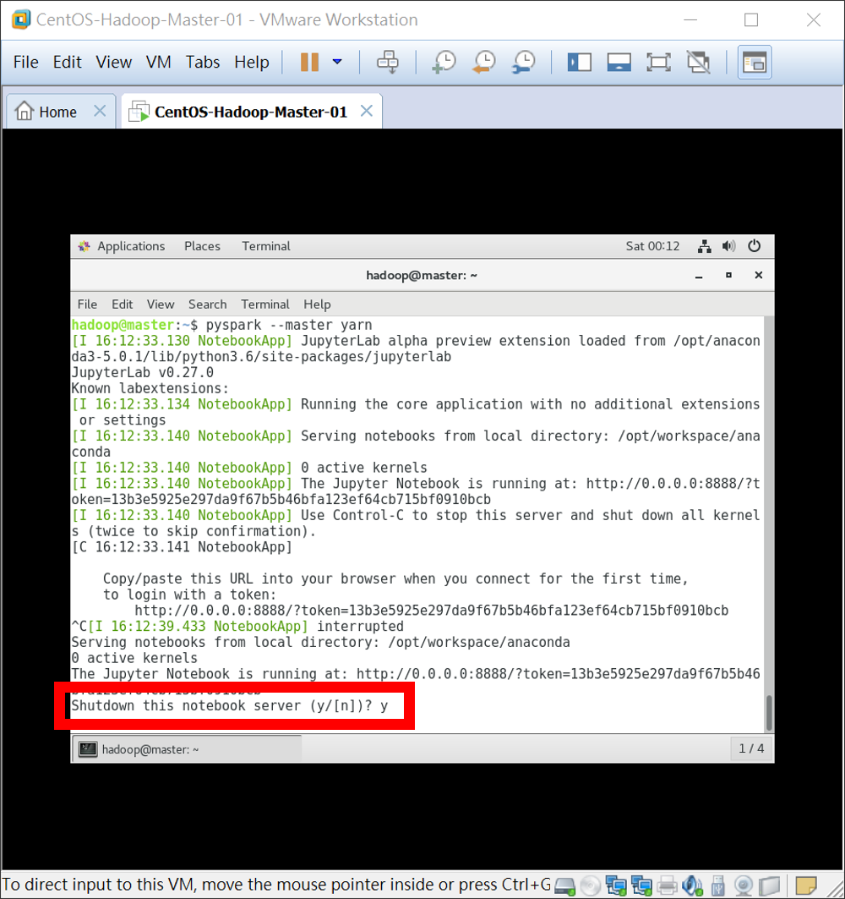

# Homework - Python Spark ML（八）：Hadoop 的安裝
# § VMware Workstation 虛擬機器軟體安裝 §

### 【[按此回上一頁](https://github.com/oneleo/PythonSparkMLBookClub/tree/master/Homework-PythonSparkML_08)】

## 【題目連結】
### [Python Spark ML（八）：Hadoop 的安裝](http://hemingwang.blogspot.tw/2017/10/python-spark-mlhadoop.html)

## 【My Answer】

> 因自身是機器學習初學者，此份作業參考各方資料並加入自己的理解，若有誤還請多指教（建立 Github Issue 來協助我修正），謝謝。

### 01、接續[上一章節]()，接下來要使用製作好的 Container 部署成 Hadoop 叢集，首先進行 Hadoop 安裝及相關設置。

#### 01-001、建立放置 Hadoop、Spark 及 Anaconda 原始檔的目錄「/opt」，建立好後設置權限。

``` Bash
$ sudo mkdir -p /opt && sudo chown -R "$USER":"$USER" /opt && sudo chmod -R 775 /opt
```

#### 01-002、安裝 Hadoop 與相關設置。至 [Apache Hadoop](http://hadoop.apache.org/releases.html) 官網，點擊進入目前最新穩定版（2.9.0）binary 連結。


#### 01-003、Apache Hadoop 官網會自動偵測最近的站點。請在站點上按滑鼠【右鍵】→【複製連結網址(E)】，並取代 ``` wget ``` 指令後方位址。

``` Bash
$ cd /tmp && wget "http://apache.stu.edu.tw/hadoop/common/hadoop-2.9.0/hadoop-2.9.0.tar.gz"
```


#### 01-004、解壓縮剛才下載的 Hadoop 壓縮包（這裡為 hadoop-2.9.0.tar.gz 壓縮包）至 /opt 目錄。

``` Bash
$ tar -zxv -f "/tmp/hadoop-2.9.0.tar.gz" -C "/opt"
```

#### 01-005、為了保持彈性，建立 Hadoop 原始檔捷徑。

``` Bash
$ ln -sf "/opt/hadoop-2.9.0" "/opt/hadoop"
```

#### 01-006、查看剛建立的 Hadoop 捷徑。

``` Bash
$ ls -al /opt
```

	total 4
	drwxrwxr-x. 1 hadoop hadoop  42 Nov 24 16:34 .
	dr-xr-xr-x. 1 root   root   132 Nov 24 16:04 ..
	drwxrwxr-x. 1 hadoop hadoop  32 Nov 24 16:35 bin
	lrwxrwxrwx. 1 hadoop hadoop  17 Nov 24 16:33 hadoop -> /opt/hadoop-2.9.0
	drwxr-xr-x. 1 hadoop hadoop 126 Nov 14 07:28 hadoop-2.9.0

#### 01-007、下載敬翔自製的設定檔，解壓縮至「/opt」目錄，並設置權限。

``` Bash
$ cd /tmp && wget "https://drive.google.com/uc?authuser=0&id=1aLWevPkZ1Bo2zAGmI-boS67qaP_6s0os&export=download"
$ tar -zxv -f "hdopt17.11.23.tar.gz" -C "/"
$ sudo chown -R "$USER":"$USER" /opt && sudo chmod -R 775 /opt
```

#### 01-008、查看解壓縮結果。

``` Bash
$ ls -al /opt
```

	drwxrwxr-x. 1 hadoop hadoop 140 Nov 24 16:36 .
	dr-xr-xr-x. 1 root   root   132 Nov 24 16:04 ..
	drwxrwxr-x. 1 hadoop hadoop  92 Nov 24 16:04 bin
	drwxrwxr-x. 1 hadoop hadoop  10 Nov 24 16:04 conf
	lrwxrwxrwx. 1 hadoop hadoop  17 Nov 24 16:33 hadoop -> /opt/hadoop-2.9.0
	drwxrwxr-x. 1 hadoop hadoop 126 Nov 14 07:28 hadoop-2.9.0
	drwxrwxr-x. 1 hadoop hadoop 216 Nov 24 16:04 hadoop.etc.hadoop.template
	drwxrwxr-x. 1 hadoop hadoop  74 Nov 24 16:04 spark.conf.template

#### 01-009、將敬翔已撰寫好的 Hadoop 設定檔複製到「/opt/hadoop/etc/hadoop」目錄內
* 設定檔分別為「[core-site.xml]()」、「[hdfs-site.xml]()」、「[mapred-site.xml]()」、「[yarn-site.xml]()」、「[slaves]()」、「[hdfs.include]()」、「[hdfs.exclude]()」、「[yarn.include]()」、「[yarn.exclude]()」，請點入連結察看設定說明。
* 「core-default.xml」所有的可用參數請參考：[官方網站](http://hadoop.apache.org/docs/current/hadoop-project-dist/hadoop-common/core-default.xml)
* 「hdfs-default.xml」所有的可用參數請參考：[官方網站](http://hadoop.apache.org/docs/current/hadoop-project-dist/hadoop-hdfs/hdfs-default.xml)
* 「mapred-default.xml」所有的可用參數請參考：[官方網站](http://hadoop.apache.org/docs/current/hadoop-mapreduce-client/hadoop-mapreduce-client-core/mapred-default.xml)
* 「yarn-default.xml」所有的可用參數請參考：[官方網站](http://hadoop.apache.org/docs/current/hadoop-yarn/hadoop-yarn-common/yarn-default.xml)
* 新舊版本 Hadoop 參數對照請參考：[官網參數對照表](http://hadoop.apache.org/docs/current/hadoop-project-dist/hadoop-common/DeprecatedProperties.html)

``` Bash
$ cp -pRf /opt/hadoop.etc.hadoop.template/* /opt/hadoop/etc/hadoop
```

### 02、安裝 Python Spark 與相關設置

#### 02-001、至 [Apache Spark](https://spark.apache.org/downloads.html) 官網，點擊進入目前最新穩定版（2.2.0）binary 連結。
* 「1. Choose a Spark release:」=【2.2.0 (Jul 11 2017)】。
* 「2. Choose a package type:」=【Pre-built for Apache Hadoop 2.7 and later】。
* 點選【spark-2.2.0-bin-hadoop2.7.tgz】進入下載頁面。


#### 02-002、Apache Spark 官網會自動偵測最近的站點。請在站點上按滑鼠【右鍵】→【複製連結網址(E)】，並取代 ``` wget ``` 指令後方位址。

``` Bash
$ cd /tmp && wget "http://apache.stu.edu.tw/spark/spark-2.2.0/spark-2.2.0-bin-hadoop2.7.tgz"
```


#### 02-003、解壓縮剛才下載的 Spark 壓縮包（這裡為 spark-2.2.0-bin-hadoop2.7.tgz 壓縮包）至 /opt 目錄，並設置權限。

``` Bash
$ tar -zxv -f "/tmp/spark-2.2.0-bin-hadoop2.7.tgz" -C "/opt"
$ sudo chown -R "$USER":"$USER" /opt && sudo chmod -R 775 /opt
```

#### 02-004、為了保持彈性，建立 spark 原始檔捷徑。

``` Bash
$ ln -sf "/opt/spark-2.2.0-bin-hadoop2.7" "/opt/spark"
```

#### 02-005、查看剛建立的 Spark 捷徑。

``` Bash
$ ls -al /opt
```

	total 8
	drwxrwxr-x. 1 hadoop hadoop 200 Nov 24 16:53 .
	dr-xr-xr-x. 1 root   root   132 Nov 24 16:04 ..
	drwxrwxr-x. 1 hadoop hadoop  92 Nov 24 16:04 bin
	drwxrwxr-x. 1 hadoop hadoop  10 Nov 24 16:04 conf
	lrwxrwxrwx. 1 hadoop hadoop  17 Nov 24 16:33 hadoop -> /opt/hadoop-2.9.0
	drwxrwxr-x. 1 hadoop hadoop 126 Nov 14 07:28 hadoop-2.9.0
	drwxrwxr-x. 1 hadoop hadoop 216 Nov 24 16:04 hadoop.etc.hadoop.template
	lrwxrwxrwx. 1 hadoop hadoop  30 Nov 24 16:53 spark -> /opt/spark-2.2.0-bin-hadoop2.7
	drwxrwxr-x. 1 hadoop hadoop 150 Jul  1 07:09 spark-2.2.0-bin-hadoop2.7
	drwxrwxr-x. 1 hadoop hadoop  74 Nov 24 16:04 spark.conf.template

#### 02-006、將敬翔已撰寫好的 Hadoop 設定檔複製到「/opt/spark/conf」目錄內
* 設定檔分別為「[spark-defaults.conf]()」、「[spark-env.sh]()」、「[slaves]()」，請點入連結察看設定說明。
* 相關參數請參考：[官方網站](https://spark.apache.org/docs/latest/configuration.html)。

``` Bash
$ cp -pRf /opt/spark.conf.template/* /opt/spark/conf
```

### 03、安裝 Anaconda 與相關設置

#### 03-001、至 [Anaconda](https://www.anaconda.com/download/#linux) 官網，請在站點上按滑鼠【右鍵】→【複製連結網址(E)】，並取代 ```wget``` 指令後方位址。

``` Bash
$ cd /tmp && wget https://repo.continuum.io/archive/Anaconda3-5.0.1-Linux-x86_64.sh
```


#### 03-002、開始安裝 Anaconda。
* Anaconda*-Linux-x86_64.sh 是一個可執行的安裝檔，可直接使用 /bin/bash 來執行。
* 注意：在安裝過程中，請依序按此順序操作：按下【Enter】繼續→按下【q】離開授權條條→輸入【yes】後按下【Enter】→輸入安裝資料夾【/opt/anaconda3-5.0.1】→按下【Enter】鍵→安裝好輸入【no】之後按下【Enter】。

``` Bash
$ sudo /bin/bash /tmp/Anaconda3-5.0.1-Linux-x86_64.sh
```

#### 03-003、設置 /opt 擁有者及權限。

``` Bash
$ sudo chown -R "$USER":"$USER" /opt && sudo chmod -R 775 /opt
```

#### 03-004、為保留彈性建立 Anaconda 捷徑。

``` Bash
$ ln -sf "/opt/anaconda3-5.0.1" "/opt/anaconda"
```

#### 03-005、查看剛建立的 Anaconda 捷徑。

``` Bash
$ ls -al /opt
```

	total 12
	drwxrwxr-x. 1 hadoop hadoop 246 Nov 24 17:12 .
	dr-xr-xr-x. 1 root   root   132 Nov 24 16:04 ..
	lrwxrwxrwx. 1 hadoop hadoop  20 Nov 24 17:12 anaconda -> /opt/anaconda3-5.0.1
	drwxrwxr-x. 1 hadoop hadoop 302 Nov 24 17:12 anaconda3-5.0.1
	drwxrwxr-x. 1 hadoop hadoop  92 Nov 24 16:04 bin
	drwxrwxr-x. 1 hadoop hadoop  10 Nov 24 16:04 conf
	lrwxrwxrwx. 1 hadoop hadoop  17 Nov 24 16:33 hadoop -> /opt/hadoop-2.9.0
	drwxrwxr-x. 1 hadoop hadoop 126 Nov 14 07:28 hadoop-2.9.0
	drwxrwxr-x. 1 hadoop hadoop 216 Nov 24 16:04 hadoop.etc.hadoop.template
	lrwxrwxrwx. 1 hadoop hadoop  30 Nov 24 16:53 spark -> /opt/spark-2.2.0-bin-hadoop2.7
	drwxrwxr-x. 1 hadoop hadoop 150 Jul  1 07:09 spark-2.2.0-bin-hadoop2.7
	drwxrwxr-x. 1 hadoop hadoop  74 Nov 24 16:04 spark.conf.template

----------

### 04、供裝 Container 叢集環境

#### 04-001、依需求修改設計圖。
* 敬翔自製的腳本放置於 /opt/bin 目錄內，腳本會參照 /opt/conf/hosts 檔（設計圖）來執行，故要依需求修改此設計圖，請將此設計圖的【dockerimage】參數修改成[上一章節]()所製作的 Docker Image。
* 敬翔自製的腳本分別為「[dkc.boot]()」、「[dkc.bash]()」、「[dkrstart]()」、「[dkrstop]()」、「[dkrremove]()」、「[dkrnet]()」，請點入連結察看設定說明。
* 文件最下方（未被註解處）可再自行追加或減少 Hostname 及對映的 IP 數，腳本會自動偵測並供裝。 

``` Bash
$ vim /opt/conf/hosts
```

> 	# appadmin=hadoop # Application Administrator
> 	# dockerimage=oneleo/worker:17.11.2 # Docker Image Selection
> 	# clusterconf= #/opt/conf/cluster # Application Configuration Folder
> 	# sparkpython=python2 # python3 for Spark, python2 for Jupyter (IPython) Notebook
> 	
> 	# hadoophome=/opt/hadoop # Apache Hadoop Home
> 	# hbasehome= #/opt/hbase-1.2.6 # Apache HBase Home
> 	# pighome= #/opt/pig-0.17.0 # Apache Pig Home
> 	# hivehome= #/opt/apache-hive-2.2.0-bin # Apache Hive Home
> 	# flumehome= #/opt/apache-flume-1.7.0-bin # Apache Flume Home
> 	# kafkahome= #/opt/kafka_2.12-0.11.0.0 # Apache Kafka Home
> 	# zookeeperhome= #/opt/zookeeper-3.4.10 # Apache ZooKeeper Home
> 	# sparkhome=/opt/spark # Spark Home
> 	# anacondahome=/opt/anaconda # Anaconda Home
> 	
> 	# netmask=255.255.0.0 # Docker Netmask
> 	# gateway=172.17.0.1 # Docker Gateway
> 	# nameserver= #168.95.1.1 # Docker Name Server
> 	
> 	# namenodehost=master # Name Node, Secondary Name Node, Resource Manager, Spark Master
> 	
> 	172.17.0.10 master # Name Node, Secondary Name Node, Resource Manager, Spark Master
> 	172.17.0.11 data1 # Data Node, Node Manager, Spark Worker
> 	172.17.0.12 data2 # Data Node, Node Manager, Spark Worker
> 	172.17.0.13 data3 # Data Node, Node Manager, Spark Worker

#### 04-002、根據設計圖供裝 Container，並設置好每一個 Container 環境變數及 IP，並將執行結果放到 /opt/logs 目錄內。

``` Bash
$ /opt/bin/dkrstart
```

	f8b2ab7fb309ef79e3d6654a2c812a2762bb8178b8376674873802de6a20d85d
	（註解：容器 data1 建好且執行中。）
	Container data1 is created.
	（註解：容器 data1 的 hostname 成功覆寫至 hadoop 設定檔 slvaes、hdfs.include、yarn.include。）
	Container Hostname data1 is overwritten to /opt/hadoop/etc/hadoop/slaves file.
	Container Hostname data1 is overwritten to /opt/hadoop/etc/hadoop/hdfs.include file.
	Container Hostname data1 is overwritten to /opt/hadoop/etc/hadoop/yarn.include file.
	Container Hostname data1 is overwritten to /opt/spark/conf/slaves file.
	5b67272625d0c20bc5e7faa919bace31887d06205b45996ca1d12da18cd0f048
	Container data2 is created.
	（註解：容器 data2 的 hostname 成功追加至 hadoop 設定檔 slvaes、hdfs.include、yarn.include 最下方。）
	Container Hostname data2 is written to /opt/hadoop/etc/hadoop/slaves file.
	Container Hostname data2 is written to /opt/hadoop/etc/hadoop/hdfs.include file.
	Container Hostname data2 is written to /opt/hadoop/etc/hadoop/yarn.include file.
	Container Hostname data2 is written to /opt/spark/conf/slaves file.
	3eaab5a6c21c2c59a465e1fa60e50269f1c81d1ef950f478e2023cac5dceb946
	Container data3 is created.
	Container Hostname data3 is written to /opt/hadoop/etc/hadoop/slaves file.
	Container Hostname data3 is written to /opt/hadoop/etc/hadoop/hdfs.include file.
	Container Hostname data3 is written to /opt/hadoop/etc/hadoop/yarn.include file.
	Container Hostname data3 is written to /opt/spark/conf/slaves file.
	5c196b66d43a5a2eee00f8e307c3862fef84bd63043e8b093537d06d8ce03c5e
	Container master is created.
	（註解：成功將設計圖 /opt/conf/hosts 覆寫至宿主的 /etc/hosts 檔。）
	Successfully overwrite file from /opt/conf/hosts to "/etc/hosts".
	（註解：成功將容器的 SSH 金鑰複製到宿主的 /home/hadoop/.ssh 內；使其 SSH 登入容器免密碼。）
	Successfully copy id_rsa, id_rsa.pub, id_rsa.pub from Container to "/home/hadoop/.ssh".

#### 04-003、目前整個環境的網路架構應如下。


#### 04-004、格式化 HDFS 檔案系統。

``` Bash
$ ssh "$USER"@master hdfs namenode -format
```

#### 04-005、啟動 HDFS、Yarn、SparkWorker。

``` Bash
$ ssh "$USER"@master start-dfs.sh && ssh "$USER"@master start-yarn.sh && ssh "$USER"@master /opt/spark/sbin/start-all.sh
```

	Starting namenodes on [master]
	master: Warning: Permanently added 'master,172.17.0.10' (ECDSA) to the list of known hosts.
	master: starting namenode, logging to /opt/logs/hadoop/hadoop-hadoop-namenode-master.out
	data3: Warning: Permanently added 'data3,172.17.0.13' (ECDSA) to the list of known hosts.
	data3: starting datanode, logging to /opt/logs/hadoop/hadoop-hadoop-datanode-data3.out
	data1: Warning: Permanently added 'data1,172.17.0.11' (ECDSA) to the list of known hosts.
	data1: starting datanode, logging to /opt/logs/hadoop/hadoop-hadoop-datanode-data1.out
	data2: Warning: Permanently added 'data2,172.17.0.12' (ECDSA) to the list of known hosts.
	data2: starting datanode, logging to /opt/logs/hadoop/hadoop-hadoop-datanode-data2.out
	Starting secondary namenodes [master]
	master: starting secondarynamenode, logging to /opt/logs/hadoop/hadoop-hadoop-secondarynamenode-master.out
	
	starting yarn daemons
	starting resourcemanager, logging to /opt/logs/yarn/yarn-hadoop-resourcemanager-master.out
	data3: starting nodemanager, logging to /opt/logs/yarn/yarn-hadoop-nodemanager-data3.out
	data2: starting nodemanager, logging to /opt/logs/yarn/yarn-hadoop-nodemanager-data2.out
	data1: starting nodemanager, logging to /opt/logs/yarn/yarn-hadoop-nodemanager-data1.out
	
	starting org.apache.spark.deploy.master.Master, logging to /opt/logs/spark/spark-hadoop-org.apache.spark.deploy.master.Master-1-master.out
	failed to launch: nice -n 0 /opt/spark/bin/spark-class org.apache.spark.deploy.master.Master --host master --port 7077 --webui-port 8080
	full log in /opt/logs/spark/spark-hadoop-org.apache.spark.deploy.master.Master-1-master.out
	data2: starting org.apache.spark.deploy.worker.Worker, logging to /opt/logs/spark/spark-hadoop-org.apache.spark.deploy.worker.Worker-1-data2.out
	data3: starting org.apache.spark.deploy.worker.Worker, logging to /opt/logs/spark/spark-hadoop-org.apache.spark.deploy.worker.Worker-1-data3.out
	data1: starting org.apache.spark.deploy.worker.Worker, logging to /opt/logs/spark/spark-hadoop-org.apache.spark.deploy.worker.Worker-1-data1.out

#### 04-006、查看 master 容器 Java 程式執行狀況。

``` Bash
$ ssh "$USER"@master jps
```

	1169 Jps
	870 Master
	780 ResourceManager
	431 NameNode
	623 SecondaryNameNode

#### 04-007、查看 data 容器 Java 程式執行狀況。

``` Bash
$ ssh "$USER"@data1 jps
$ ssh "$USER"@data2 jps
$ ssh "$USER"@data3 jps
```

	Warning: Permanently added 'datax,172.17.0.1x' (ECDSA) to the list of known hosts.
	418 NodeManager
	470 Worker
	311 DataNode
	618 Jps

#### 04-009、接下來要將 CentOS VM 宿主的第二張網路卡插到 Master Container 內，使得外部也可使用瀏覽器連至 Master Container 的服務。首先查看目前的網路卡。
* 【-A 1】：連同找到那一列的上下一列也顯示出來。
* 在這邊要記下第一張 NAT 網路的名稱為「ens33」，而第二張 NAT 網路的名稱為「ens34」。

``` Bash
ifconfig | grep -E "^[0-9a-z]*:" -A 1
```

	docker0: flags=4163<UP,BROADCAST,RUNNING,MULTICAST>  mtu 1500
	        inet 172.17.0.1  netmask 255.255.0.0  broadcast 0.0.0.0
	--
	ens33: flags=4163<UP,BROADCAST,RUNNING,MULTICAST>  mtu 1500
	        inet 192.168.133.137  netmask 255.255.255.0  broadcast 192.168.133.255
	--
	ens34: flags=4163<UP,BROADCAST,RUNNING,MULTICAST>  mtu 1500
	        inet 192.168.133.138  netmask 255.255.255.0  broadcast 192.168.133.255
	--
	lo: flags=73<UP,LOOPBACK,RUNNING>  mtu 65536
	        inet 127.0.0.1  netmask 255.0.0.0
	--
	veth1d9774a: flags=4163<UP,BROADCAST,RUNNING,MULTICAST>  mtu 1500
	        inet6 fe80::54ff:b7ff:fef4:6feb  prefixlen 64  scopeid 0x20<link>
	--
	veth85574eb: flags=4163<UP,BROADCAST,RUNNING,MULTICAST>  mtu 1500
	        inet6 fe80::fc2f:81ff:fee4:9388  prefixlen 64  scopeid 0x20<link>
	--
	vetheda8a2b: flags=4163<UP,BROADCAST,RUNNING,MULTICAST>  mtu 1500
	        inet6 fe80::84cc:51ff:fe2a:86d5  prefixlen 64  scopeid 0x20<link>
	--
	vethfc95c78: flags=4163<UP,BROADCAST,RUNNING,MULTICAST>  mtu 1500
	        inet6 fe80::f8e3:16ff:fec2:4c48  prefixlen 64  scopeid 0x20<link>
	--
	virbr0: flags=4099<UP,BROADCAST,MULTICAST>  mtu 1500
	        inet 192.168.122.1  netmask 255.255.255.0  broadcast 192.168.122.255

#### 04-010、將 CentOS VM 宿主的第二張網路卡插到 Master Container 內。

``` Bash
$ /opt/bin/dkrnet ens33 ens34 master
```

	Container master's ens34 IP is 192.168.133.10.

#### 04-011、此時整個網路環境如下圖。


#### 04-012、可以在 Windows 透過瀏覽器查看 HDFS、Yarn、SparkWorker 服務。
* 以這邊為例，Hadoop HDFS 服務網址為：[http://192.168.133.10:50070](http://192.168.133.10:50070)。
* 以這邊為例，Hadoop Yarn 服務網址為：[http://192.168.133.10:8088](http://192.168.133.10:8088)。
* 以這邊為例，Spark Worker 服務網址為：[http://192.168.133.10:8080/](http://192.168.133.10:8080/)。


#### 04-013、另也可以在 Windows 透過瀏覽器查看 Webmin 服務。
* 因 CentOS 宿主的第二張網路卡已給 master Container 使用，所以要連至第一張網路卡的 IP，以這邊為例為：[https://192.168.133.137:10000](https://192.168.133.137:10000)


----------

### 05、使用 Jupyter Notebook 進行 PySpark on Yarn 測試

#### 05-001、為增加 Hadoop 叢集執行 PySpark 效率，先將 PySpark 函式庫複製到 HDFS 內。
* 注意：請觀察「/opt/spark/conf/spark-defaults.conf」檔內設置，在這邊我們指定將函式庫放在「hdfs://master:9000/hadoop/jars」目錄內。

``` Bash
$ ssh "$USER"@master hadoop fs -mkdir -p "/hadoop/jars"
$ ssh "$USER"@master hadoop fs -put "/opt/spark/jars/*" "/hadoop/jars"
```

#### 05-002、在 HDFS 中建立資料夾，並將測試檔從本地端複製檔案進去。
* 【-copyFromLocal A B】指令：將本地的 A 檔案複製到 HDFS 內的 B 目錄內，或成為 B 檔案。A 檔案只能是單一個檔案。
* 【-f】參數：若已存在則強制覆蓋不詢問。

``` Bash
$ ssh "$USER"@master hadoop fs -mkdir -p "/user/$USER/wordcount/input"
$ ssh "$USER"@master hadoop fs -copyFromLocal -f "/opt/hadoop/LICENSE.txt" "/user/$USER/wordcount/input"
```

#### 05-003、使用 Jupyter Notebook 進行 PySpark on Yarn。
* 【--master】：選擇 PySpark 要執行在哪一個模式下，這邊為 Hadoop Yarn 下進行運算。

``` Bash
$ ssh "$USER"@master
hadoop@master:~$ pyspark --master yarn
```

	[I 16:06:17.848 NotebookApp] Writing notebook server cookie secret to /home/hadoop/.local/share/jupyter/runtime/notebook_cookie_secret
	[I 16:06:18.004 NotebookApp] JupyterLab alpha preview extension loaded from /opt/anaconda3-5.0.1/lib/python3.6/site-packages/jupyterlab
	JupyterLab v0.27.0
	Known labextensions:
	[I 16:06:18.008 NotebookApp] Running the core application with no additional extensions or settings
	[I 16:06:18.013 NotebookApp] Serving notebooks from local directory: /opt/workspace/anaconda
	[I 16:06:18.013 NotebookApp] 0 active kernels 
	[I 16:06:18.013 NotebookApp] The Jupyter Notebook is running at: http://0.0.0.0:8888/?token=b30619e714a01bb56039d3c4dd81e8144122edeabba9d4f9
	[I 16:06:18.013 NotebookApp] Use Control-C to stop this server and shut down all kernels (twice to skip confirmation).
	[C 16:06:18.014 NotebookApp] 
	    
	    Copy/paste this URL into your browser when you connect for the first time,
	    to login with a token:
	        http://0.0.0.0:8888/?token=b30619e714a01bb56039d3c4dd81e8144122edeabba9d4f9

#### 05-004、使用 Windows 瀏覽器進入 Jupyter Notebook。
* 在這邊為例，使用 Windows 瀏覽器進入「[http://192.168.133.10:8888/?token=b30619e714a01bb56039d3c4dd81e8144122edeabba9d4f9](http://192.168.133.10:8888/?token=b30619e714a01bb56039d3c4dd81e8144122edeabba9d4f9)」進行認證


#### 05-005、進入 Jupyter Notebook 後亦可至 Hadoop Yarn 頁面 http://192.168.133.139:8088 看到 Spark 執行狀況。


#### 05-006、點選【New】→【Python 3】建立一個新的 Python Notebook。


#### 05-007、進行 Spark 簡單測試，查看目前 Spark 模式。
* 在「In [1]:」中輸入【sc.master】→按下【Shift】+【Enter】開始運算。

		Out[1]: 'yarn'


#### 05-008、使用 Spark Standalone 叢集計算 /opt/hadoop/LICENSE.txt 檔內文字列數。
* 在「In [2]:」中輸入【textFile=sc.textFile("hdfs://master:9000/user/hadoop/wordcount/input/LICENSE.txt")】→按下【Enter】。
* 接著輸入【textFile.count()】→按下【Shift】+【Enter】開始運算。

		Out[2]: 1975


#### 05-009、測試正確無誤後，將目前 Python Notebook 關閉。
* 點選【File】→【Close and Halt】離開。
* 注意：請一定要使用此法關閉 Python Notebook，若只是將瀏覽器關閉，在將 Jupyter Notebook 關閉時會因為 Python Notebook 仍在運作而出現錯誤。 


#### 05-010、關閉 Jupyter Notebook 服務。
* 按下鍵盤的【Ctrl】+【c】→輸入【y】→按下【Enter】完成關閉。



----------

### 06、使用 Jupyter Notebook 進行 PySpark Stand Alone 測試

#### 06-001、使用 Jupyter Notebook 進行 PySpark Stand Alone。
* 【--num-executors】：設置執行程式的程序數量。
* 【--total-executor-cores】：設置執行程式的總核心數量。
* 【--executor-memory】：設置執行程式的總記憶體大小。

``` Bash
hadoop@master:~$ pyspark --master spark://master:7077 --num-executors 1 --total-executor-cores 3 --executor-memory 512m
```

	[I 16:15:53.618 NotebookApp] JupyterLab alpha preview extension loaded from /opt/anaconda3-5.0.1/lib/python3.6/site-packages/jupyterlab
	JupyterLab v0.27.0
	Known labextensions:
	[I 16:15:53.620 NotebookApp] Running the core application with no additional extensions or settings
	[I 16:15:53.626 NotebookApp] Serving notebooks from local directory: /opt/workspace/anaconda
	[I 16:15:53.626 NotebookApp] 0 active kernels 
	[I 16:15:53.626 NotebookApp] The Jupyter Notebook is running at: http://0.0.0.0:8888/?token=f3eaa2386914c1fe2e252c9083bfde21aa2a31c28bc84b41
	[I 16:15:53.626 NotebookApp] Use Control-C to stop this server and shut down all kernels (twice to skip confirmation).
	[C 16:15:53.627 NotebookApp] 
	    
	    Copy/paste this URL into your browser when you connect for the first time,
	    to login with a token:
	        http://0.0.0.0:8888/?token=f3eaa2386914c1fe2e252c9083bfde21aa2a31c28bc84b41

#### 06-002、使用 Windows 瀏覽器進入 Jupyter Notebook。
* 在這邊為例，使用 Windows 瀏覽器進入「[http://192.168.133.10:8888/?token=f3eaa2386914c1fe2e252c9083bfde21aa2a31c28bc84b41](http://192.168.133.10:8888/?token=f3eaa2386914c1fe2e252c9083bfde21aa2a31c28bc84b41)」進行認證


#### 06-003、點選【New】→【Python 3】建立一個新的 Python Notebook。


#### 06-004、進行 Spark 簡單測試，查看目前 Spark 模式。
* 在「In [1]:」中輸入【sc.master】→按下【Shift】+【Enter】開始運算。

		Out[1]: 'spark://master:7077'


#### 06-005、使用 Spark Standalone 叢集計算 /opt/hadoop/LICENSE.txt 檔內文字列數。
* 在「In [2]:」中輸入【textFile=sc.textFile("hdfs://master:9000/user/hadoop/wordcount/input/LICENSE.txt")】→按下【Enter】。
* 接著輸入【textFile.count()】→按下【Shift】+【Enter】開始運算。

		Out[2]: 1975


#### 06-006、此時可以進入 Spark Stand Alone 頁面 http://192.168.133.139:8080 看到 Spark 執行狀況。


#### 06-007、測試正確無誤後，將目前 Python Notebook 關閉。
* 點選【File】→【Close and Halt】離開。


#### 06-008、關閉 Jupyter Notebook 服務。
* 按下鍵盤的【Ctrl】+【c】→輸入【y】→按下【Enter】完成關閉。


#### 06-009、離開 master Container。

``` Bash
hadoop@master:~$ exit
```

----------

### 07、測試完畢，停止所有 Java 程式後，再將 Containers 關閉及刪除。

#### 07-001、停止 SparkWorker、Hadoop Yarn、Hadoop HDFS Java 程式。

``` Bash
$ ssh "$USER"@master /opt/spark/sbin/stop-all.sh && ssh "$USER"@master stop-yarn.sh && ssh "$USER"@master stop-dfs.sh
```

	aster stop-yarn.sh && ssh "$USER"@master stop-dfs.sh
	data3: stopping org.apache.spark.deploy.worker.Worker
	data2: stopping org.apache.spark.deploy.worker.Worker
	data1: stopping org.apache.spark.deploy.worker.Worker
	stopping org.apache.spark.deploy.master.Master
	
	stopping yarn daemons
	stopping resourcemanager
	data1: stopping nodemanager
	data1: nodemanager did not stop gracefully after 5 seconds: killing with kill -9
	data2: stopping nodemanager
	data2: nodemanager did not stop gracefully after 5 seconds: killing with kill -9
	data3: stopping nodemanager
	data3: nodemanager did not stop gracefully after 5 seconds: killing with kill -9
	no proxyserver to stop
	
	Stopping namenodes on [master]
	master: stopping namenode
	data3: stopping datanode
	data1: stopping datanode
	data2: stopping datanode
	Stopping secondary namenodes [master]
	master: stopping secondarynamenode

#### 07-002、關閉所有 Containers。

``` Bash
$ /opt/bin/dkrstop
```

	Container master is stopped.
	Container data1 is stopped.
	Container data2 is stopped.
	Container data3 is stopped.

#### 07-003、刪除所有 Containers。

``` Bash
$ /opt/bin/dkrremove
```

	Container master is removed.
	Container data1 is removed.
	Container data2 is removed.
	Container data3 is removed.
	8d58a977748f327eca834d194fc163451aedf9fabf020255f90408457842dd45
	906406c8970c690815ffe078fa5e4d68fe3ddd333c68827e20c684f6f14a5c74
	bf6abc7ca1e798110e31749370e5253fae88c41c8d7fc4472aaea3277e9e5c5a
	f28e08e0ea88ff75da31d1b900977915d9788dad26fa2b0af3f203561f872c7e
	All of the Docker dangling volumes are deleted.

#### 07-004、將 CentOS 宿主進行安全關機。

``` Bash
$ sudo sync; sudo sync; sudo sync; sudo sync; sudo sync; sudo sync; sudo sync; sudo shutdown -h now;
```

## 【References】

- [01] 林大貴，「博碩出版社 - Python+Spark 2.0+Hadoop機器學習與大數據分析實戰」，ISBN-13：9789864341535

### 【[按此回上一頁](https://github.com/oneleo/PythonSparkMLBookClub/tree/master/Homework-PythonSparkML_08)】