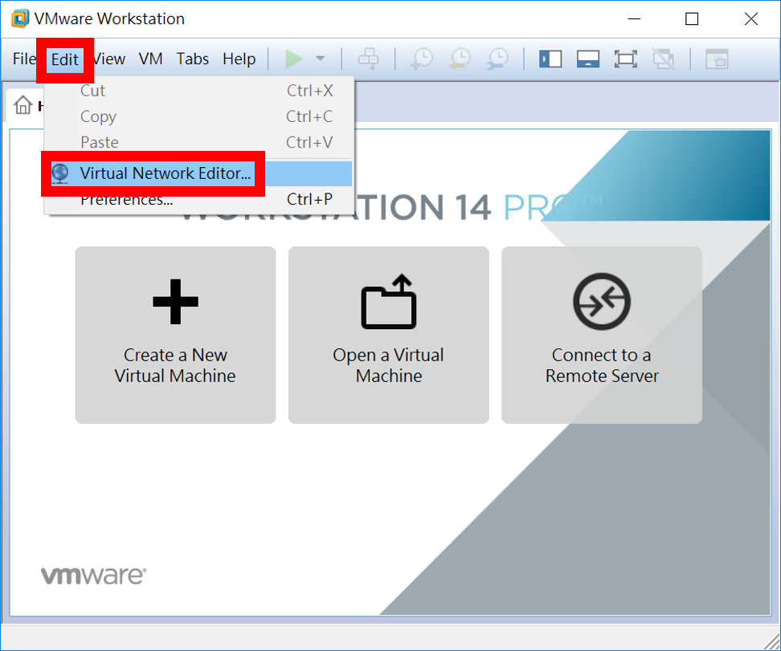
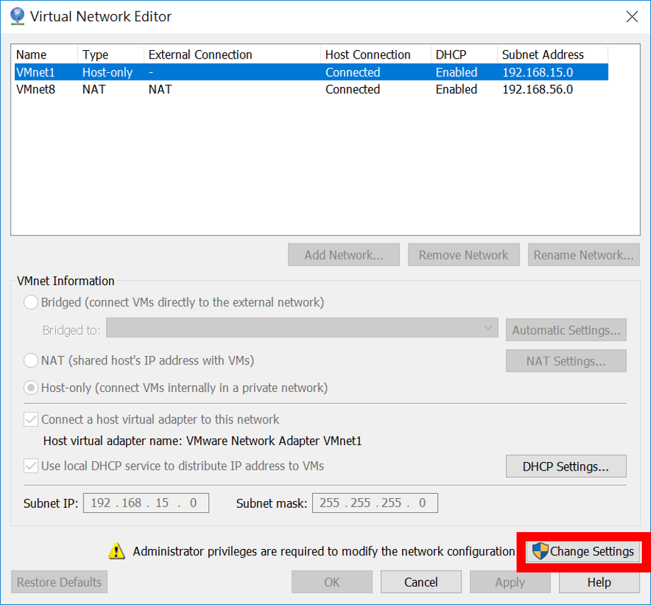
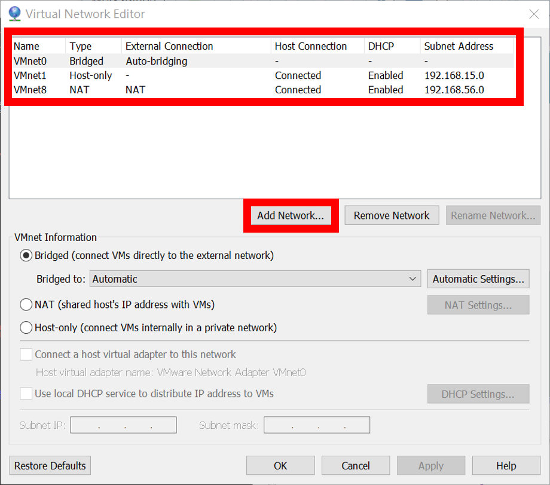
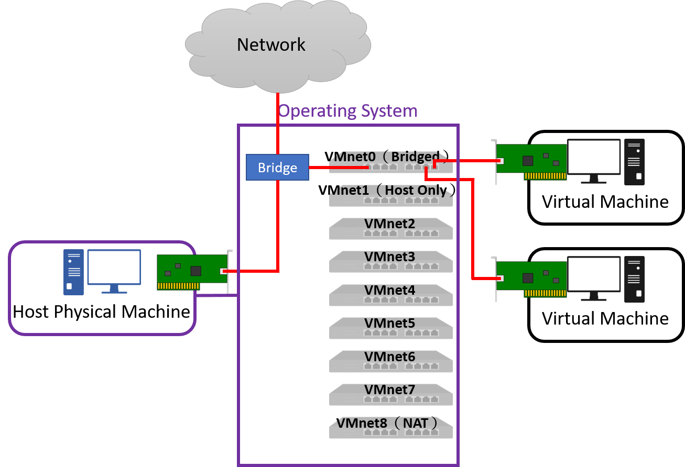
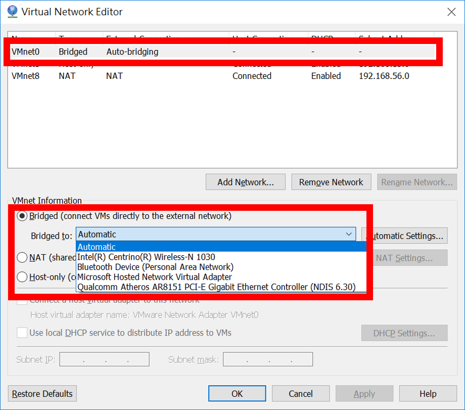
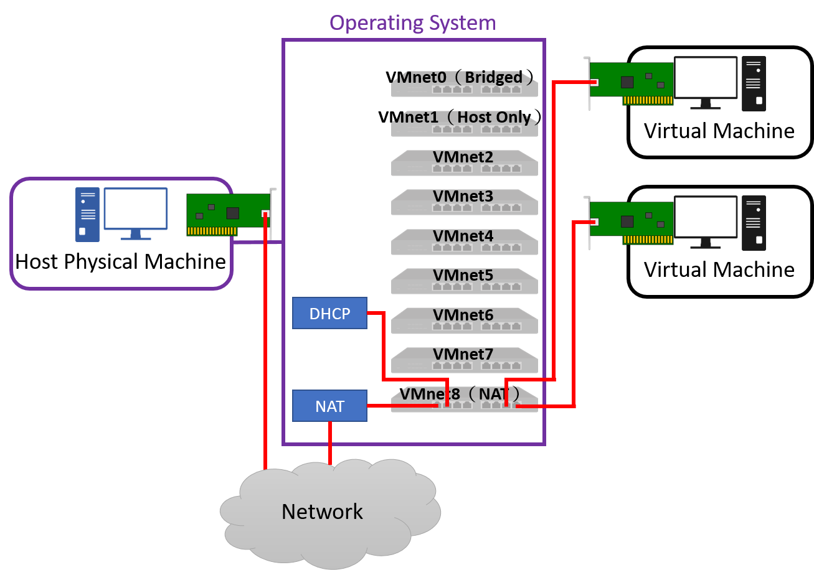
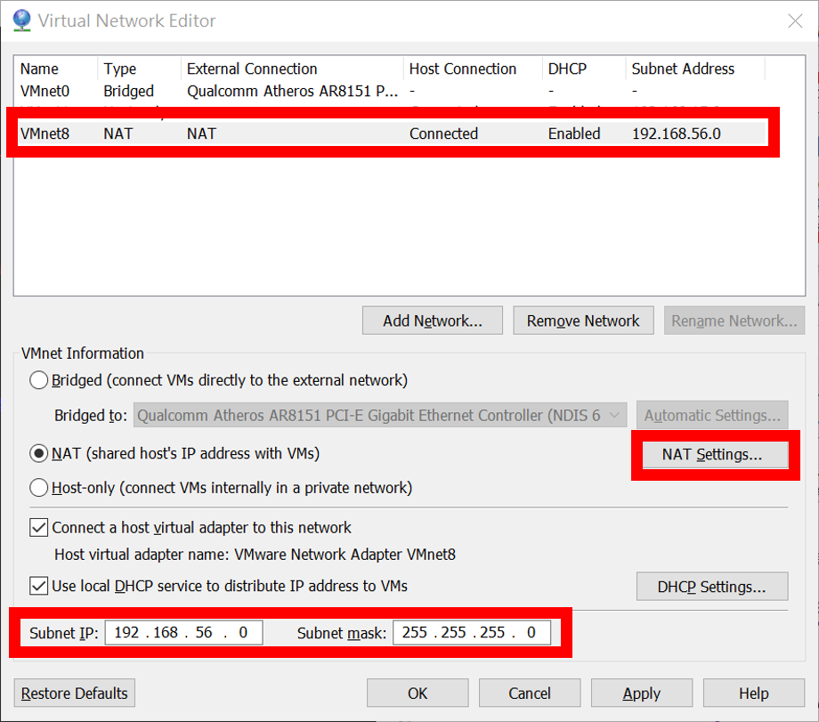
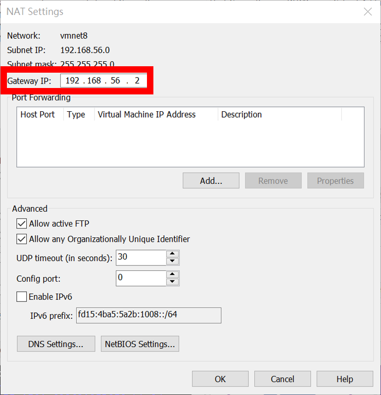
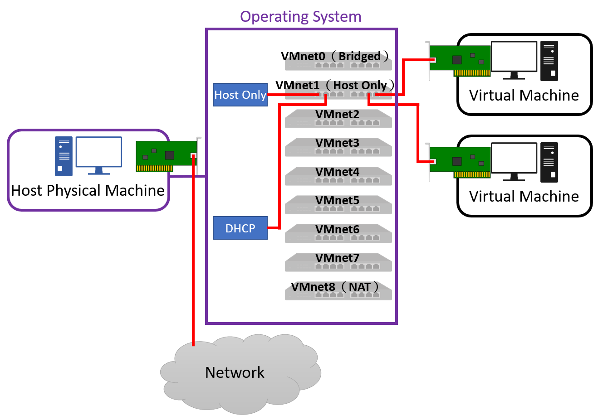

# Homework - Python Spark ML（八）：Hadoop 的安裝
# § 附錄 - VMware Workstaion 網路架構圖 §

### 【[按此回上一頁目錄](https://github.com/oneleo/PythonSparkMLBookClub/tree/master/Homework-PythonSparkML_08)】

## 【原始題目連結】
### [Python Spark ML（八）：Hadoop 的安裝](http://hemingwang.blogspot.tw/2017/10/python-spark-mlhadoop.html)

## 【My Answer】

> 因自身是機器學習初學者，此份作業參考各方資料並加入自己的理解，若有誤還請多指教（建立 Github Issue 來協助我修正），謝謝。

### 01、我們可以使用下面方法來查看目前 VMware Workstation 已設置哪些網路可供 VM 使用。
* 預設下會有三種網路模式：
	1. VMnet0 為 Bridge 網路。
	2. VMnet8 為 NAT 網路。
	3. VMnet1 為 Host Only 網路。

#### （01）點選【Edit】→【Virtual Network Editor...】。

#### （02）點選下方【Change Settings】。

#### （03）此時可以看到 VMware Workstation 可用的網路一覽。
* 若實體主機有多張網路卡，我們可以根據需求新增網路（【Add Network...】），並且將不同的實體網路卡設置成不同的 Bridge 網路。如此我們將可以透過不同實體網路卡，連接至不同的 VM 內，使用不同 VM 所提供的服務。

### 02、Bridge 網路模式下，被選擇作為 Bridge 的實體網路卡（預設為實體主機用來上網的那一張網路卡），會和所有相同 Bridge 的 VM 處在同一個網段底下（可以看到彼此的 IP），VM 必須手動設定 IP，或仰賴和實體主機相同層級的 DHCP Server 才能取得 IP，進而連線至網際網路。

#### （01）我們可以在 Virtual Network Editor 中設定作為 Bridge 模式的實體網路卡。

### 03、在 NAT 網路模式下，所有相同 NAT 的 VM 可透過虛擬的 DHCP Server 取得 IP（預設為 192.168.x.x），但要連至網際網路時，所有的 IP 將會偽裝（Masquerade）成，我們選擇下載含有常用工具的【DVD ISO】版映象檔。
* Everything ISO 版含所有工具但會佔用較大空間，Minimal ISO 則大多數的工具需至網路下載。

#### （1）我們可以設定下方的「Subnet IP:」及「Subnet mask:」來設置在此 NAT 底下的 VM IP 網段及遮罩。

#### （2）以及在【NAT Settings...】選單內設定閘道 IP。

### 04、在 Host Only 網路模式下，所有相同 Host Only 的 VM 可透過虛擬的 DHCP Server 取得 IP，雖然彼此可以互相通訊，卻沒有辦法連通至網際網路。

## 【References】

- [01] VMware Docs, "Selecting the Network Connection Type for a Virtual Machine", [https://docs.vmware.com/en/VMware-Workstation-Pro/12.0/com.vmware.ws.using.doc/GUID-3B504F2F-7A0B-415F-AE01-62363A95D052.html](https://docs.vmware.com/en/VMware-Workstation-Pro/12.0/com.vmware.ws.using.doc/GUID-3B504F2F-7A0B-415F-AE01-62363A95D052.html)
- [02] VMware Docs, "Configuring Bridged Networking", [https://docs.vmware.com/en/VMware-Workstation-Pro/12.0/com.vmware.ws.using.doc/GUID-BAFA66C3-81F0-4FCA-84C4-D9F7D258A60A.html](https://docs.vmware.com/en/VMware-Workstation-Pro/12.0/com.vmware.ws.using.doc/GUID-BAFA66C3-81F0-4FCA-84C4-D9F7D258A60A.html)
- [03] VMware Docs, "Configure Bridged Networking for an Existing Virtual Machine", [https://docs.vmware.com/en/VMware-Workstation-Pro/12.0/com.vmware.ws.using.doc/GUID-826323AD-D014-475D-8909-DFA73B5A3A57.html](https://docs.vmware.com/en/VMware-Workstation-Pro/12.0/com.vmware.ws.using.doc/GUID-826323AD-D014-475D-8909-DFA73B5A3A57.html)
- [04] VMware Docs, "Configuring Network Address Translation", [https://docs.vmware.com/en/VMware-Workstation-Pro/12.0/com.vmware.ws.using.doc/GUID-89311E3D-CCA9-4ECC-AF5C-C52BE6A89A95.html](https://docs.vmware.com/en/VMware-Workstation-Pro/12.0/com.vmware.ws.using.doc/GUID-89311E3D-CCA9-4ECC-AF5C-C52BE6A89A95.html)
- [05] VMware Docs, "Configuring Host-Only Networking", [https://docs.vmware.com/en/VMware-Workstation-Pro/12.0/com.vmware.ws.using.doc/GUID-93BDF7F1-D2E4-42CE-80EA-4E305337D2FC.html](https://docs.vmware.com/en/VMware-Workstation-Pro/12.0/com.vmware.ws.using.doc/GUID-93BDF7F1-D2E4-42CE-80EA-4E305337D2FC.html)
- [06] VMware Docs, "Configuring LAN Segments", [https://docs.vmware.com/en/VMware-Workstation-Pro/12.0/com.vmware.ws.using.doc/GUID-DEE1E2F1-5DA4-4C83-B7C5-A1165C84C757.html](https://docs.vmware.com/en/VMware-Workstation-Pro/12.0/com.vmware.ws.using.doc/GUID-DEE1E2F1-5DA4-4C83-B7C5-A1165C84C757.html)
- [07] VMware Docs, "Sample Custom Networking Configuration", [https://docs.vmware.com/en/VMware-Workstation-Pro/12.0/com.vmware.ws.using.doc/GUID-AB5295E7-7EFC-4B3A-81E7-7FC444D81F07.html](https://docs.vmware.com/en/VMware-Workstation-Pro/12.0/com.vmware.ws.using.doc/GUID-AB5295E7-7EFC-4B3A-81E7-7FC444D81F07.html)
- [08] , "Intro to Virtual Machine Networking", [https://diarmuidmccarthy.wordpress.com/2011/02/15/hello-world/](https://diarmuidmccarthy.wordpress.com/2011/02/15/hello-world/)

### 【[按此回上一頁目錄](https://github.com/oneleo/PythonSparkMLBookClub/tree/master/Homework-PythonSparkML_08)】