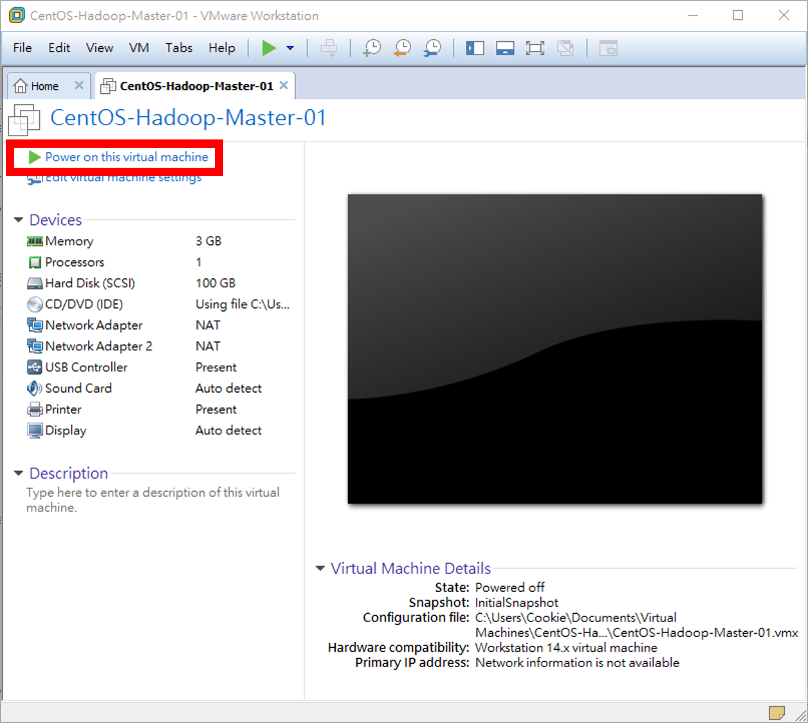

# Homework - Python Spark ML（八）：Hadoop 的安裝

## 【題目連結】
### [Python Spark ML（九）：Hadoop 基本功能介紹](http://hemingwang.blogspot.tw/2017/11/python-spark-mlhadoop.html)

## 【My Answer】

> 因自身是機器學習初學者，此份作業參考各方資料並加入自己的理解，若有誤還請多指教（建立 Github Issue 來協助我修正），謝謝。

### 001、本處使用[上一篇](../Homework-PythonSparkML_08)作業作好的 Container 叢集環境進行操作。首先將上一篇作業已裝好 Docker 的 CentOS 宿主 VM 開機。



### 002、使用 hadoop 帳號及 hadoop 密碼登入後開啟 Terminal，即可開始操作，首先將 Hadoop 叢集架設好。

``` Bash
$ /opt/bin/dkrstart
```

### 003、格式化 HDFS 檔案系統。

``` Bash
$ ssh "$USER"@master hdfs namenode -format
```

### 004、啟動 HDFS、Yarn、SparkWorker。

``` Bash
$ ssh "$USER"@master start-dfs.sh && ssh "$USER"@master start-yarn.sh && ssh "$USER"@master /opt/spark/sbin/start-all.sh
```

### 005、查看 master 容器 Java 程式執行狀況。

``` Bash
$ ssh "$USER"@master jps
```

	1185 Jps
	435 NameNode
	633 SecondaryNameNode
	796 ResourceManager
	892 Master

### 006、查看 data 容器 Java 程式執行狀況。

``` Bash
$ ssh "$USER"@data1 jps
$ ssh "$USER"@data2 jps
$ ssh "$USER"@data3 jps
```

	416 NodeManager
	628 Jps
	473 Worker
	303 DataNode

### 007、開始測試 HDFS（第 06 章），首先（遠端至 Master Container）建立 user 目錄。

``` Bash
$ ssh "$USER"@master hadoop fs -mkdir "/user"
```

### 008、（遠端至 Master Container）在 user 目錄下，建立 hadoop 子目錄。

``` Bash
$ ssh "$USER"@master hadoop fs -mkdir "/user/$USER"
```

### 009、（遠端至 Master Container）在 hadoop 目錄下，建立 test 子目錄。

``` Bash
$ ssh "$USER"@master hadoop fs -mkdir "/user/$USER/test"
```

### 010、（遠端至 Master Container）查看之前建立的 HDFS 目錄。

``` Bash
$ ssh "$USER"@master hadoop fs -ls
```

	Found 1 items
	drwxr-xr-x   - hadoop supergroup          0 2017-11-28 11:33 test

### 011、（遠端至 Master Container）查看 HDFS 根目錄。

``` Bash
$ ssh "$USER"@master hadoop fs -ls "/"
```

	Found 1 items
	drwxr-xr-x   - hadoop supergroup          0 2017-11-28 11:33 /user

### 012、（遠端至 Master Container）查看 HDFS 的 /user 目錄。

``` Bash
$ ssh "$USER"@master hadoop fs -ls "/user"
```

	Found 1 items
	drwxr-xr-x   - hadoop supergroup          0 2017-11-28 11:33 /user/hadoop

### 013、（遠端至 Master Container）查看 HDFS 的 /user/hadoop 目錄。

``` Bash
$ ssh "$USER"@master hadoop fs -ls "/user/$USER"
```

	Found 1 items
	drwxr-xr-x   - hadoop supergroup          0 2017-11-28 11:33 /user/hadoop/test

### 014、（遠端至 Master Container）一次查看所有子目錄。

``` Bash
$ ssh "$USER"@master hadoop fs -ls -R "/"
```

	drwxr-xr-x   - hadoop supergroup          0 2017-11-28 11:33 /user
	drwxr-xr-x   - hadoop supergroup          0 2017-11-28 11:33 /user/hadoop
	drwxr-xr-x   - hadoop supergroup          0 2017-11-28 11:33 /user/hadoop/test

### 015、（遠端至 Master Container）建立多層 HDFS 目錄。

``` Bash
$ ssh "$USER"@master hadoop fs -mkdir -p "/dir1/dir2/dir3"
```

### 016、（遠端至 Master Container）查看所有 HDFS 子目錄。

``` Bash
$ ssh "$USER"@master hadoop fs -ls -R "/"
```

	drwxr-xr-x   - hadoop supergroup          0 2017-11-28 11:41 /dir1
	drwxr-xr-x   - hadoop supergroup          0 2017-11-28 11:41 /dir1/dir2
	drwxr-xr-x   - hadoop supergroup          0 2017-11-28 11:41 /dir1/dir2/dir3
	drwxr-xr-x   - hadoop supergroup          0 2017-11-28 11:33 /user
	drwxr-xr-x   - hadoop supergroup          0 2017-11-28 11:33 /user/hadoop
	drwxr-xr-x   - hadoop supergroup          0 2017-11-28 11:33 /user/hadoop/test

### 017、（遠端至 Master Container）複製 Master Container 檔案至 HDFS 的目錄。

``` Bash
$ ssh "$USER"@master hadoop fs -copyFromLocal "/opt/hadoop/README.txt" "/user/$USER/test"
```

### 018、（遠端至 Master Container）複製 Master Container 檔案成為 HDFS 的目錄的 test1.txt 檔。

``` Bash
$ ssh "$USER"@master hadoop fs -copyFromLocal "/opt/hadoop/README.txt" "/user/$USER/test/test1.txt"
```

### 019、（遠端至 Master Container）列出 HDFS 目錄下的檔案。

``` Bash
$ ssh "$USER"@master hadoop fs -ls "/user/$USER/test"
```

	Found 2 items
	-rw-r--r--   3 hadoop supergroup       1366 2017-11-28 11:42 /user/hadoop/test/README.txt
	-rw-r--r--   3 hadoop supergroup       1366 2017-11-28 11:43 /user/hadoop/test/test1.txt

### 020、（遠端至 Master Container）列出 HDFS 目錄下的檔案內容。

``` Bash
$ ssh "$USER"@master hadoop fs -cat "/user/$USER/test/README.txt"
```

### 021、（遠端至 Master Container）列出 HDFS 目錄下的檔案內容（導入 more）。
* 【-t】：使用 Interactive Shell。

``` Bash
$ ssh -t "$USER"@master 'hadoop fs -cat "/user/$USER/test/README.txt" | more'
```

### 022、（遠端至 Master Container）複製 Master Container 檔案至 HDFS 的目錄時，檔案已經存在。

``` Bash
$ ssh "$USER"@master hadoop fs -copyFromLocal "/opt/hadoop/README.txt" "/user/$USER/test"
```

	copyFromLocal: `/user/hadoop/test/README.txt': File exists

### 023、（遠端至 Master Container）強迫複製檔案。

``` Bash
$ ssh "$USER"@master hadoop fs -copyFromLocal -f "/opt/hadoop/README.txt" "/user/$USER/test"
```

### 024、（遠端至 Master Container）同時複製 NOTICE.txt 與 LICENSE.txt 至 HDFS 目錄 /user/hadoop/test。

``` Bash
$ ssh "$USER"@master hadoop fs -copyFromLocal "/opt/hadoop/NOTICE.txt" "/opt/hadoop/LICENSE.txt" "/user/$USER/test"
```

### 025、（遠端至 Master Container）複製整個 Master Container 目錄 /opt/hadoop/etc 至 HDFS 目錄 /user/hduser/test。

``` Bash
$ ssh "$USER"@master hadoop fs -copyFromLocal "/opt/hadoop/etc" "/user/$USER/test"
```

### 026、（遠端至 Master Container）列出在 HDFS 目錄下的檔案。

``` Bash
$ ssh "$USER"@master hadoop fs -ls "/user/$USER/test"
```

	Found 5 items
	-rw-r--r--   3 hadoop supergroup     106210 2017-11-28 13:01 /user/hadoop/test/LICENSE.txt
	-rw-r--r--   3 hadoop supergroup      15915 2017-11-28 13:01 /user/hadoop/test/NOTICE.txt
	-rw-r--r--   3 hadoop supergroup       1366 2017-11-28 11:47 /user/hadoop/test/README.txt
	drwxr-xr-x   - hadoop supergroup          0 2017-11-28 13:02 /user/hadoop/test/etc
	-rw-r--r--   3 hadoop supergroup       1366 2017-11-28 11:43 /user/hadoop/test/test1.txt

### 027、（遠端至 Master Container）列出 HDFS 目錄 /user/hadoop/test/etc 下的所有檔案。

``` Bash
$ ssh "$USER"@master hadoop fs -ls -R "/user/$USER/test/etc"
```

	drwxr-xr-x   - hadoop supergroup          0 2017-11-28 13:02 /user/hadoop/test/etc/hadoop
	-rw-r--r--   3 hadoop supergroup       7861 2017-11-28 13:02 /user/hadoop/test/etc/hadoop/capacity-scheduler.xml
	-rw-r--r--   3 hadoop supergroup       1335 2017-11-28 13:02 /user/hadoop/test/etc/hadoop/configuration.xsl
	-rw-r--r--   3 hadoop supergroup       1211 2017-11-28 13:02 /user/hadoop/test/etc/hadoop/container-executor.cfg
	-rw-r--r--   3 hadoop supergroup       1883 2017-11-28 13:02 /user/hadoop/test/etc/hadoop/core-site.xml
	-rw-r--r--   3 hadoop supergroup       3804 2017-11-28 13:02 /user/hadoop/test/etc/hadoop/hadoop-env.cmd
	-rw-r--r--   3 hadoop supergroup       4666 2017-11-28 13:02 /user/hadoop/test/etc/hadoop/hadoop-env.sh
	-rw-r--r--   3 hadoop supergroup       2490 2017-11-28 13:02 /user/hadoop/test/etc/hadoop/hadoop-metrics.properties
	-rw-r--r--   3 hadoop supergroup       2598 2017-11-28 13:02 /user/hadoop/test/etc/hadoop/hadoop-metrics2.properties
	-rw-r--r--   3 hadoop supergroup      10206 2017-11-28 13:02 /user/hadoop/test/etc/hadoop/hadoop-policy.xml
	-rw-r--r--   3 hadoop supergroup       5605 2017-11-28 13:02 /user/hadoop/test/etc/hadoop/hdfs-site.xml
	-rw-r--r--   3 hadoop supergroup          0 2017-11-28 13:02 /user/hadoop/test/etc/hadoop/hdfs.exclude
	-rw-r--r--   3 hadoop supergroup         18 2017-11-28 13:02 /user/hadoop/test/etc/hadoop/hdfs.include
	-rw-r--r--   3 hadoop supergroup       2230 2017-11-28 13:02 /user/hadoop/test/etc/hadoop/httpfs-env.sh
	-rw-r--r--   3 hadoop supergroup       1657 2017-11-28 13:02 /user/hadoop/test/etc/hadoop/httpfs-log4j.properties
	-rw-r--r--   3 hadoop supergroup         21 2017-11-28 13:02 /user/hadoop/test/etc/hadoop/httpfs-signature.secret
	-rw-r--r--   3 hadoop supergroup        620 2017-11-28 13:02 /user/hadoop/test/etc/hadoop/httpfs-site.xml
	-rw-r--r--   3 hadoop supergroup       3518 2017-11-28 13:02 /user/hadoop/test/etc/hadoop/kms-acls.xml
	-rw-r--r--   3 hadoop supergroup       3139 2017-11-28 13:02 /user/hadoop/test/etc/hadoop/kms-env.sh
	-rw-r--r--   3 hadoop supergroup       1788 2017-11-28 13:02 /user/hadoop/test/etc/hadoop/kms-log4j.properties
	-rw-r--r--   3 hadoop supergroup       5939 2017-11-28 13:02 /user/hadoop/test/etc/hadoop/kms-site.xml
	-rw-r--r--   3 hadoop supergroup      14016 2017-11-28 13:02 /user/hadoop/test/etc/hadoop/log4j.properties
	-rw-r--r--   3 hadoop supergroup       1076 2017-11-28 13:02 /user/hadoop/test/etc/hadoop/mapred-env.cmd
	-rw-r--r--   3 hadoop supergroup       1507 2017-11-28 13:02 /user/hadoop/test/etc/hadoop/mapred-env.sh
	-rw-r--r--   3 hadoop supergroup       4113 2017-11-28 13:02 /user/hadoop/test/etc/hadoop/mapred-queues.xml.template
	-rw-r--r--   3 hadoop supergroup       1741 2017-11-28 13:02 /user/hadoop/test/etc/hadoop/mapred-site.xml
	-rw-r--r--   3 hadoop supergroup        758 2017-11-28 13:02 /user/hadoop/test/etc/hadoop/mapred-site.xml.template
	-rw-r--r--   3 hadoop supergroup         18 2017-11-28 13:02 /user/hadoop/test/etc/hadoop/slaves
	-rw-r--r--   3 hadoop supergroup       2316 2017-11-28 13:02 /user/hadoop/test/etc/hadoop/ssl-client.xml.example
	-rw-r--r--   3 hadoop supergroup       2697 2017-11-28 13:02 /user/hadoop/test/etc/hadoop/ssl-server.xml.example
	-rw-r--r--   3 hadoop supergroup       2250 2017-11-28 13:02 /user/hadoop/test/etc/hadoop/yarn-env.cmd
	-rw-r--r--   3 hadoop supergroup       4876 2017-11-28 13:02 /user/hadoop/test/etc/hadoop/yarn-env.sh
	-rw-r--r--   3 hadoop supergroup       4619 2017-11-28 13:02 /user/hadoop/test/etc/hadoop/yarn-site.xml
	-rw-r--r--   3 hadoop supergroup          0 2017-11-28 13:02 /user/hadoop/test/etc/hadoop/yarn.exclude
	-rw-r--r--   3 hadoop supergroup         18 2017-11-28 13:02 /user/hadoop/test/etc/hadoop/yarn.include

### 028、（遠端至 Master Container）使用 put 複製檔案至 HDFS 目錄，會直接覆蓋檔案。

``` Bash
$ ssh "$USER"@master hadoop fs -put "/opt/hadoop/README.txt" "/user/$USER/test/test2.txt"
```

### 029、（遠端至 Master Container）將原本顯示在螢幕上的內容儲存到 HDFS 檔案。

``` Bash
$ ssh "$USER"@master "echo abc | hadoop fs -put - /user/$USER/test/echoin.txt"
```

### 030、（遠端至 Master Container）顯示在 HDFS 的檔案 echoin.txt 的內容。

``` Bash
$ ssh "$USER"@master hadoop fs -cat "/user/$USER/test/echoin.txt"
```

	abc

### 031、（遠端至 Master Container）Master Container 目錄的列表，儲存到 HDFS 檔案。

``` Bash
$ ssh "$USER"@master "ls /opt/hadoop | hadoop fs -put - /user/$USER/test/hadooplist.txt"
```

### 032、（遠端至 Master Container）顯示 HDFS 的檔案 hadooplist.txt 內容。

``` Bash
$ ssh "$USER"@master hadoop fs -cat "/user/$USER/test/hadooplist.txt"
```

	bin
	etc
	include
	lib
	libexec
	LICENSE.txt
	NOTICE.txt
	README.txt
	sbin
	share

### 033、（遠端至 Master Container）建立 /tmp/test 測試目錄。

``` Bash
$ ssh "$USER"@master mkdir "/tmp/test"
```

### 034、（遠端至 Master Container）將 HDFS 的檔案複製到 Master Container。

``` Bash
$ ssh "$USER"@master hadoop fs -copyToLocal "/user/$USER/test/hadooplist.txt" "/tmp/test"
```

### 035、（遠端至 Master Container）查看 Master Container 目錄。

``` Bash
$ ssh "$USER"@master ls "/tmp/test"
```

	hadooplist.txt

### 036、（遠端至 Master Container）將整個 HDFS 上的目錄複製到 Master Container。

``` Bash
$ ssh "$USER"@master hadoop fs -get "/user/$USER/test/etc" "/tmp"
```

### 037、（遠端至 Master Container）將 HDFS 上的檔案複製到 Master Container。

``` Bash
$ ssh "$USER"@master hadoop fs -get "/user/$USER/test/README.txt" "/tmp/localREADME.txt"
```

### 038、（遠端至 Master Container）在 HDFS 上建立測試目錄 /user/hadoop/test/temp。

``` Bash
$ ssh "$USER"@master hadoop fs -mkdir "/user/$USER/test/temp"
```

### 039、（遠端至 Master Container）複製 HDFS 檔案至 HDFS 測試目錄。

``` Bash
$ ssh "$USER"@master hadoop fs -cp "/user/$USER/test/README.txt" "/user/$USER/test/temp"
```

### 040、（遠端至 Master Container）查看 HDFS 測試目錄。

``` Bash
$ ssh "$USER"@master hadoop fs -ls "/user/$USER/test/temp"
```

	Found 1 items
	-rw-r--r--   3 hadoop supergroup       1366 2017-11-28 13:07 /user/hadoop/test/temp/README.txt

### 041、（遠端至 Master Container）先查看預定要刪除的檔案。

``` Bash
$ ssh "$USER"@master hadoop fs -ls "/user/$USER/test"
```

	Found 9 items
	-rw-r--r--   3 hadoop supergroup     106210 2017-11-28 13:01 /user/hadoop/test/LICENSE.txt
	-rw-r--r--   3 hadoop supergroup      15915 2017-11-28 13:01 /user/hadoop/test/NOTICE.txt
	-rw-r--r--   3 hadoop supergroup       1366 2017-11-28 11:47 /user/hadoop/test/README.txt
	-rw-r--r--   3 hadoop supergroup          4 2017-11-28 13:03 /user/hadoop/test/echoin.txt
	drwxr-xr-x   - hadoop supergroup          0 2017-11-28 13:02 /user/hadoop/test/etc
	-rw-r--r--   3 hadoop supergroup         73 2017-11-28 13:05 /user/hadoop/test/hadooplist.txt
	drwxr-xr-x   - hadoop supergroup          0 2017-11-28 13:07 /user/hadoop/test/temp
	-rw-r--r--   3 hadoop supergroup       1366 2017-11-28 11:43 /user/hadoop/test/test1.txt
	-rw-r--r--   3 hadoop supergroup       1366 2017-11-28 13:03 /user/hadoop/test/test2.txt

### 042、（遠端至 Master Container）刪除 HDFS 檔案

``` Bash
$ ssh "$USER"@master hadoop fs -rm "/user/$USER/test/test2.txt"
```

	Deleted /user/hadoop/test/test2.txt

### 043、（遠端至 Master Container）查看預備刪除的 HDFS 目錄

``` Bash
$ ssh "$USER"@master hadoop fs -ls "/user/$USER/test"
```

	Found 8 items
	-rw-r--r--   3 hadoop supergroup     106210 2017-11-28 13:01 /user/hadoop/test/LICENSE.txt
	-rw-r--r--   3 hadoop supergroup      15915 2017-11-28 13:01 /user/hadoop/test/NOTICE.txt
	-rw-r--r--   3 hadoop supergroup       1366 2017-11-28 11:47 /user/hadoop/test/README.txt
	-rw-r--r--   3 hadoop supergroup          4 2017-11-28 13:03 /user/hadoop/test/echoin.txt
	drwxr-xr-x   - hadoop supergroup          0 2017-11-28 13:02 /user/hadoop/test/etc
	-rw-r--r--   3 hadoop supergroup         73 2017-11-28 13:05 /user/hadoop/test/hadooplist.txt
	drwxr-xr-x   - hadoop supergroup          0 2017-11-28 13:07 /user/hadoop/test/temp
	-rw-r--r--   3 hadoop supergroup       1366 2017-11-28 11:43 /user/hadoop/test/test1.txt

### 044、（遠端至 Master Container）刪除 HDFS 目錄

``` Bash
$ ssh "$USER"@master hadoop fs -rm -R "/user/$USER/test/etc"
```

### 045、接下來要開始進行 Yarn 測試，首先 SSH 進入到 Master Container 內。

``` Bash
$ ssh "$USER"@master
```

### 046、建立 wordcount 目錄。

``` Bash
hadoop@master:~$ mkdir -p "/home/$USER/wordcount/input"
```

### 047、到下列網址複製 Java 原始碼
* 連結：將 [http://hadoop.apache.org/docs/current/hadoop-mapreduce-client/hadoop-mapreduce-client-core/MapReduceTutorial.html#Source_Code](http://hadoop.apache.org/docs/current/hadoop-mapreduce-client/hadoop-mapreduce-client-core/MapReduceTutorial.html#Source_Code) 連結內的 Java 程式複製至 /home/$USER/wordcount/WordCount.java 檔內。

``` Bash
hadoop@master:~$ vim /home/$USER/wordcount/WordCount.java
```

> 	import java.io.IOException;
> 	import java.util.StringTokenizer;
> 	
> 	import org.apache.hadoop.conf.Configuration;
> 	import org.apache.hadoop.fs.Path;
> 	import org.apache.hadoop.io.IntWritable;
> 	import org.apache.hadoop.io.Text;
> 	import org.apache.hadoop.mapreduce.Job;
> 	import org.apache.hadoop.mapreduce.Mapper;
> 	import org.apache.hadoop.mapreduce.Reducer;
> 	import org.apache.hadoop.mapreduce.lib.input.FileInputFormat;
> 	import org.apache.hadoop.mapreduce.lib.output.FileOutputFormat;
> 	
> 	public class WordCount {
> 	
> 	  public static class TokenizerMapper
> 	       extends Mapper<Object, Text, Text, IntWritable>{
> 	
> 	    private final static IntWritable one = new IntWritable(1);
> 	    private Text word = new Text();
> 	
> 	    public void map(Object key, Text value, Context context
> 	                    ) throws IOException, InterruptedException {
> 	      StringTokenizer itr = new StringTokenizer(value.toString());
> 	      while (itr.hasMoreTokens()) {
> 	        word.set(itr.nextToken());
> 	        context.write(word, one);
> 	      }
> 	    }
> 	  }
> 	
> 	  public static class IntSumReducer
> 	       extends Reducer<Text,IntWritable,Text,IntWritable{
> 	    private IntWritable result = new IntWritable();
> 	
> 	    public void reduce(Text key, Iterable<IntWritablevalues,
> 	                       Context context
> 	                       ) throws IOException, InterruptedException {
> 	      int sum = 0;
> 	      for (IntWritable val : values) {
> 	        sum += val.get();
> 	      }
> 	      result.set(sum);
> 	      context.write(key, result);
> 	    }
> 	  }
> 	
> 	  public static void main(String[] args) throws Exception {
> 	    Configuration conf = new Configuration();
> 	    Job job = Job.getInstance(conf, "word count");
> 	    job.setJarByClass(WordCount.class);
> 	    job.setMapperClass(TokenizerMapper.class);
> 	    job.setCombinerClass(IntSumReducer.class);
> 	    job.setReducerClass(IntSumReducer.class);
> 	    job.setOutputKeyClass(Text.class);
> 	    job.setOutputValueClass(IntWritable.class);
> 	    FileInputFormat.addInputPath(job, new Path(args[0]));
> 	    FileOutputFormat.setOutputPath(job, new Path(args[1]));
> 	    System.exit(job.waitForCompletion(true) ? 0 : 1);
> 	  }
> 	}

### 048、新增 HADOOP_CLASSPATH 臨時環境變數。

``` Bash
hadoop@master:~$ export HADOOP_CLASSPATH="$JAVA_HOME/lib/tools.jar" && echo "$HADOOP_CLASSPATH"
```

	/usr/lib/jvm/java-8-oracle/lib/tools.jar

### 049、切換至 /home/$USER/wordcount 資料檔目錄。

``` Bash
hadoop@master:~$ cd "/home/$USER/wordcount"
```

### 050、編譯 WordCount 程式。

``` Bash
hadoop@master:~$ hadoop "com.sun.tools.javac.Main" "WordCount.java"
```

### 051、打包 WordCount 類別成為 wc.jar。

``` Bash
hadoop@master:~$ jar cf wc.jar WordCount*.class
```

### 052、查看目錄內容。

``` Bash
hadoop@master:~$ ls -al
```

	total 20
	drwxrwxr-x. 1 hadoop hadoop  200 11月 28 13:12 .
	drwxr-xr-x. 1 hadoop hadoop  216 11月 28 13:21 ..
	drwxrwxr-x. 1 hadoop hadoop   22 11月 28 13:13 input
	-rw-rw-r--. 1 hadoop hadoop 3075 11月 28 13:24 wc.jar
	-rw-rw-r--. 1 hadoop hadoop 1491 11月 28 13:23 WordCount.class
	-rw-rw-r--. 1 hadoop hadoop 1739 11月 28 13:23 WordCount$IntSumReducer.class
	-rw-rw-r--. 1 hadoop hadoop 2089 11月 28 13:10 WordCount.java
	-rw-rw-r--. 1 hadoop hadoop 1736 11月 28 13:23 WordCount$TokenizerMapper.class

### 053、複製 LICENSE.txt。

``` Bash
hadoop@master:~$ cp "/opt/hadoop/LICENSE.txt" "/home/$USER/wordcount/input"
hadoop@master:~$ ls "/home/$USER/wordcount/input"
```

	LICENSE.txt

### 054、在 HDFS 建立目錄。

``` Bash
hadoop@master:~$ hadoop fs -mkdir -p "/user/$USER/wordcount/input"
```

### 055、上傳文字檔至 HDFS

``` Bash
hadoop@master:~$ hadoop fs -copyFromLocal "/home/$USER/wordcount/input/LICENSE.txt" "/user/$USER/wordcount/input"
```

### 056、列出 HDFS 檔案

``` Bash
hadoop@master:~$ hadoop fs -ls "/user/$USER/wordcount/input"
```

	Found 1 items
	-rw-r--r--   3 hadoop supergroup     106210 2017-11-28 13:14 /user/hadoop/wordcount/input/LICENSE.txt

### 057、切換至 /home/$USER/wordcount 資料檔目錄。

``` Bash
hadoop@master:~$ cd "/home/$USER/wordcount"
```

### 058、執行 WordCount 程式

``` Bash
hadoop@master:~$ hadoop jar "wc.jar" WordCount "/user/$USER/wordcount/input/LICENSE.txt" "/user/$USER/wordcount/output"
```

	17/11/28 13:25:50 INFO client.RMProxy: Connecting to ResourceManager at master/172.17.0.10:8032
	17/11/28 13:25:53 WARN mapreduce.JobResourceUploader: Hadoop command-line option parsing not performed. Implement the Tool interface and execute your application with ToolRunner to remedy this.
	17/11/28 13:25:53 INFO input.FileInputFormat: Total input files to process : 1
	17/11/28 13:25:54 INFO mapreduce.JobSubmitter: number of splits:1
	17/11/28 13:25:55 INFO Configuration.deprecation: yarn.resourcemanager.system-metrics-publisher.enabled is deprecated. Instead, use yarn.system-metrics-publisher.enabled
	17/11/28 13:25:55 INFO mapreduce.JobSubmitter: Submitting tokens for job: job_1511868463018_0001
	17/11/28 13:25:57 INFO impl.YarnClientImpl: Submitted application application_1511868463018_0001
	17/11/28 13:25:57 INFO mapreduce.Job: The url to track the job: http://master:8088/proxy/application_1511868463018_0001/
	17/11/28 13:25:57 INFO mapreduce.Job: Running job: job_1511868463018_0001
	17/11/28 13:26:19 INFO mapreduce.Job: Job job_1511868463018_0001 running in uber mode : false
	17/11/28 13:26:19 INFO mapreduce.Job:  map 0% reduce 0%
	17/11/28 13:26:36 INFO mapreduce.Job:  map 100% reduce 0%
	17/11/28 13:26:52 INFO mapreduce.Job:  map 100% reduce 100%
	17/11/28 13:26:53 INFO mapreduce.Job: Job job_1511868463018_0001 completed successfully
	17/11/28 13:26:53 INFO mapreduce.Job: Counters: 49
		File System Counters
			FILE: Number of bytes read=36735
			FILE: Number of bytes written=480295
			FILE: Number of read operations=0
			FILE: Number of large read operations=0
			FILE: Number of write operations=0
			HDFS: Number of bytes read=106333
			HDFS: Number of bytes written=27714
			HDFS: Number of read operations=6
			HDFS: Number of large read operations=0
			HDFS: Number of write operations=2
		Job Counters 
			Launched map tasks=1
			Launched reduce tasks=1
			Data-local map tasks=1
			Total time spent by all maps in occupied slots (ms)=12070
			Total time spent by all reduces in occupied slots (ms)=9780
			Total time spent by all map tasks (ms)=12070
			Total time spent by all reduce tasks (ms)=9780
			Total vcore-milliseconds taken by all map tasks=12070
			Total vcore-milliseconds taken by all reduce tasks=9780
			Total megabyte-milliseconds taken by all map tasks=12359680
			Total megabyte-milliseconds taken by all reduce tasks=10014720
		Map-Reduce Framework
			Map input records=1975
			Map output records=15433
			Map output bytes=166257
			Map output materialized bytes=36735
			Input split bytes=123
			Combine input records=15433
			Combine output records=2332
			Reduce input groups=2332
			Reduce shuffle bytes=36735
			Reduce input records=2332
			Reduce output records=2332
			Spilled Records=4664
			Shuffled Maps =1
			Failed Shuffles=0
			Merged Map outputs=1
			GC time elapsed (ms)=171
			CPU time spent (ms)=2060
			Physical memory (bytes) snapshot=353431552
			Virtual memory (bytes) snapshot=3866017792
			Total committed heap usage (bytes)=198316032
		Shuffle Errors
			BAD_ID=0
			CONNECTION=0
			IO_ERROR=0
			WRONG_LENGTH=0
			WRONG_MAP=0
			WRONG_REDUCE=0
		File Input Format Counters 
			Bytes Read=106210
		File Output Format Counters 
			Bytes Written=27714

### 059、查看 HDFS 的目錄（若有出現 _SUCCESS 檔案，表示上述程式執行成功）

``` Bash
hadoop@master:~$ hadoop fs -ls "/user/$USER/wordcount/output"
```

	Found 2 items
	-rw-r--r--   3 hadoop supergroup          0 2017-11-28 13:26 /user/hadoop/wordcount/output/_SUCCESS
	-rw-r--r--   3 hadoop supergroup      27714 2017-11-28 13:26 /user/hadoop/wordcount/output/part-r-00000

### 060、查看 HDFS 的輸出檔案內容
* 輸出內容可參考此連結 [part-r-00000](./part-r-00000)。

``` Bash
hadoop@master:~$ hadoop fs -cat "/user/$USER/wordcount/output/part-r-00000" | more
```

### 061、將輸出檔案內容複製到 Master Container 內

``` Bash
hadoop@master:~$ hadoop fs -copyToLocal "/user/$USER/wordcount/output" "/home/$USER/wordcount"
```

### 062、若要再次執行 wc.jar 程式，請先刪除輸出目錄，才不會出現檔案已經存在的錯誤訊息。

``` Bash
hadoop@master:~$ hadoop fs -rm -R "/user/$USER/wordcount/output"
```

#### 063、離開 Master Container 並停止 SparkWorker、Hadoop Yarn、Hadoop HDFS Java 程式。

``` Bash
$ exit
$ ssh "$USER"@master /opt/spark/sbin/stop-all.sh && ssh "$USER"@master stop-yarn.sh && ssh "$USER"@master stop-dfs.sh
```

#### 064、關閉所有 Containers。

``` Bash
$ /opt/bin/dkrstop
```

#### 065、刪除所有 Containers。

``` Bash
$ /opt/bin/dkrremove
```

### 066、將 CentOS 宿主進行安全關機。

``` Bash
$ sudo sync; sudo sync; sudo sync; sudo sync; sudo sync; sudo sync; sudo sync; sudo shutdown -h now;
```

## 【References】

- [01] 林大貴，「博碩出版社 - Python+Spark 2.0+Hadoop機器學習與大數據分析實戰」，ISBN-13：9789864341535
- [02] Fenriswolf 程式筆記，「Hadoop 參數設定」，[https://fenriswolf.me/](https://fenriswolf.me/)
- [03] 陳松林老師，「Big Data 研究室」，[http://bigdatahome.blogspot.tw/](http://bigdatahome.blogspot.tw/)
- [04] Apache Hadoop，「Hadoop Docs」，[http://hadoop.apache.org/docs/current/](http://hadoop.apache.org/docs/current/)
- [05] VMware，「VMware Workstation Docs」，[https://docs.vmware.com/en/VMware-Workstation-Pro/14.0/com.vmware.ws.using.doc/GUID-0EE752F8-C159-487A-9159-FE1F646EE4CA.html](https://docs.vmware.com/en/VMware-Workstation-Pro/14.0/com.vmware.ws.using.doc/GUID-0EE752F8-C159-487A-9159-FE1F646EE4CA.html)
- [07] 楊保華、戴王劍、曹亞侖，「碁峰書局 - Docker入門與實戰」，[http://www.books.com.tw/products/0010676115](http://www.books.com.tw/products/0010676115)

License
=============

Copyright {yyyy} Sean Chen

Licensed under the Apache License, Version 2.0 (the "License");
you may not use this file except in compliance with the License.
You may obtain a copy of the License at

http://www.apache.org/licenses/LICENSE-2.0

Unless required by applicable law or agreed to in writing, software
distributed under the License is distributed on an "AS IS" BASIS,
WITHOUT WARRANTIES OR CONDITIONS OF ANY KIND, either express or implied.
See the License for the specific language governing permissions and
limitations under the License.
